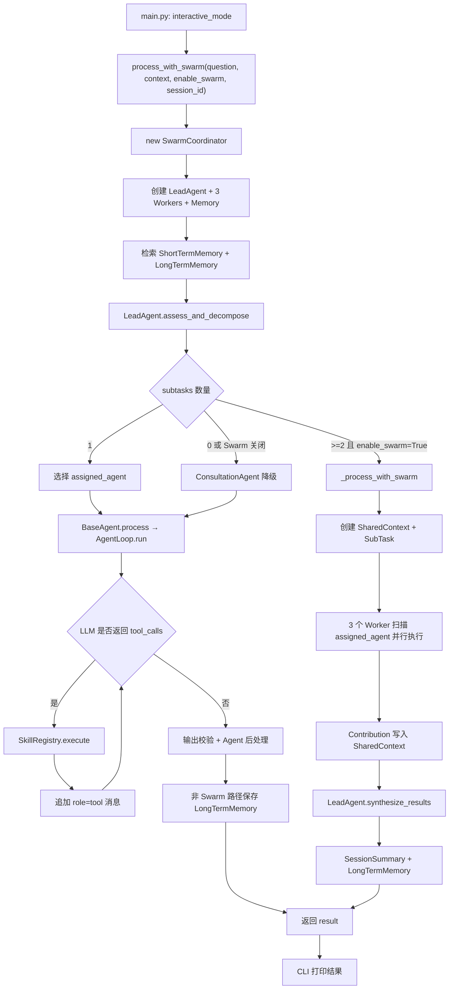
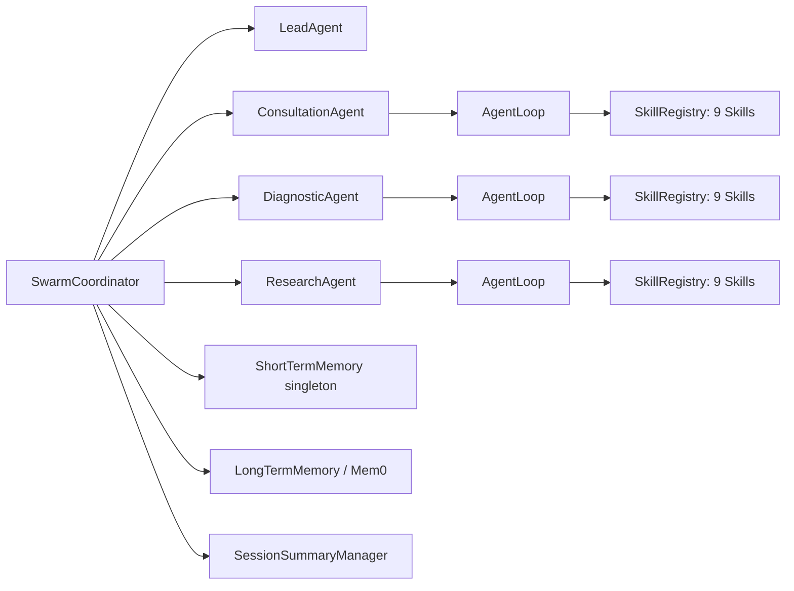
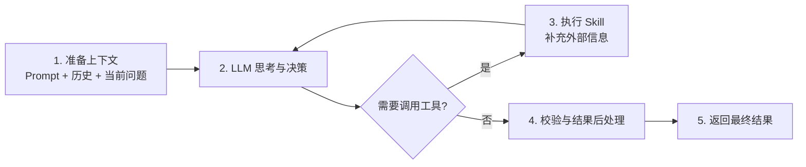

# medix-agent-swarm 完整请求链路：从 CLI 输入到最终返回，以及中间所有主要分支

> 审查基线：仓库提交 `8d516ade1228cb3a51b5c23740ff41684cca333e`，源码阅读日期为 **2026-08-12**。  
> 阅读目标：不只知道“正常情况怎么走”，还要知道单 Agent、Swarm、工具调用、降级、超时、解析失败、记忆不可用和当前源码阻塞分别会发生什么。  
> 事实口径：文档中的“当前行为”来自真实调用方；README、注释、Prompt 或 YAML 中尚未进入调用链的内容，会明确标为“设计意图”。

## 系列导航

| 文档 | 重点 |
|---|---|
| **本文** | 一次请求的完整主链路和所有主要分支 |
| [02-核心运行时与Agent实现](./02-核心运行时与Agent实现.md) | `LLMClient`、`AgentLoop`、状态管理、三个 Worker Agent |
| [03-Swarm协作与状态管理](./03-Swarm协作与状态管理.md) | LeadAgent、Coordinator、SharedContext、并发、事件和超时 |
| [04-Skills知识库记忆研究与约束](./04-Skills知识库记忆研究与约束.md) | 9 个 Skills、Milvus、Memory、Deep Research、Harness |

---

## 1. 先看最终结论

当前系统的真实主链路可以压缩为：

```text
CLI 输入
→ process_with_swarm()
→ 创建 SwarmCoordinator
→ 读取短期/长期记忆
→ LeadAgent 调 LLM 生成 subtasks
→ 根据 subtasks 数量选择单 Agent、Swarm 或降级路径
→ Worker 在 AgentLoop 中直接回答或调用 Skills
→ 单 Agent 直接返回；Swarm 由 LeadAgent 二次汇总
→ 保存长期记忆；Swarm 额外写 SessionSummary
→ CLI 展示 answer、suggestions、disclaimer
```

但是，当前快照在真正进入这条链路前就有两个模块名阻塞：

| 代码需要 | 实际文件 | 影响 |
|---|---|---|
| `swarm/events.py` | `swarm/events_20260428_231035.py` | `from swarm import process_with_swarm` 直接失败，CLI 不能启动 |
| `validation/auto_fixer.py` | `validation/auto_fixer_20260428_231043.py` | 即使先修复 events，AgentLoop 的 Harness 导入仍会失败，Validator 和 AutoFixer 会一起关闭 |

因此，本文讲的是**修复模块名后，代码按照当前实现会怎样执行**，而不是声称仓库现在已经可以开箱运行。

---

## 2. 全景调用图



这里有两个很重要的事实：

1. `process_with_swarm()` 每次调用都会创建一个新的 `SwarmCoordinator`，进而创建新的 LeadAgent 和三个 Worker；交互式 CLI 虽然复用同一个 `session_id`，但并不复用 Coordinator。
2. `ShortTermMemory` 是进程级单例，所以即使 Coordinator 每轮重建，当前 Python 进程中的短期会话仍可能保留；这不是因为 Coordinator 被复用了。

---

## 3. 启动阶段：程序在处理问题前做了什么

### 3.1 `main.py` 导入入口

`main.py` 把 `medix-agent-swarm/` 自身加入 `sys.path`，然后执行：

```python
from swarm import process_with_swarm
```

`swarm/__init__.py` 又依次导入 `shared_context`、`events`、`lead_agent` 和 `swarm_coordinator`。因为当前没有 `swarm/events.py`，导入在这里终止，`interactive_mode()` 根本不会执行。

### 3.2 修复导入后，CLI 的生命周期

`interactive_mode()` 启动时只创建一次 `session_id`：

```text
YYYYMMDD-HHMMSS-8位UUID
```

之后每个用户问题都把同一个 `session_id` 传给 `process_with_swarm()`。CLI 支持以下本地命令：空输入直接忽略；`exit/quit/q` 退出；`clear` 输出终端清屏控制符；`help` 显示帮助；其他文本全部作为医疗问题处理。

### 3.3 CLI 对返回结果的假设

CLI 最终直接读取：

```python
result['answer']
result['disclaimer']
```

并可选读取 `suggestions`、`swarm_enabled`、`agents_involved` 和 `timeout_occurred`。这意味着上游如果返回一个缺少 `answer` 的字典，CLI 会产生 `KeyError`，然后被交互循环最外层的 `except Exception` 捕获并打印错误。

---

## 4. `process_with_swarm()`：每次请求都创建一套运行对象

便捷函数只有两行核心逻辑：

```python
coordinator = SwarmCoordinator(enable_swarm=enable_swarm)
return await coordinator.process(question, context, session_id=session_id)
```

### 4.1 Coordinator 初始化对象图



LeadAgent 复用 Coordinator 的 `LLMClient`；三个 Worker 默认各自创建一个新的 `LLMClient`。每个 Worker 也各有一个 `AgentLoop` 和一个 `SkillRegistry`。Coordinator 把同一个 `ShortTermMemory` 实例注入三个 Worker 的 Loop。

### 4.2 初始化阶段可能发生的情况

| 情况 | 当前行为 |
|---|---|
| LLM 配置导入失败 | `LLMClient()` 构造失败，请求还没进入 `process()` |
| Mem0 包不存在 | `LongTermMemory.enabled=False`，系统继续工作 |
| Mem0 配置/初始化失败 | 捕获异常并关闭长期记忆，系统继续工作 |
| Skill 脚本导入失败 | `discover_skills()` 跳过该 Skill，Worker 看到的工具数量减少 |
| Milvus/Embedding 不可用 | 通常在真正执行相关 Skill 时才暴露，因为多数 Skill 延迟创建知识库 |
| Harness 模块名错误 | `AgentLoop` 将 `CONSTRAINTS_ENABLED=False`，Validator 与 AutoFixer 都不实例化 |

---

## 5. Coordinator 第一步：为问题补充记忆上下文

`SwarmCoordinator.process()` 首先确定 `session_id`，然后进行两类检索。

### 5.1 短期记忆

```python
recent_history = short_term_memory.get_recent_messages(
    session_id=session_id,
    limit=10,
)
```

返回值被转成：

```python
{
    "recent_history": [
        {"role": "user", "content": "..."},
        {"role": "assistant", "content": "..."},
    ]
}
```

这里取的是最近 10 条消息，不保证严格等于五组完整问答，因为历史中还可能有“调用工具”形式的 assistant 消息和 tool 消息。

### 5.2 长期记忆

```python
similar_memories = long_term_memory.search_similar_sessions(
    query=question,
    limit=3,
)
```

成功时会把每条结果的 `content` 和 `score` 放入 `historical_cases`。Mem0 不可用、搜索异常或没有结果时，返回空列表，不阻止主链路。

### 5.3 `enhanced_context` 的一个细节

源码使用：

```python
enhanced_context = context or {}
```

如果调用方传入的是非空字典，Coordinator 会直接在原字典上增加 `recent_history` 和 `historical_cases`，而不是复制一份。这意味着调用方持有的 `context` 对象可能被原地修改。

---

## 6. LeadAgent：决定路由的不是规则，而是一次 LLM 输出

### 6.1 请求内容

LeadAgent 使用普通 `chat()`，不是 Function Calling。消息包含一段很长的系统 Prompt，以及：

```text
问题：用户原始问题
背景：enhanced_context
```

Prompt 要求模型尽量少分任务，并为每个任务输出 `description` 和 `assigned_agent`。

### 6.2 JSON 解析分支

`assess_and_decompose()` 用正则 `\{.*\}` 从模型文本中提取 JSON，再执行 `json.loads()`。

| LLM 结果 | 当前行为 |
|---|---|
| 返回可解析 JSON | 原样返回，没有 Pydantic/JSON Schema 校验 |
| 文本中完全没有 `{...}` | 创建 1 个 ConsultationAgent 降级任务 |
| 找到 `{...}` 但 JSON 非法 | `json.loads()` 抛错，被外层捕获，返回 `subtasks=[]` |
| LLM/API 调用抛错 | 返回 `subtasks=[]` |
| JSON 有 `subtasks`，但元素缺少字段 | 只有进入 Swarm 的 `create_subtasks()` 时才可能因 KeyError 失败 |
| `assigned_agent` 是未知字符串 | 单任务路径会降级到 ConsultationAgent；Swarm 路径则没有 Worker 会处理该任务 |

注意：`constraints/validator.py` 虽然实现了 `validate_task_decomposition()` 和 `get_required_agents()`，但当前 LeadAgent 与 Coordinator 都没有调用它们。YAML 中的高危症状“必须包含 DiagnosticAgent”不是运行时硬规则。

---

## 7. 路由总表

Coordinator 只看 `len(subtasks)` 和 `enable_swarm`：

| 条件 | 进入路径 | mode/标记 |
|---|---|---|
| `len(subtasks)==1` | 按 `assigned_agent` 选择单个 Worker | `mode="single_agent"`，`swarm_enabled=False` |
| `len(subtasks)>=2 and enable_swarm=True` | `_process_with_swarm()` | `swarm_enabled=True` |
| `len(subtasks)==0` | ConsultationAgent 降级 | `mode="fallback"` |
| `len(subtasks)>=2 and enable_swarm=False` | ConsultationAgent 降级，不执行多个已分解任务 | `mode="disabled_swarm"` |

因此，“简单/复杂”的判断没有一个独立的规则分类器，而是间接来自 LeadAgent 输出了几个子任务。

---

## 8. 单 Agent 路径

### 8.1 选择 Agent

支持的精确 ID 是：

```text
consultation_agent
diagnostic_agent
research_agent
```

如果 ID 未知，实际执行对象降级为 `ConsultationAgent`。但日志和 `route_reason` 仍可能保留原始未知 ID，容易让观察者误以为未知 Agent 被成功执行。

### 8.2 输入数据

单 Agent 收到：

```python
{
    "question": question,
    "context": enhanced_context,
    "session_id": session_id,
}
```

三个 Worker 对它的利用并不相同：

| Agent | `format_user_input()` |
|---|---|
| ConsultationAgent | 把 session_id、context 和 question 都拼入当前 user message |
| DiagnosticAgent | 继承 BaseAgent，只取 `question` |
| ResearchAgent | 继承 BaseAgent，只取 `question` |

不过三者都会从 `input_data` 提取 `session_id` 传给 AgentLoop，所以短期历史仍可能由 Loop 注入；被忽略的是当前请求的额外 `context` 文本。

### 8.3 返回补齐

单任务路径会补充：`swarm_enabled=False`、`session_id` 和 `route_reason`。如果 Agent 没返回 `disclaimer` 或 `suggestions`，Coordinator 会补默认值。

但如果 AgentLoop 在特定错误路径返回空字典，Coordinator 没有补 `answer`，CLI 最后仍可能因为 `result['answer']` 失败。

---

## 9. AgentLoop：一条 Worker 请求内部怎么跑



> **面试/PPT 一句话讲法**：AgentLoop 让 LLM 先判断能否直接回答；如果信息不足，就调用 Skill 获取信息并交还给 LLM，直到生成最终答案，再统一校验和结构化输出。

### 9.1 消息初始化

顺序是 system Prompt、短期历史、当前 user message。历史通过 `get_history(session_id, limit=5)` 获取，最终只保留 user 和 assistant，tool 消息会被过滤掉。

### 9.2 情况 A：模型直接回答

如果 `tool_calls=[]`，Loop 把 `content` 当作最终文本，进行输出验证和可选自动修复，然后写入短期记忆，再调用具体 Agent 的后处理，最后返回：

```python
{
    "answer": final_answer,
    "iterations": 当前迭代次数,
    "agent_id": agent.agent_id,
    # 可能还有 suggestions/disclaimer/risk_level/evidence_level 等
}
```

### 9.3 情况 B：模型请求一个或多个 Skills

Loop 会把包含 tool_calls 的 assistant 消息追加到 messages，然后逐个执行：

```text
LLM ToolCall
→ BaseAgent.execute_tool
→ SkillRegistry.execute
→ 具体 Skill 函数
→ LLMClient.create_tool_message
→ role=tool 消息
→ 下一轮 LLM
```

工具返回的字典不会直接成为用户最终回答；它先作为 observation 回到 LLM，由 LLM 再组织自然语言。

### 9.4 情况 C：工具名不存在

`SkillRegistry.execute()` 不抛异常，而是返回：

```python
{
    "success": False,
    "error": "Skill not found: ...",
}
```

这个失败字典仍会被包装成 tool 消息交给 LLM。模型有机会根据错误改用别的工具或直接回答。

### 9.5 情况 D：Skill 内部抛异常

Registry 同样捕获异常并返回 `success=False`。因此多数 Skill 错误不会中断 AgentLoop，而会作为工具结果反馈给模型。

### 9.6 情况 E：工具参数 JSON 无法解析

`LLMClient.chat_with_tools()` 在构造 `ToolCall` 时直接执行 `json.loads(tc.function.arguments)`。如果模型返回非法 JSON，这里会抛异常，进入 AgentLoop 当前迭代的异常分支，而不是生成一个失败 tool message。

### 9.7 情况 F：达到工具调用预算

默认 `max_tool_calls=2`。预算检查发生在处理整批 tool calls 之前：如果当前计数小于 2，而模型一次返回 3 个 tool calls，for 循环仍会执行 3 个，最终突破预算。预算不是严格的逐调用硬限制。

计数器 `tool_call_count` 还是 AgentLoop 实例字段。正常串行调用时每次 `run()` 开头会归零；同一个 Worker 在 Swarm 中并发执行多个子任务时，多次 `run()` 会互相重置和修改同一个计数器。

### 9.8 情况 G：单轮 LLM/协议异常

内层 `except` 会记录错误。如果还没到最大迭代次数，Loop 不修改 messages，直接进入下一轮重试；如果已经到最后一轮，则 `state.mark_failed()`。

由于 `AgentState.is_completed()` 把 FAILED 也视为完成，后面的“强制生成最终答案”分支不会执行。`state.final_result` 又仍为 None，因此函数最后返回 `{}`。这是上游可能拿不到 `answer` 的关键来源。

### 9.9 情况 H：没有异常，但始终没完成

如果模型持续调用工具或循环自然耗尽，且 state 没有标记 COMPLETED/FAILED，Loop 会在 `tools=None` 的情况下再请求一次最终总结。成功则返回带 `warning="max_iterations_reached"` 的答案；再次失败则返回固定降级文本和 error。

---

## 10. 0 个任务或关闭 Swarm 的降级路径

两种情况都会直接调用 ConsultationAgent：LeadAgent 返回 0 个任务，或者调用者显式设置 `enable_swarm=False` 且 LeadAgent 输出多个任务。

这条路径不会执行 LeadAgent 原本分配给 Diagnostic/Research 的子任务。它只是在 ConsultationAgent 上重新处理用户原问题。返回结果会补 `swarm_enabled=False` 和 `session_id`，但没有像单任务路径那样统一补 `route_reason`。

处理结束后，Coordinator 尝试把问题、答案前 500 字和 mode 写入 Mem0。长期记忆关闭或保存失败只记录日志，不改变返回结果。

---

## 11. Swarm 路径：多个子任务如何并行

### 11.1 创建 SharedContext

Coordinator 创建一个会话级 `SharedContext`，把引用挂到三个 Worker，然后发布 `SWARM_STARTED` 事件。

### 11.2 把 LLM 字典变成 SubTask

`LeadAgent.create_subtasks()` 逐项读取 `assigned_agent` 和 `description`，生成 UUID，并把任务写入 SharedContext。虽然 LeadAgent 注释说“不分配特定 Agent”，真实数据结构中却有明确的 `assigned_agent`，因此是中心化分配。

如果子任务字典缺少 `assigned_agent` 或 `description`，这里会抛 KeyError；当前 `_process_with_swarm()` 没有局部降级。

### 11.3 启动三个 Worker 扫描器

Coordinator 无论是否有任务，都为 Consultation、Diagnostic、Research 各创建一个 asyncio task。每个 Worker 只取：

```text
subtask.assigned_agent == worker.agent_id
且 status == PENDING
```

没有匹配任务的 Worker 立即返回。未知 Agent ID 对应的任务没有 Worker 会处理。

### 11.4 同一 Worker 的多个任务

一个 Worker 如果被分配多个任务，会先把它们全部标为 IN_PROGRESS，再为每个子任务创建协程并发执行。它们共享同一个 Worker、同一个 LLMClient、同一个 AgentLoop 和同一个 `tool_call_count`。

### 11.5 Swarm Worker 的输入缺口

`BaseAgent.process_subtask()` 只构造：

```python
{
    "question": subtask.description,
    "subtask_id": subtask.id,
    "subtask_type": subtask.type,
}
```

这里没有原始问题、`enhanced_context`、`session_id`、`recent_history` 或 `historical_cases`。虽然 Worker 持有 SharedContext 引用，当前 `process_subtask()` 和 AgentLoop 也没有读取其他 Agent 的 Contribution 或事件。

因此，当前 Swarm 是“并行独立处理 + 最后汇总”，不是 Worker 间多轮交流。

### 11.6 完成与失败

成功时：

```text
Worker result
→ SharedContext.complete_subtask
→ SubTask.status=COMPLETED
→ 新增 Contribution
→ 发布 SUBTASK_COMPLETED
```

失败时，`_execute_single_subtask()` 只记录日志，没有调用 `SubTask.fail()`。任务会继续停留在 IN_PROGRESS，也不会形成 Contribution。外层 `gather(return_exceptions=True)` 又不会把该异常重新抛给 Coordinator。

---

## 12. Swarm 超时分支

整体等待使用硬编码 90 秒：

```python
await asyncio.wait_for(
    asyncio.gather(*tasks, return_exceptions=True),
    timeout=90.0,
)
```

YAML 中虽然也有 `timeout_seconds: 90`，但 Coordinator 没有读取它。

### 12.1 超时发生时

`wait_for()` 会取消尚未完成的 gather/task，`timeout_occurred=True`。随后代码尝试记录未完成任务，但存在三个偏差：

1. 它筛选 `status == "claimed"`，而当前 SubTask 从 PENDING 直接进入 IN_PROGRESS，正常主链不会进入 CLAIMED。
2. 列表表达式使用不存在的 `subtask.assigned_to`；因为前面的状态过滤通常得到空列表，这个字段错误多半处于潜伏状态。
3. LeadAgent 汇总时只把 pending/claimed 视为未完成，遗漏真正的 IN_PROGRESS 任务。

### 12.2 超时后仍然会汇总

Coordinator 不会直接返回超时错误，而是调用 `synthesize_results()`，尽量使用已经完成的 Contributions。

| 超时结果 | 返回内容 |
|---|---|
| 没有任何 Contribution | LeadAgent 返回固定的“所有 Agent 均超时”文本 |
| 有部分 Contribution | 再调 LLM 汇总已完成部分，但未完成模块名称可能因为状态过滤错误而缺失 |
| 汇总 LLM 失败 | 返回字符串 `汇总结果时出错：...` |

---

## 13. LeadAgent 汇总分支

### 13.1 无贡献且未超时

返回固定文本：

```text
抱歉，Swarm 未能提供有效分析结果。
```

这可能发生在 Worker 异常被吞掉、任务分给未知 Agent 或所有结果都没有成功写入 SharedContext 时。

### 13.2 有贡献

LeadAgent 把每个 Contribution 转成：

```text
agent_id (subtask.type):
{result字典}
```

然后要求 LLM 输出风险评估、诊断分析、医学证据、核心建议和免责声明。Contribution 中的结构化字典在这里直接通过字符串表示交给模型，没有统一 schema。

### 13.3 建议提取

Coordinator 只在最终文本存在 `【核心建议】` 时用正则提取编号行，最多五条；否则总是返回默认建议：

```text
请遵循医嘱，注意休息和营养
```

这条默认建议与实际问题无关。

### 13.4 免责声明

Coordinator 不解析 LeadAgent 输出里的免责声明来设置顶层字段，而是根据超时情况重新写一个独立的 `result['disclaimer']`：正常、多 Agent 部分超时、所有 Agent 超时三种文案。

---

## 14. 会话总结与记忆保存

### 14.1 非 Swarm

AgentLoop 已负责短期消息写入；Coordinator 只额外尝试保存 Mem0 会话总结。

### 14.2 Swarm

Swarm Worker 没有收到 session_id，所以其 AgentLoop 不会把子任务消息写入当前短期会话。Coordinator 会做两项额外工作：

1. 从 SharedContext 生成 `SessionSummary` 并写本地 Markdown。
2. 把最终问题/答案摘要写入 Mem0。

SessionSummary 里的 `parallel_efficiency=0.8`、`information_coverage=0.9` 和 `redundancy=0.15` 是硬编码占位值；`lessons_learned` 固定为空，`tool_calls` 也实际按成功 Contribution 计数，不是真实工具调用数。

保存失败只记录日志，不影响主结果。

---

## 15. 返回对象在不同路径中的形状

### 15.1 单 Agent 常见形状

```json
{
  "answer": "...",
  "iterations": 2,
  "agent_id": "consultation_agent",
  "suggestions": ["..."],
  "disclaimer": "...",
  "swarm_enabled": false,
  "session_id": "...",
  "route_reason": "单任务路由到 consultation_agent"
}
```

DiagnosticAgent 可能增加 `risk_level` 和 `diagnosis_provided`；ResearchAgent 可能增加 `evidence_level`、`literature_count` 和 `evidence_provided`。

### 15.2 Swarm 常见形状

```json
{
  "answer": "...",
  "swarm_enabled": true,
  "session_id": "...",
  "agents_involved": ["diagnostic_agent", "consultation_agent"],
  "subtasks_completed": 2,
  "total_time": 12.3,
  "swarm_metadata": {
    "total_events": 7,
    "total_subtasks": 2,
    "completed_subtasks": 2,
    "agent_count": 2
  },
  "timeout_occurred": false,
  "suggestions": ["..."],
  "disclaimer": "..."
}
```

---

## 16. 四条典型执行轨迹

### 16.1 轨迹一：一个任务、模型直接回答

```text
用户问题
→ LeadAgent 输出 1 个 consultation_agent 任务
→ ConsultationAgent AgentLoop
→ 第一轮 LLM 不调用工具
→ 输出校验/后处理
→ 保存短期记忆和 Mem0
→ 返回单 Agent 结果
```

### 16.2 轨迹二：一个任务、调用两个 Skills

```text
用户问题
→ LeadAgent 输出 1 个 diagnostic_agent 任务
→ 第一轮 LLM 调 assess_risk
→ 规则引擎 + 可选 Milvus 返回 tool result
→ 第二轮 LLM 调 analyze_symptoms
→ 规则引擎 + 可选 Milvus 返回 tool result
→ 第三轮 LLM 输出最终文本
→ DiagnosticAgent 提取 risk_level
→ 返回
```

这条轨迹是否真的调用这两个工具由 LLM 决定，Prompt 只提供建议，不是确定程序顺序。

### 16.3 轨迹三：多个任务正常完成

```text
LeadAgent 输出 Diagnostic + Research + Consultation 三个任务
→ SharedContext 创建三条 SubTask
→ 三个 Worker 并行运行各自 AgentLoop
→ 三条 Contribution 写入 SharedContext
→ LeadAgent 再调一次 LLM 汇总
→ 写 SessionSummary + Mem0
→ 返回 Swarm 结果
```

### 16.4 轨迹四：部分 Worker 失败或超时

```text
多个任务开始
→ Diagnostic 成功写 Contribution
→ Research 抛异常，状态停留 IN_PROGRESS
→ Consultation 超过 90 秒被取消
→ Coordinator 使用 Diagnostic 的部分结果汇总
→ timeout_occurred=True
→ 返回部分结果免责声明
```

当前代码不能保证把 Research/Consultation 的未完成任务名称准确写进最终说明。

---

## 17. 主链中“看起来存在，但其实没有生效”的能力

| 描述 | 当前真实状态 |
|---|---|
| Worker 自主认领任务 | 没有。LeadAgent 输出 `assigned_agent`，Worker 只扫描分给自己的任务 |
| Agent 通过事件互相问答 | EventType 有 AGENT_QUESTION/ANSWER，但主链没有发布和消费逻辑 |
| Worker 读取其他 Agent 结果 | SharedContext 有 API，但 `process_subtask()` 没有读取 |
| sequential/debate 模式 | 只写在 YAML，未实现 |
| 高危症状强制包含 DiagnosticAgent | Validator 有辅助函数，但主链没调用 |
| 工具白名单阻止越权 | 只 warning，仍执行 |
| 自动压缩后的历史摘要进入 LLM | 压缩摘要角色是 system，而 `get_history()` 又只保留 user/assistant，旧摘要会被过滤 |
| Agent Identity 持续学习 | 类和文件管理器存在，但 Coordinator 没创建或注入 IdentityManager |
| SessionSummary 相似度搜索 | 当前只返回最近文件，不做向量相似度；Coordinator 也没使用它做检索 |

---

## 18. 阅读完本文后，你应该能回答

1. 为什么当前路由不是规则路由，而是 LeadAgent 输出子任务数量形成的间接路由？
2. 为什么单 Agent 的 Consultation 能看到 context，而 Diagnostic/Research 当前看不到同样的 context 文本？
3. 为什么 Skill 返回后还要再调用一次 LLM？
4. 为什么一次返回三个 tool calls 可能突破两次预算？
5. 为什么 Swarm Worker 虽然挂了 SharedContext，却仍然不会真正交流？
6. Worker 抛异常后，为什么 SubTask 可能一直保持 IN_PROGRESS？
7. 为什么 Swarm 超时后仍可能返回部分答案？
8. 哪些路径可能返回缺少 `answer` 的字典，从而让 CLI 再次报错？

下一篇将把这条链拆回代码结构，重点解释 `LLMClient`、`AgentLoop`、`StateManager`、`BaseAgent` 和三个具体 Agent 各自承担什么职责。
