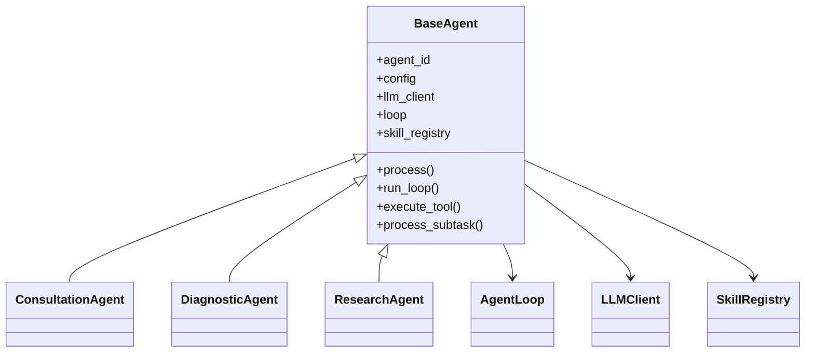

# medix-agent-swarm 代码阅读二：核心运行时、AgentLoop 与三个 Worker Agent

> 审查基线：提交 `8d516ade1228cb3a51b5c23740ff41684cca333e`，阅读日期 **2026-08-12**。  
> 本文目标：理解 `core/` 和 `agents/` 两层分别解决什么问题，以及一次 Worker 调用为什么能从普通输入变成“LLM 自主选择 Skill 的循环”。  
> 前置阅读：[01-完整请求链路与全部分支](./01-完整请求链路与全部分支.md)。

## 系列导航

| 文档 | 重点 |
|---|---|
| [01-完整请求链路与全部分支](./01-完整请求链路与全部分支.md) | 端到端主链和所有主要情况 |
| **本文** | `LLMClient`、`AgentLoop`、状态、BaseAgent 和三个 Worker |
| [03-Swarm协作与状态管理](./03-Swarm协作与状态管理.md) | 多 Agent 数据结构与并发 |
| [04-Skills知识库记忆研究与约束](./04-Skills知识库记忆研究与约束.md) | 工具和外围能力 |

---

## 1. 先把 `core/` 与 `agents/` 分开

| 层 | 负责什么 | 不负责什么 |
|---|---|---|
| `core/` | 模型通信协议、Agent 循环、工具注册/执行、运行状态 | 不定义“医疗咨询专家应该怎么说” |
| `agents/` | 角色 Prompt、能力标签、输入格式、结果后处理 | 不直接实现 OpenAI API，也不管理 Swarm 并发 |

最重要的依赖方向是：

```text
具体 Agent
  继承 BaseAgent
  复用 AgentLoop
  持有 LLMClient
  持有 SkillRegistry
```



---

## 2. `core/llm_client.py`：模型协议适配层

### 2.1 模块职责

`LLMClient` 的目标是把具体 OpenAI-compatible SDK 响应转成项目内部稳定结构。项目没有让 AgentLoop 直接操作 SDK 的 `ChatCompletionMessageToolCall`，而是定义了两个 dataclass：

```python
@dataclass
class ToolCall:
    id: str
    name: str
    arguments: Dict[str, Any]

@dataclass
class LLMResponse:
    content: Optional[str]
    tool_calls: List[ToolCall]
    finish_reason: str
```

这层抽象让 AgentLoop 只依赖 `content`、`tool_calls` 和 `finish_reason`，理论上以后可以替换底层模型客户端。

### 2.2 初始化

`LLMClient.__init__()` 当前只支持 `model_type="openai_compatible"`。它从工作区根 `config.py` 的 `LLM_CONFIG` 读取 `api_key`、`base_url`、`model_name`、`temperature` 和 `max_tokens`，再创建 `AsyncOpenAI`。

当前文件还有硬编码：

```python
sys.path.insert(0, '/Users/saintgeo/Desktop/self-learn/swarm')
```

这是旧机器路径，不应该作为可移植配置方案。更合理的是项目内配置模块、环境变量或通过构造参数注入配置。

### 2.3 `chat()`

`chat()` 用于普通文本生成。LeadAgent 的任务分解和结果汇总、Deep Research 的查询规划和证据综合都使用它。

调用步骤很直接：补默认 temperature/max_tokens，调用 `client.chat.completions.create()`，返回第一条 choice 的 message.content。异常只记录日志并重新抛出。

一个细节是：

```python
temperature = temperature or self.temperature
```

如果调用者显式传 `temperature=0`，Python 会把 0 当作 False，最终改用默认 temperature。这里应该使用 `if temperature is None` 才能保留合法的 0。

### 2.4 `chat_with_retry()`

这个方法只包装普通 `chat()`，最多三次指数退避；当前 AgentLoop 调的是 `chat_with_tools()`，没有使用该重试方法。因此，“LLM 工具调用自带三次重试”不是当前事实。

### 2.5 `chat_with_tools()`

该方法负责：

1. 构造模型、messages、温度、最大 token。
2. 只有 `tools` 非空时才发送 tools。
3. 只有 `tool_choice != "auto"` 时才显式发送 tool_choice。
4. 把 SDK tool calls 转成内部 `ToolCall`。
5. 返回 `LLMResponse`。

最关键的边界在参数解析：

```python
arguments=json.loads(tc.function.arguments)
```

模型 arguments 必须是合法 JSON。解析失败会让整个 `chat_with_tools()` 抛异常，而不是产生一个可恢复的 ToolCall 错误对象。

### 2.6 `create_tool_message()`

工具执行后，OpenAI 协议要求把结果作为 `role="tool"` 消息回传，并关联原 `tool_call_id`。这个方法统一生成：

```python
{
    "role": "tool",
    "tool_call_id": tool_call_id,
    "name": tool_name,
    "content": json.dumps(result, ensure_ascii=False),
}
```

因此测试 Fake LLM 不能只实现 `chat_with_tools()`；如果要覆盖工具路径，也必须实现 `create_tool_message()`。

### 2.7 模块边界总结

| 输入 | 输出 | 失败方式 |
|---|---|---|
| messages | 文本字符串 | API/SDK 异常重新抛出 |
| messages + tools | `LLMResponse` | API 异常、非法 JSON arguments 重新抛出 |
| 工具执行结果字典 | OpenAI tool message | `json.dumps()` 不可序列化时抛出 |

---

## 3. `core/state_manager.py`：单次 AgentLoop 的状态账本

### 3.1 `AgentState`

每次 `AgentLoop.run()` 都生成新的 task_id，并创建一个 `AgentState`：

| 字段 | 含义 |
|---|---|
| `task_id` | 本次 Loop 调用 UUID |
| `agent_id` | 正在运行的 Worker ID |
| `status` | PENDING、IN_PROGRESS、COMPLETED、FAILED |
| `iteration` | 当前 LLM 迭代次数 |
| `max_iterations` | 最大迭代数 |
| `input_data` | 原始输入字典 |
| `intermediate_results` | 每轮 LLM 的文本、tool_calls 和 finish_reason |
| `final_result` | 最终返回字典 |
| `error` | 失败原因 |

`should_continue()` 的条件是状态为 IN_PROGRESS、迭代次数未到上限，并且没有完成。

### 3.2 FAILED 也被视为 completed

`is_completed()` 返回：

```python
status in [COMPLETED, FAILED]
```

这个命名容易误解：它表达的是“终态”，不是“成功完成”。AgentLoop 后面用 `if not state.is_completed()` 判断是否需要强制总结，因此 FAILED 会阻止 fallback 总结。

### 3.3 `StateManager`

`StateManager` 只是一个进程内字典，提供 create/get/update/delete、查询活跃任务和清理 24 小时前状态。当前主链创建状态后不会删除，也没有定期调用 `cleanup_old_states()`；长时间运行的进程会持续累积状态对象。

### 3.4 两套同名 `TaskStatus`

项目中有两套状态枚举：

| 文件 | 作用域 | 状态 |
|---|---|---|
| `core/state_manager.py` | 一次 AgentLoop | pending/in_progress/completed/failed |
| `swarm/shared_context.py` | 一个 Swarm SubTask | pending/claimed/in_progress/completed/failed |

它们名字相同但类型不同，阅读日志和调试时必须先确认当前对象是 `AgentState` 还是 `SubTask`。

---

## 4. `core/agent_loop.py`：运行时核心

### 4.1 AgentLoop 管理哪些东西

`AgentLoop` 持有：最大迭代数、最大工具调用数、StateManager、ShortTermMemory、工具计数器，以及可选 Validator/AutoFixer。

它不持有具体 Prompt 或 Skills；这些通过传入的 Agent 获取：

```python
agent.get_system_prompt()
agent.get_tools_for_llm()
agent.execute_tool()
agent.post_process_result()
```

这就是“运行时”和“角色定义”分离的关键。

### 4.2 Loop 的完整伪代码

```text
create AgentState
state = IN_PROGRESS
messages = system + history + current_user
tools = agent.get_tools_for_llm()

while state.should_continue():
    iteration += 1
    response = llm.chat_with_tools(messages, tools)
    record intermediate result

    if response has tool_calls:
        if budget already exhausted:
            append "请直接回答"
            continue

        append assistant tool-call message
        for each tool_call:
            validate, but only warn
            result = agent.execute_tool(...)
            append role=tool message
        continue

    final_answer = response.content
    validate/fix output
    write memory
    result = agent.post_process_result(...)
    mark completed
    break

if state is neither COMPLETED nor FAILED:
    ask LLM for final answer with tools disabled

return state.final_result or {}
```

### 4.3 为什么工具结果必须回到模型

Skill 通常返回结构化字典，例如风险等级、检索内容或证据列表。这是 observation，不是最终自然语言。第二次 LLM 调用负责把 observation 与原问题、角色 Prompt 和其他工具结果结合，形成用户回答。

因此 AgentLoop 不是简单的：

```text
问题 → 函数 → 返回
```

而是：

```text
问题 → 模型决定调用 → 程序执行 → 模型解释结果 → 最终回答
```

### 4.4 工具调用消息协议

一次完整工具调用会在 messages 中形成：

```text
system
历史 user/assistant
当前 user
assistant(tool_calls=[...])
tool(tool_call_id=..., content=JSON结果)
assistant(最终回答或下一批 tool_calls)
```

如果测试只返回一个最终字符串，就没有覆盖工具协议；如果缺少 assistant 的 tool_calls 消息，有些兼容服务也会拒绝后续 tool message。

### 4.5 Harness 的实际执行位置

工具前调用 `validate_tool_call()`，输出后调用 `validate_output()`。但工具校验失败只打印 warning，仍然执行。输出校验只有 `auto_fixable` 非空时才调用 AutoFixer。

当前由于 `validation.auto_fixer` 文件名不匹配，AgentLoop 在 import 阶段把整个 Harness 关闭，连本来可以正常导入的 ConstraintValidator 也不会使用。

### 4.6 记忆写入

有 session_id 时，Loop 写入四种逻辑内容：当前 user message、assistant 的“调用工具：名称列表”、每个 tool 结果摘要、最终 assistant 文本。

但后续 `ShortTermMemory.get_history()` 只保留 user/assistant，所以 tool 结果本身不会进入下一轮会话历史；“调用工具：...” assistant 文本却会保留，形成不完整的历史协议。

### 4.7 工具预算的实现缺口

默认预算为 2。当前检查是：

```python
if tool_call_count >= max_tool_calls:
    ...
for tool_call in response.tool_calls:
    tool_call_count += 1
```

这只能阻止“进入本批之前已经耗尽”的情况，不能阻止当前一批超额。严格实现应在每个调用前检查剩余预算，或者只执行 `response.tool_calls[:remaining]`。

### 4.8 并发可重入性

`tool_call_count` 是 AgentLoop 实例字段，而不是 `run()` 的局部变量。Swarm 允许同一 Worker 的多个 SubTask 并发调用同一个 Loop，因此会出现：某个 run 刚归零，另一个 run 已经执行一次；两个协程交替增加计数；一个任务消耗另一个任务的预算。

`StateManager` 可以存多个状态，但可变计数器不具备请求隔离。

### 4.9 迭代异常

单轮异常不会立即终止；只要还没到 max_iterations，就继续下一轮。因为异常前可能没有更新 messages，这种重试通常只是对相同输入再次请求。

最后一轮异常会标记 FAILED，最终返回 `{}`。这和“最大迭代自然耗尽”不同；后者会尝试一次 tools=None 的强制总结。

### 4.10 空 content

`LLMResponse.content` 允许为 None。无 tool_calls 时，Loop 会把它交给 Validator 和 Agent 后处理。Consultation 的正则、Diagnostic 的字符串包含判断、Research 的 `count()` 都要求字符串；None 可能引发异常并进入重试。

---

## 5. `agents/base_agent.py`：模板方法层

### 5.1 构造流程

BaseAgent 构造时依次完成：保存 agent_id/config；创建 LLMClient；创建 AgentLoop；创建 SkillRegistry；调用子类 `register_tools()`；初始化 capabilities、SharedContext 和 IdentityManager 引用。

一个容易忽略的 Python 设计点是：父类 `__init__()` 中调用了可重写方法 `register_tools()`。这要求子类在调用 `super().__init__()` 前不要依赖尚未初始化的字段，否则可能出错。当前三个 Agent 的实现较简单，没有触发这个问题。

### 5.2 抽象方法

子类必须提供：

```text
def get_system_prompt(self) -> str
def register_tools(self)
```

Prompt 决定角色行为，register_tools 决定模型可见的工具集合。

### 5.3 统一运行入口

```text
process(input_data)
→ run_loop(input_data)
→ 从 input_data 取 session_id
→ AgentLoop.run(self, input_data, session_id)
```

因此具体 Agent 不需要自己写工具循环。

### 5.4 工具桥接

`get_tools_for_llm()` 把 Registry 转成 OpenAI schema；`execute_tool()` 把工具名和 arguments 交给 Registry。BaseAgent 本身不认识具体的 9 个 Skills。

### 5.5 默认输入格式

BaseAgent 的 `format_user_input()` 优先取 `question`，其次 `query`，否则 `str(input_data)`。它不会自动拼接 context、session_id、subtask_id 或 SharedContext。

### 5.6 Swarm 接口

`attach_shared_context()` 只是保存引用；`attach_identity_manager()` 也只是保存引用。BaseAgent 不会自动读取或使用它们。

`process_subtask()` 把 SubTask 转成 question/subtask_id/subtask_type 后运行 Loop，但没有传 session_id 和原始 context。这是 Swarm Worker 上下文缺失的直接位置。

---

## 6. `SkillRegistryMixin`：三个 Agent 为什么都有 9 个工具

三个 Agent 的 `register_tools()` 都调用 `register_all_skills()`。Mixin 会扫描 `.claude/skills/`，动态导入每个 Skill 函数，根据函数签名推断参数，然后注册到当前 Agent 自己的 Registry。

因此三个 Agent 在程序权限上几乎没有工具差异。角色差异主要来自 Prompt、capabilities 和后处理；YAML 的 allowed_tools 当前只是运行时 warning，不是注册层裁剪。

---

## 7. `ConsultationAgent`：面向用户的综合咨询角色

### 7.1 配置

默认 `max_iterations=5`、temperature=0.8，能力标签包括 general health advice、risk assessment 和 symptom triage。

### 7.2 Prompt

Prompt 强调通俗、实用、必要时就医、不能明确诊断，并要求输出 `【回答】`、`【核心建议】` 和 `【免责声明】`。

Prompt 说“最多使用 2–3 个 Skills”，但真正运行时 AgentLoop 默认 `max_tool_calls=2`；两者口径不完全一致，且前述批量 tool call 仍可突破 2。

### 7.3 输入格式

这是唯一重写 `format_user_input()` 的 Worker。它会把 session_id、context 的所有键值和用户问题拼入当前 user message。因此增强上下文在 Consultation 单 Agent 路径中最完整。

### 7.4 后处理

用正则从 `【核心建议】` 下提取编号列表，最多五条；从 `【免责声明】` 后提取一行文本，未匹配时补默认免责声明。

免责声明正则只使用 `(.+)`，不带 DOTALL，因此如果免责声明有多行，只提取第一行。

---

## 8. `DiagnosticAgent`：诊断推理角色

### 8.1 配置与能力

默认 max_iterations=5，能力标签是 symptom analysis、differential diagnosis、clinical reasoning 和 multi-system analysis。

### 8.2 Prompt

Prompt建议先 assess_risk，再 analyze_symptoms，需要时 disease_code 或 clinical_guideline；但这些只是给 LLM 的策略提示，程序不会强制工具顺序。

Prompt 还写“可以从 SharedContext 读取其他 Agent 结果”，当前代码并没有对应读取逻辑。

### 8.3 输入格式

没有重写 `format_user_input()`，所以当前消息只包含 question。单 Agent 路径传入的 context 不会出现在当前 user message；session_id 仍用于 AgentLoop 加载短期历史。

### 8.4 后处理

代码只做很粗的风险等级提取：只要最终文本包含“风险等级”，再按整个文本是否包含“高/中/低”判断。优先级是高→中→低，因此任意位置出现“高”都可能把结果判为 high，例如“高血压”也可能触发。

它无条件写入 `diagnosis_provided=True`，并不验证是否真的生成了鉴别诊断。

---

## 9. `ResearchAgent`：证据检索角色

### 9.1 配置与能力

默认 max_iterations=5，能力标签包括 literature search、evidence synthesis、fact checking、guideline lookup、deep research 和 latest information。

### 9.2 Prompt

Prompt优先建议 clinical_guideline，复杂或最新问题使用 deep_research，并要求证据等级和文献来源。同样，SharedContext 协作描述目前只是 Prompt 意图。

### 9.3 输入格式

与 Diagnostic 一样，只使用 question，不自动拼入当前 context。

### 9.4 后处理

证据等级只按文本中是否出现 A级/B级/C级判断，A 优先；`literature_count` 只是 `final_response.count("文献")`，不是实际来源数量。即使没有有效来源，也无条件写入 `evidence_provided=True`。

---

## 10. 三个 Agent 对照表

| 维度 | Consultation | Diagnostic | Research |
|---|---|---|---|
| 角色目标 | 健康咨询与建议 | 症状/鉴别诊断思路 | 指南和证据 |
| max_iterations | 5 | 5 | 5 |
| 默认 temperature | 0.8 | 从 LLM/Agent 默认读取，config 未显式设置 | 同 Diagnostic |
| 注册 Skills | 全部 9 个 | 全部 9 个 | 全部 9 个 |
| 当前 context 文本 | 会拼入 | 忽略 | 忽略 |
| session 历史 | 可由 Loop 注入 | 可由 Loop 注入 | 可由 Loop 注入 |
| 后处理 | suggestions、disclaimer | risk_level | evidence_level、文献词频 |
| 硬权限差异 | 无 | 无 | 无 |

需要注意 Diagnostic/Research 构造时 `config={}`，只 `setdefault('max_iterations',5)`，没有 model 字段。BaseAgent 使用 `config.get('model','openai_compatible')`，所以仍能正常选择默认模型；temperature 也在 Loop 中通过 `agent.config.get('temperature',0.7)` 回落到 0.7。

---

## 11. 对象生命周期与共享关系

### 11.1 每次请求新建

`process_with_swarm()` 每次新建 Coordinator，因此 LeadAgent、三个 Worker、三个 AgentLoop、三个 SkillRegistry、多个 LLMClient 都会新建。

### 11.2 进程内复用

ShortTermMemory 和 MedicalKnowledgeBase 使用类级单例；各 Skill 脚本还维护自己的 `_kb_instance`，但最终指向同一个 `MedicalKnowledgeBase` 单例。首次初始化选择的 db_path、embedding 模型和短期记忆 backend 会固定。

### 11.3 真正共享与“看起来共享”

| 对象 | 是否共享 | 范围 |
|---|---|---|
| Coordinator 的 ShortTermMemory | 是 | 三个 Worker，且进程内单例 |
| LeadAgent LLMClient | 只与 Coordinator 自己共享 | Lead 分解和汇总 |
| Worker LLMClient | 否 | 每个 Worker 各一份 |
| SharedContext | 是 | 当前 Swarm 请求的三个 Worker |
| AgentLoop | 否 | 每个 Worker 一份，但同 Worker 多任务共享 |
| SkillRegistry | 否 | 每个 Worker 各注册 9 个 |
| MedicalKnowledgeBase | 是 | 进程内单例 |

---

## 12. 关键代码风险

| 风险 | 位置 | 影响 |
|---|---|---|
| 硬编码旧 sys.path | `llm_client.py` | 配置导入不可移植 |
| `temperature or default` | `LLMClient.chat/chat_with_tools` | 无法显式使用 temperature=0 |
| tools 调用没有专用 retry | `AgentLoop` | 短暂 API 错误靠迭代次数间接重试 |
| arguments 必须是合法 JSON | `LLMClient` | 非法参数导致整轮异常 |
| tool budget 可批量突破 | `AgentLoop` | 成本和行为边界不严格 |
| tool_call_count 是实例字段 | `AgentLoop` | 同 Worker 并发任务互相污染 |
| FAILED 返回空字典 | `AgentLoop` | 上游可能缺少 answer |
| StateManager 不清理 | `AgentLoop` | 长运行进程累积状态 |
| Diagnostic 风险解析过粗 | `diagnostic_agent.py` | “高血压”等词可能误判 high |
| Research 文献数是词频 | `research_agent.py` | 不能作为真实证据数量 |
| 三个 Agent 都有全部工具 | `SkillRegistryMixin` | Prompt 角色不是权限边界 |

---

## 13. 如何用 Fake LLM 理解和测试 Loop

下面的 Fake 只模拟模型协议，不访问真实 API：

```python
import json
from core.llm_client import LLMResponse, ToolCall

class FakeLLMClient:
    def __init__(self, responses):
        self.responses = iter(responses)

    async def chat_with_tools(self, **kwargs):
        return next(self.responses)

    def create_tool_message(self, tool_call_id, tool_name, result):
        return {
            "role": "tool",
            "tool_call_id": tool_call_id,
            "name": tool_name,
            "content": json.dumps(result, ensure_ascii=False),
        }
```

预置响应：

```python
responses = [
    LLMResponse(
        content=None,
        tool_calls=[ToolCall(
            id="call-1",
            name="assess_risk",
            arguments={"symptoms": "胸痛、呼吸困难"},
        )],
        finish_reason="tool_calls",
    ),
    LLMResponse(
        content="【风险评估】高危，建议立即就医。",
        tool_calls=[],
        finish_reason="stop",
    ),
]
```

将 Fake 挂到有 `execute_tool()` 的 Agent 后，可以稳定观察 messages 如何从 user 增长为 assistant tool_calls、tool result 和 final assistant。进一步可构造：不存在的工具、非法参数字典、连续多轮工具、最后一轮异常、空 content 和一次三工具调用等场景。

---

## 14. 建议的代码阅读顺序

```text
core/llm_client.py
→ core/state_manager.py
→ core/agent_loop.py
→ agents/base_agent.py
→ agents/skill_registry_mixin.py
→ agents/consultation_agent.py
→ agents/diagnostic_agent.py
→ agents/research_agent.py
```

带着以下问题读：

1. 哪个模块定义协议，哪个模块定义角色？
2. ToolCall 从 SDK 对象变成内部对象，再变回 OpenAI message，经过了哪些转换？
3. AgentLoop 哪些状态是局部的，哪些却错误地挂在实例上？
4. Prompt 约束、工具注册和执行权限三者有什么差异？
5. 三个 Agent 的“专业差异”有多少来自代码，有多少只来自自然语言 Prompt？

下一篇将集中阅读 `swarm/`，解释为什么当前系统更接近中心化分配的并行黑板，而不是注释所说的完全去中心化群体智能。
