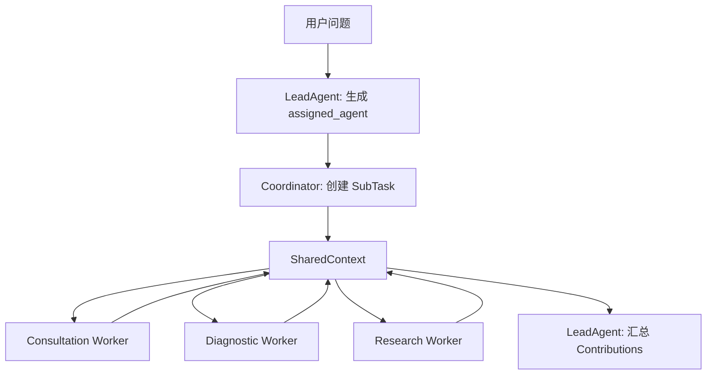
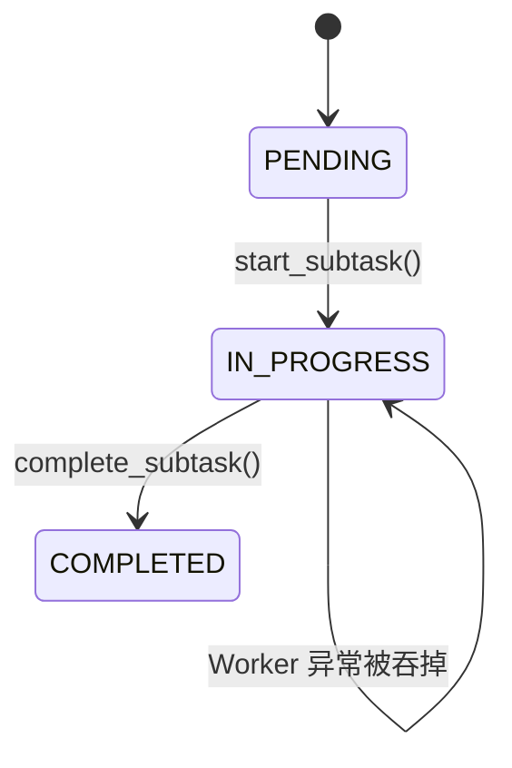
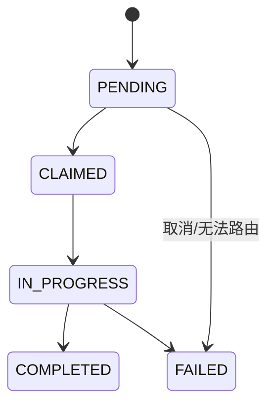

# medix-agent-swarm 代码阅读三：Swarm 协作、SharedContext、并发和状态管理

> 审查基线：提交 `8d516ade1228cb3a51b5c23740ff41684cca333e`，阅读日期 **2026-08-12**。  
> 本文目标：把 `swarm/` 目录的设计意图和真实执行行为分开，理解任务如何分解、分配、并行、汇总，以及失败和超时为何不能可靠收敛。  
> 前置阅读：[01-完整请求链路与全部分支](./01-完整请求链路与全部分支.md)、[02-核心运行时与Agent实现](./02-核心运行时与Agent实现.md)。

## 系列导航

| 文档 | 重点 |
|---|---|
| [01-完整请求链路与全部分支](./01-完整请求链路与全部分支.md) | 端到端请求 |
| [02-核心运行时与Agent实现](./02-核心运行时与Agent实现.md) | 单 Worker 内部运行时 |
| **本文** | Swarm 数据结构、任务分配、并行、事件、汇总、超时 |
| [04-Skills知识库记忆研究与约束](./04-Skills知识库记忆研究与约束.md) | 工具与外围模块 |

---

## 1. 先纠正一个架构名称

源码注释多次使用“去中心化”“Worker 自主认领”“没有中心控制节点”，但主链真实执行是：

```text
LeadAgent 生成 assigned_agent
→ Coordinator 把 SubTask 写入 SharedContext
→ 每个 Worker 查询 assigned_agent == 自己的任务
→ Coordinator 启动并等待全部 Worker
→ LeadAgent 汇总
```

更准确的定义是：

> **中心化 LLM 任务分配 + 固定 Worker 池并行执行 + SharedContext 黑板式记录 + 中心化 LLM 汇总。**

这并不意味着设计没有价值；它只是和“无中心、自主竞争认领、Agent 间多轮协商”的 Swarm 不同。



---

## 2. `LeadAgent`：两个 LLM 职责

LeadAgent 不继承 BaseAgent，没有 AgentLoop 和 SkillRegistry。它只通过普通 `LLMClient.chat()` 执行两类任务：请求前的分解，以及 Worker 完成后的汇总。

### 2.1 系统 Prompt 是路由规则的主要来源

Prompt 定义了三个 Worker 的定位，并要求尽量少分任务。它还明确要求输出：

```json
{
  "subtasks": [
    {
      "description": "具体任务",
      "assigned_agent": "consultation_agent"
    }
  ]
}
```

因此路由规则主要是自然语言约束，不是 Python if/else。`swarm_constraints.yaml` 的规则没有被 LeadAgent 调用。

### 2.2 注释与实现冲突

类注释写“不分配任务给特定 Agent”，但 Prompt 的核心职责正是“分析问题并分配给合适的 Worker Agent”，JSON 又包含 `assigned_agent`。`create_subtasks()` 也直接把该字段写入 SubTask。

阅读代码时应以数据结构和调用方为准，而不是以顶部注释为准。

### 2.3 `assess_and_decompose()` 的容错

| 阶段 | 实现 |
|---|---|
| 构造消息 | system Prompt + question/context |
| 调模型 | 普通 `chat()` |
| 提取 JSON | 贪婪正则 `\{.*\}` |
| 解析成功 | 原样返回字典 |
| 找不到 JSON | 返回一个 Consultation 降级任务 |
| 调用或解析异常 | 返回空 subtasks |

这里没有限制最大任务数，没有校验 agent ID，没有拒绝重复任务，也没有验证 description 是否为空。一个模型输出可以创建超过 YAML `max_parallel_tasks` 的任务，当前主链不会阻止。

### 2.4 `create_subtasks()`

该方法把字典转成强类型 SubTask。`type` 如果未提供，就推断为：

```text
{assigned_agent}_task
```

例如 `diagnostic_agent_task`。type 目前更多用于日志和最终汇总标签，并不参与 Worker 选择；Worker 只看 assigned_agent。

### 2.5 `wait_for_completion()` 没有进入主链

LeadAgent 实现了轮询 `is_all_subtasks_completed()` 的方法，默认 30 秒，但 Coordinator 实际使用 `asyncio.wait_for(asyncio.gather(...), 90)`，没有调用它。这是“已有组件”和“已生效流程”的典型区别。

### 2.6 汇总

LeadAgent 从 SharedContext 读取所有 Contributions，把 result 字典转成字符串拼入 Prompt，再要求 LLM 生成统一答案。它不做结构化冲突检测，也不验证某个结论来自哪个原始证据；冲突解决主要依赖 Prompt 中“综合所有观点”的要求。

---

## 3. `SubTask`：Swarm 的任务状态对象

### 3.1 字段

| 字段 | 用途 |
|---|---|
| `id` | UUID |
| `type` | 日志/分类标签 |
| `description` | Worker 实际看到的问题文本 |
| `assigned_agent` | 唯一指定 Worker ID |
| `status` | PENDING/CLAIMED/IN_PROGRESS/COMPLETED/FAILED |
| `result` | 完成或失败结果 |
| `dependencies` | 依赖任务 ID 列表，目前未使用 |
| 时间字段 | created/started/completed |

### 3.2 状态转换

实际主链只有：



数据类型定义了 CLAIMED 和 FAILED，但主链没有执行“认领”，Worker 异常时也没有调用 `fail()`。

理想状态应是：



### 3.3 `dependencies` 没有生效

`SubTask` 有 dependencies，但 `can_be_executed()` 只检查状态是否 PENDING；Coordinator 不检查依赖是否完成，也没有 sequential 调度。因此即使未来 LeadAgent 填了依赖，任务仍会立即并行。

---

## 4. `Contribution`：Worker 写入黑板的结果

一个 Contribution 包含 agent_id、subtask_id、result、timestamp、confidence 和 metadata。当前写入时 confidence 默认 1.0，Worker 没有根据实际结果调整；metadata 也为空。

`agent_contributions` 的结构是：

```python
Dict[str, List[Contribution]]
```

也就是先按 agent_id 分组。LeadAgent 汇总时再扁平化。`agents_involved` 只来自存在 Contribution 的 agent key，所以启动过但失败的 Agent 不会出现在参与列表中。

---

## 5. `Event` 与事件流

### 5.1 支持的类型

| EventType | 当前主链是否使用 |
|---|---|
| TASK_DECOMPOSED | 使用 |
| SUBTASK_STARTED | 使用 |
| SUBTASK_COMPLETED | 使用 |
| CONTEXT_UPDATED | `set_data()` 时使用，但主链很少调用 |
| SWARM_STARTED | 使用 |
| SWARM_COMPLETED | 使用 |
| AGENT_QUESTION | 未使用 |
| AGENT_ANSWER | 未使用 |

### 5.2 事件不是实时消息总线

`publish_event()` 只执行 `self.events.append(event)`；没有 asyncio Queue、订阅器、回调或唤醒机制。Worker 也不会轮询 `get_events()`。

所以当前 Event 更像**审计日志数据结构**，不是驱动 Agent 行为的事件总线。

### 5.3 target_agents

Event 支持 target_agents，`get_events()` 也可按 target 过滤；主链发布的事件基本没有使用 target_agents。AGENT_QUESTION/ANSWER 所需的点对点流程尚未实现。

---

## 6. `SharedContext`：当前黑板真正保存什么

### 6.1 五类数据

```text
data                  通用 key-value
 events                按时间追加的事件
 task_decomposition    subtask_id → SubTask
 agent_contributions   agent_id → Contributions
 memory_pool           临时数据池，当前主链未使用
```

### 6.2 它提供的任务 API

- `add_subtask()`：保存任务并发布 TASK_DECOMPOSED。
- `get_subtasks_for_agent()`：按 assigned_agent 和 PENDING 查询。
- `start_subtask()`：PENDING → IN_PROGRESS，发布 SUBTASK_STARTED。
- `complete_subtask()`：校验执行 Agent、标记完成、写 Contribution、发布 SUBTASK_COMPLETED。
- `get_all_completed_subtasks()`：只返回 COMPLETED。
- `is_all_subtasks_completed()`：必须所有任务都是 COMPLETED；FAILED 也会让它返回 False。

### 6.3 它没有提供的运行保障

没有锁、事务、并发冲突控制、任务 lease、重试次数、取消状态和幂等键。当前单线程 asyncio 下多数字典操作是顺序执行的，但未来多线程/多进程或真正分布式 Worker 不能直接复用这份内存对象。

### 6.4 `get_summary()`

返回会话 ID、事件数、任务数、完成任务数、产生 Contribution 的 Agent 数和 Agent ID。它不包含失败/超时任务数、每个状态分布、重试、工具次数或质量指标。

---

## 7. `SwarmCoordinator`：真实的编排者

虽然文件注释强调“不是编排器”，但它实际承担了大量编排责任：初始化 Worker 池、决定单/多 Agent、创建 SharedContext、启动协程、设置整体超时、等待 Worker、调用汇总、保存总结和构造返回对象。

### 7.1 `_process_with_swarm()` 的顺序

```text
创建 SharedContext
→ attach 到所有 Worker
→ 发布 SWARM_STARTED
→ LeadAgent.create_subtasks
→ 为三个 Worker 创建扫描协程
→ wait_for(gather, timeout=90)
→ LeadAgent.synthesize_results
→ SessionSummary.from_shared_context
→ Mem0 add_session_summary
→ 发布 SWARM_COMPLETED
→ 构造 result
```

### 7.2 为什么总是启动三个 Worker

Coordinator 不根据 assessment 只启动参与者，而是遍历固定 worker_pool。没有任务的 Worker 查询为空后立即返回。这种实现简单，但 Worker 数量扩大时会产生不必要协程；真正分布式场景通常会按任务投递到对应队列。

### 7.3 Worker 扫描器

`_worker_execute_assigned_tasks()` 先获取该 Agent 的全部 PENDING 任务，然后逐个调用 `start_subtask()`，再把每个任务包装成 asyncio task，最后 gather。

任务在真正协程执行前就已被批量标为 IN_PROGRESS。若后续创建任务、事件循环或 Agent 执行出现问题，状态可能已经变化而没有恢复。

### 7.4 异常被两层吞掉

`_execute_single_subtask()` 捕获 Worker 异常只打印日志；外层 Worker 扫描器也捕获异常；gather 又使用 `return_exceptions=True`。这些层共同导致错误难以传播到 Coordinator。

结果是：Coordinator 可能认为等待已经结束，但 SharedContext 中有 IN_PROGRESS 任务且没有 Contribution。

---

## 8. 并发模型

### 8.1 第一层并发：不同 Worker

三个 Worker 扫描器同时运行。若 LeadAgent 分别分配一个任务，就形成三个独立 AgentLoop 并发。

### 8.2 第二层并发：同一 Worker 的多个任务

同一 Worker 的所有任务也同时运行。于是并发拓扑可能是：

```text
Consultation Worker
  ├── subtask A AgentLoop.run
  └── subtask B AgentLoop.run

Diagnostic Worker
  └── subtask C AgentLoop.run

Research Worker
  ├── subtask D AgentLoop.run
  └── subtask E AgentLoop.run
```

同一 Worker 的任务共享 LLMClient、AgentLoop、SkillRegistry 和 tool_call_count。LLMClient/AsyncOpenAI 通常可并发请求，但 AgentLoop 的可变计数没有隔离。

### 8.3 没有读取依赖

所有任务都并行开始，不考虑 `dependencies`，也不根据另一 Agent 的 Contribution 生成后续输入。所谓“Diagnostic 结果给 Research 使用”只写在 Prompt 中，当前执行顺序不支持这一点。

---

## 9. 超时、取消与状态不一致

### 9.1 整体超时而非单任务超时

90 秒覆盖整个 `gather`。没有为某个 Skill、某个 LLM 调用或某个 SubTask 单独设置 timeout；任何一个未完成任务都可能让整个 Swarm 等到 90 秒。

### 9.2 `wait_for` 的取消

超时时，`wait_for` 会取消 gather，取消会传播给尚未完成的 Worker task。代码没有捕获 `asyncio.CancelledError` 并调用 SubTask.fail/cancel，所以取消后的任务通常仍是 IN_PROGRESS。

### 9.3 超时日志 bug

```python
claimed_tasks = [
    (subtask.assigned_to, subtask.type)
    for subtask in ...
    if subtask.status.value == "claimed"
]
```

主链没有 CLAIMED，因此通常为空；如果未来启用 CLAIMED，`assigned_to` 又不存在，会引发二次异常。正确字段是 `assigned_agent`。

### 9.4 汇总遗漏 IN_PROGRESS

LeadAgent 构造 timeout_note 时只检查 pending/claimed。被取消或失败后停留 IN_PROGRESS 的任务不会列入“未完成模块”。最终回答可能说“基于部分结果”，却没有准确指出缺了什么。

---

## 10. 汇总与冲突处理

### 10.1 当前冲突处理策略

`swarm_constraints.yaml` 写 `lead_agent_decides`，实际也是把所有结果交给 LeadAgent LLM 统一写作。没有程序化比较：风险等级冲突、指南版本冲突、两个 Agent 对同一疾病的概率差异或来源质量差异。

### 10.2 结果字符串化

Contribution.result 是字典，但汇总 Prompt 中通过 f-string 变成 Python 字典文本。没有明确 schema、字段解释或大小限制。某个 Skill 返回很长内容时，可能放大汇总 Prompt。

### 10.3 汇总失败

汇总 LLM 异常不会抛回 Coordinator，而是转成：

```text
汇总结果时出错：{exception}
```

Coordinator 仍把这段文本作为 `answer`，继续写 SessionSummary 和长期记忆。这会把基础设施错误当成正式会话答案保存。

---

## 11. SessionSummary：审计资产，而不是学习闭环

`SessionSummary.from_shared_context()` 读取完成的 Contributions，记录 Agent、任务数、事件数、最终答案和少量关键发现。

当前限制：

| 字段 | 当前口径 |
|---|---|
| tool_calls | 成功 Contribution 数，不是真实工具次数 |
| execution_time | 总时间 / 参与 Agent 数，不是真实每 Agent 时间 |
| key_findings | 只提取 result 中的 risk_level |
| lessons_learned | 固定空列表 |
| context | 固定空字典 |
| parallel_efficiency | 固定 0.8 |
| information_coverage | 固定 0.9 |
| redundancy | 固定 0.15 |

`load_summary()` 固定返回 None；`search_similar_sessions()` 只按文件修改时间返回最近 Markdown。它不是当前长期记忆检索链路，Mem0 才是 Coordinator 使用的跨会话搜索。

---

## 12. “设计意图—已有组件—真实行为”对照

| 主题 | 设计意图/注释 | 当前真实行为 |
|---|---|---|
| 任务分配 | Worker 自主认领 | LeadAgent 直接指定 assigned_agent |
| 能力匹配 | 根据 capabilities 匹配 | capabilities 不参与 Coordinator 路由 |
| 事件通信 | Agent 通过事件问答 | 事件只被追加，无消费循环 |
| 黑板协作 | Worker 读取其他结果 | Worker 不读取 Contributions |
| 顺序执行 | dependencies/sequential | 未实现，全部并行 |
| Debate | Agent 辩论达成共识 | 仅 YAML 条目 |
| 失败状态 | SubTask.fail() | 主链异常时未调用 |
| 超时配置 | YAML timeout_seconds | 代码硬编码 90 秒 |
| 最大并行任务 | YAML max_parallel_tasks=5 | 未校验 |
| 持续进化 | Identity + Summary | Identity 未接入，Summary 指标多为占位 |

---

## 13. 如果要把当前 Swarm 修成可靠的黑板系统

### 13.1 P0：保证任务状态收敛

在 `_execute_single_subtask()` 捕获异常时调用 `subtask.fail()` 并发布失败事件；超时时给未完成任务设置 CANCELLED/TIMED_OUT，而不是保留 IN_PROGRESS。汇总和返回对象应带完整状态分布。

### 13.2 P0：校验 LeadAgent 输出

使用明确 schema 校验 `subtasks`、description、agent ID、任务数量和重复；未知 Agent 在进入 SharedContext 前就降级或拒绝。执行 `get_required_agents()` 和分解约束，而不是只在 YAML 中声明。

### 13.3 P1：隔离每个任务的运行状态

AgentLoop 的工具计数改成 `run()` 局部变量；如果同 Worker 并发不必要，可以串行执行同 Agent 任务，或为每个任务创建独立 Loop context。

### 13.4 P1：真正利用 SharedContext

给 Worker Prompt 显式注入原始问题、enhanced_context、已完成 Contributions 和依赖结果；或者实现事件订阅，让 Research 在 Diagnostic 完成后再执行。只有数据被调用方读取，黑板才参与决策。

### 13.5 P1：分层超时

至少区分：LLM 请求 timeout、Skill timeout、SubTask timeout 和整次 Swarm timeout；支持取消传播和结构化错误码。

### 13.6 P2：让事件成为可消费流

可使用 `asyncio.Queue` 或持久消息队列，记录 cursor/offset，允许 Worker 等待特定事件。否则 Event 继续保留为审计日志即可，不应描述成异步通信机制。

---

## 14. 调试 Swarm 时最值得打印的字段

| 阶段 | 字段 |
|---|---|
| Lead 输出 | 原始文本 hash、JSON 解析结果、subtask 数、agent ID 集合 |
| 创建任务 | subtask_id、assigned_agent、type、description 长度 |
| 开始执行 | subtask_id、状态前后、worker_id、task_id |
| Worker 完成 | result keys、耗时、是否 success、工具次数 |
| Worker 失败 | 异常类型、状态是否已进入 FAILED |
| 超时 | pending/in_progress/failed/completed 数量、取消结果 |
| 汇总 | Contribution 数、缺失任务、Prompt token 估算 |
| 返回 | agents_involved、subtasks_completed、timeout、answer 是否为空 |

日志中不要直接打印完整病历、Mem0 内容、API key 或未经脱敏的用户信息。

---

## 15. 阅读顺序与自检

推荐：

```text
swarm/shared_context.py
→ swarm/events_*.py
→ swarm/lead_agent.py
→ swarm/swarm_coordinator.py
→ memory/session_summary.py
→ constraints/swarm_constraints.yaml
```

读完后应能回答：

1. 为什么 assigned_agent 证明当前不是自主认领？
2. 为什么 Event 已经存在，却仍不能称为事件驱动协作？
3. 同一 Worker 被分两个任务时，共享了哪些可变对象？
4. 为什么 Worker 异常会让状态停留 IN_PROGRESS？
5. 为什么 CLAIMED、FAILED、dependencies 都是“数据结构存在，主链没用完整”？
6. 为什么 SessionSummary 不能用来证明并行效率提升 80%？

下一篇将阅读所有外围能力：Skill 自动发现、九个工具、Milvus RAG、短期/长期记忆、Deep Research 和 Harness。
