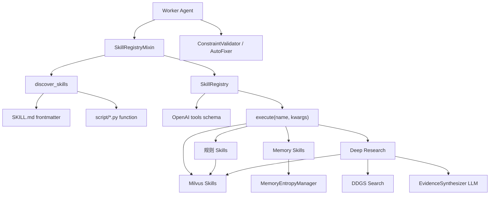

# medix-agent-swarm 代码阅读四：Skills、Milvus、Memory、Deep Research 与 Harness

> 审查基线：提交 `8d516ade1228cb3a51b5c23740ff41684cca333e`，阅读日期 **2026-08-12**。  
> 本文目标：理解模型最终能调用哪些能力，这些能力如何从目录变成 OpenAI tools，以及知识库、记忆、网络研究和约束模块哪些已经进入主链、哪些仍是原型。  
> 前置阅读：[01-完整请求链路与全部分支](./01-完整请求链路与全部分支.md)、[02-核心运行时与Agent实现](./02-核心运行时与Agent实现.md)、[03-Swarm协作与状态管理](./03-Swarm协作与状态管理.md)。

## 系列导航

| 文档 | 重点 |
|---|---|
| [01-完整请求链路与全部分支](./01-完整请求链路与全部分支.md) | 请求主线 |
| [02-核心运行时与Agent实现](./02-核心运行时与Agent实现.md) | Agent 内部循环 |
| [03-Swarm协作与状态管理](./03-Swarm协作与状态管理.md) | 多 Agent 并发 |
| **本文** | Skills、RAG、Memory、Research、Harness 和测试边界 |

---

## 1. 外围模块全景



当前有 9 个 Skill 目录：7 个医疗/研究能力加 2 个记忆能力。三个 Worker 都自动注册全部 9 个。

---

## 2. 一个 Skill 如何从文件变成模型工具

### 2.1 目录约定

每个 Skill 目录类似：

```text
.claude/skills/search-knowledge/
├── SKILL.md
└── script/
    ├── __init__.py
    └── search.py
```

自动发现依赖三条约定：存在 `SKILL.md` 或 `skill.md`；存在 `script/`；目录名 kebab-case 转 snake_case 后，脚本中存在同名函数。例如 `search-knowledge` 必须提供 `search_knowledge()`。

### 2.2 `SKILL.md` 的作用

Loader 只解析 YAML frontmatter，当前主要使用 `description`。正文中的 When to Use、调用示例和返回格式不会自动进入 OpenAI schema，也不会被运行时读取。

也就是说，以下内容是给人和 Agent 开发环境看的说明，不是当前 Python 主链的可执行配置：

```markdown
## When to Use
## 底层实现
## 调用方式
```

### 2.3 动态导入

`discover_skills()` 遍历 Skill 子目录，选择 `script/` 下第一个非 `__init__.py` 的 Python 文件，再通过 `importlib.util.spec_from_file_location()` 执行模块顶层代码。

当前每个目录只有一个主要脚本，结果稳定；如果未来放多个 Python 文件而不排序，“第一个文件”会依赖目录迭代顺序。更稳妥的契约应在 frontmatter 中显式声明入口模块和函数。

动态导入会执行模块顶层副作用。当前大部分 Skill 把 Embedding/Milvus 初始化放在 `get_knowledge_base()` 中，发现阶段不会立即加载模型；但以后新增 Skill 时要警惕 import 阶段网络请求或大模型加载。

### 2.4 参数推断

Mixin 使用 `inspect.signature()`，规则非常简单：无默认值即 required；参数名含 count/limit/max/iterations 即 JSON Schema `number`；其余全部是 `string`。

例如：

```text
async def clinical_guideline(query: str, max_results: int = 1)
```

会生成大致：

```json
{
  "query": {"type": "string"},
  "max_results": {"type": "number"}
}
```

当前推断没有读取类型注解，所以 int 被表达成 number 而不是 integer，也不能正确表达 List、Dict、Enum、Optional、嵌套对象和默认值。

### 2.5 Registry 注册和执行

`SkillRegistry.register()` 保存函数、描述、参数和 `is_async`。`to_openai_format()` 生成标准 tools；`execute()` 对 async 函数直接 await，对 sync 函数放进默认线程池。

不存在的工具或执行异常都会转成 `success=False` 字典，而不是抛给 AgentLoop。这让 LLM 有机会根据错误恢复，但也可能掩盖真正的基础设施故障，必须在日志和指标中区分业务失败与系统失败。

---

## 3. 9 个 Skills 的能力地图

| Skill | 主要输入 | 核心实现 | 外部/重资源依赖 |
|---|---|---|---|
| `search_knowledge` | query、max_results | Milvus 语义检索 | BGE + Milvus Lite |
| `recommend_lifestyle` | diagnosis | 按 lifestyle 类型检索 | BGE + Milvus Lite |
| `assess_risk` | symptoms | 关键词规则 + 可选 RAG | 可延迟加载 Milvus |
| `analyze_symptoms` | symptoms | 症状分类规则 + 疾病映射 + RAG | 可延迟加载 Milvus |
| `disease_code` | disease_name | disease_classification 检索 + 简单解析 | BGE + Milvus Lite |
| `clinical_guideline` | query、max_results | clinical_guideline 类型检索 | BGE + Milvus Lite |
| `deep_research` | query、max_iterations | 查询规划 + Web + Milvus + LLM 综合 | 网络、BGE、LLM |
| `search_history` | session_id、limit | ShortTermMemory | 进程内存或 Redis |
| `search_similar_cases` | query、max_results | LongTermMemory/Mem0 | Mem0 服务 |

所有 Agent 都可见全部 9 个。YAML 只定义推荐 allowed_tools；调用超出列表时 Validator 返回 warning，AgentLoop 仍执行。

---

## 4. 规则与 RAG 混合 Skills

### 4.1 `assess_risk`

处理流程：按逗号切症状；匹配高风险短语；未命中时检查“持续/加重/反复/严重/剧烈”；生成 low/medium/high；最后尝试用原症状检索一条 Milvus 补充建议。

当前代码虽然有 emergency 显示映射，但规则不会把 `risk_level` 设为 emergency。高风险规则也只是字符串包含，无法理解否定、时间和主体，例如“否认胸痛”仍可能命中胸痛。

Milvus 失败被捕获，规则结果仍返回，所以这是“规则主结果 + RAG 可选增强”。

### 4.2 `analyze_symptoms`

先把关键词映射到呼吸、消化、神经、心血管和骨骼肌肉系统，再根据类别扩展一组可能疾病，最多五个；对前三个疾病分别查一条 Milvus 说明。

疾病去重使用 `list(set(...))`，集合无稳定顺序，导致“前三个疾病”以及随后的 KB 查询顺序可能在不同进程中变化。结果只是模式关联，不是概率模型或临床诊断。

### 4.3 风险与症状结果如何回到 Agent

两个 Skill 都返回 `answer` 加结构化字段。AgentLoop 会把整个字典 JSON 序列化成 tool message；模型可以使用 risk_level、possible_diseases、kb_insights，也可能只阅读 answer。项目没有强制模型必须引用结构化字段。

---

## 5. 纯 Milvus 检索 Skills

### 5.1 `search_knowledge`

不加类型过滤，返回 top K。它把每个结果的 content、metadata 和 score 格式化为“结果 1/2/3”。当 score > 0 时才显示百分比，但当前 score 的语义本身需要校验。

### 5.2 `recommend_lifestyle`

查询文本自动追加“生活方式建议 饮食 运动 用药”，并过滤 `type="lifestyle"`。只取 top 1，score > 0.1 才认为命中。返回 categories 固定包含 diet/exercise/lifestyle/medication，并不是从文档解析出的实际类别。

### 5.3 `disease_code`

过滤 disease_classification，先从 metadata 取 `icd10_code`，没有时再从内容中查找“ICD-10编码：”。当前导入脚本的 metadata 默认并没有写 icd10_code，所以多数情况下依赖文本解析。

### 5.4 `clinical_guideline`

过滤 clinical_guideline，默认只返回一条。它期望 metadata 中有 organization/year，但导入脚本只固定写 type、disease、source 和 filename；除非现有数据库数据另有字段，否则发布机构和年份通常是 N/A。

### 5.5 共同风险

四个 Skill 都依赖 `score > 0.1/0.5`。如果 `MedicalKnowledgeBase.search()` 对 Milvus COSINE 返回值做了错误的 `1 - distance` 转换，阈值判断、结果展示和排序含义都会受影响。

---

## 6. `MedicalKnowledgeBase`：Milvus Lite RAG 主实现

### 6.1 单例和初始化

`MedicalKnowledgeBase` 使用类级单例，第一次初始化会固定 db_path、collection 和 embedding 模型。默认相对路径是：

```text
./knowledge/data/milvus_lite.db
```

相对路径基于当前工作目录，不是基于 `milvus_kb.py` 文件位置。从错误目录启动可能创建或连接另一份数据库。主程序应统一工作目录或使用绝对路径计算。

### 6.2 Embedding 模型

优先搜索 Hugging Face 本地缓存中的 `BAAI/bge-small-zh-v1.5` snapshots，并按文件修改时间选择“最新”目录；否则按模型 ID 下载。它不固定 revision，也不记录当前数据库向量对应的模型版本。

模型固定在 CPU。第一次相关 Skill 调用可能产生显著下载和加载延迟。

### 6.3 Collection

如果不存在就创建 `medical_knowledge`，metric_type=COSINE、auto_id=True。auto_id 使每次 insert 都生成新 ID。

### 6.4 文档分块

按字符长度切块，默认 1024，overlap 100。不会识别 Markdown 标题、句子或医学章节边界。每个 chunk 的 metadata 增加 doc_id、chunk_id 和 total_chunks。

### 6.5 导入不是幂等的

`add_documents()` 直接 insert，没有按 `doc_id + chunk_id` 查重或 upsert。仓库已包含 Milvus DB，再运行 importer 可能重复插入相同内容。

### 6.6 类型过滤

metadata 被存成 JSON 字符串。过滤类型时构造：

```text
metadata like "%\"type\": \"clinical_guideline\"%"
```

这比把 type 作为独立字段更脆弱，也不利于索引和 schema 校验。

### 6.7 score 语义

当前格式化：

```python
score = 1 - hit["distance"]
```

对于不同 Milvus/PyMilvus 版本，名为 distance 的字段可能表示距离，也可能在 COSINE 下具有“越大越相似”的分数语义。不能仅凭字段名判断。最小验证应使用完全相同、明显相关、无关三组文本，观察原始值和排序，再决定是否做 `1-x`。

### 6.8 `count_documents()`

使用 `describe_collection()` 尝试读取 `num_entities`，源码自己也注明 Milvus Lite 可能不准确。因此它是 best effort，不适合做严格导入校验。

---

## 7. 知识导入脚本

`import_hardcoded_data.py` 读取 `knowledge/data/documents/*.txt`，根据文件编号分类：01–09 lifestyle，10–19 disease_classification，20–29 clinical_guideline，其他 general。

文档 ID 是 `{doc_type}_{filename}`，但 Milvus collection 使用 auto_id，因此这个 ID 只进入 chunk metadata，不成为数据库主键。

导入完成后脚本还会执行三个真实检索测试。它不是纯数据转换命令，运行时会加载 Embedding 模型、连接数据库、写入数据并查询。重复执行前应先统计/备份，避免重复 chunk。

---

## 8. ShortTermMemory：会话内消息

### 8.1 两个 backend

memory 存在进程字典；redis 使用 `session:<session_id>`，TTL 3600 秒。Redis 连接失败会降级 memory。

### 8.2 单例带来的后果

第一次创建后 `_initialized` 阻止后续配置。若先用 memory 初始化，再调用 `ShortTermMemory(storage_type="redis")`，仍然返回原 memory 实例，不会切换 backend。测试之间也会共享 sessions，除非显式 clear。

### 8.3 消息结构

每条消息保存 role、content 和 timestamp。AgentLoop 可能写 user、assistant、tool。

### 8.4 `get_recent_messages()` 的“自动清理”

它取最近消息后调用 entropy manager 去重/压缩，但只返回清理后的列表，没有把结果写回 `ConversationHistory.messages`。因此这是读取视图清理，不是真正持久垃圾回收。

### 8.5 `get_history()`

先取 `limit*2` 条，再只保留 user/assistant。后果是：tool result 被丢弃；压缩器生成的 system 历史摘要也被丢弃；assistant 的“调用工具：...”仍保留。长期对话中，较早消息可能不是被“摘要后送给模型”，而是摘要被过滤、只剩最近 user/assistant。

### 8.6 `search_history` Skill

该 Skill 重新获取 ShortTermMemory 单例，并按 session_id 查询。单 Agent 模式中模型可能从 Consultation 当前 Prompt 看到 session_id；Diagnostic/Research 当前输入不包含 session_id 文本，模型未必知道该必需参数。Swarm Worker 的 `process_subtask()` 更没有 session_id，因此该 Skill 在 Swarm 中很难正确调用当前会话历史。

---

## 9. LongTermMemory：Mem0 跨会话记忆

### 9.1 初始化降级

Mem0 包不存在、配置缺失或客户端初始化失败时，`enabled=False`。Coordinator 和 `search_similar_cases` 会返回空结果/未启用说明，主问答继续运行。

### 9.2 保存内容

会话结束后保存：

```text
问题：完整 question
回答：answer 前 500 字...
```

metadata 包含 session_id、timestamp、mode 和耗时等。

### 9.3 固定 user_id

添加和搜索都使用 `user_id="medix_user"`。在多用户服务中会把所有人写入同一个逻辑记忆空间，形成严重的跨用户隐私和上下文污染风险。

### 9.4 去重数据契约 bug

Mem0 格式化结果使用 `content`；`deduplicate_sessions()` 却读取 `question` 和 `summary`。这些字段通常为空，于是不同结果都可能哈希成同一个空内容，错误地只保留第一条。

### 9.5 `search_similar_cases` Skill

创建新的 LongTermMemory 包装器，但后端仍是同一 Mem0 用户空间。结果会显示相似度、内容前 300 字和 timestamp。它不是经过医学审核的“病例库”，只是历史会话文本搜索。

---

## 10. MemoryEntropyManager：工程清理器，不是信息论熵

### 10.1 消息去重

使用 `md5(role:content)` 检测完全重复，注释说“保留最新”，实际按输入顺序保留第一次出现的消息。

### 10.2 压缩

超过 max_messages 后，保留最近消息；较早消息寻找 user/assistant 配对，并截取前 50/100 字生成 system 摘要。这是字符串截断，不调用 LLM，也不验证摘要忠实性。

### 10.3 熵估算

指标只有消息数、完全重复率和平均长度。high/medium 主要由数量阈值决定，不是 Shannon entropy。

### 10.4 过期清理

`cleanup_old_memories()` 可按 timestamp 移除旧数据，但当前 ShortTermMemory/LongTermMemory 主链没有自动调用它。

---

## 11. Deep Research：多源检索与 LLM 综合

### 11.1 Skill 包装层

`deep_research(query, max_iterations=2)` 创建 `DeepResearchWorkflow`，但没有调用真正的 `research_with_refinement()`。参数 max_iterations 被换算成：

```text
max_web_results = max_iterations * 5
max_kb_results  = max_iterations * 3
```

所以它实际控制结果预算，不是迭代轮数。

### 11.2 查询规划

Workflow 先让 LLM 将问题拆为 2–3 个子查询。调用失败则使用原问题。解析只是按行去编号，最多保留三条。

### 11.3 并行搜索

对最多三个子查询，同时创建 Web Search 和 Milvus 搜索协程，使用 `gather(return_exceptions=True)`。单个搜索失败会被跳过，其他来源继续。

### 11.4 Web Search 主链

`WebSearchTool.search()` 尝试 bing、duckduckgo、auto 后端，并重试；查询自动追加“医学”。虽然类中实现了医学域名白名单、网页抓取和 `search_with_content()`，Workflow 主链只调用基础 `search()`，没有域名过滤，也不抓取全文。

因此 EvidenceSynthesizer 主要看到标题、URL 和 snippet，不是已验证的论文正文。

### 11.5 Milvus 主链

Workflow 直接使用 `knowledge.milvus_kb.MedicalKnowledgeBase`。`research/knowledge_base.py` 中的 Qdrant/内存 KnowledgeBase 是另一套原型，不是当前 Deep Research 主链。

### 11.6 EvidenceSynthesizer

把前五条 Web 结果和前五条 KB 结果写进 Prompt，再要求 LLM 输出关键发现、A/B/C、来源、置信度、冲突、总结和建议。

证据等级和置信度由 LLM 根据片段自报，不是程序读取研究设计、样本量、偏倚风险或 GRADE 元数据计算。

### 11.7 解析器边界

关键发现/建议/冲突只读取以 `-` 开头的行；模型使用编号列表时可能解析为空。置信度正则主要识别小数，输出 `80%` 可能无法解析，report.confidence 留在默认值。

来源列表由程序根据输入结果重新收集，不依赖 LLM 的“信息来源”段落；但 Skill 最终格式只显示来源数量，不逐条展示 URL。

---

## 12. Harness：约束、验证和自动修复

### 12.1 当前启动状态

AgentLoop 在一个 try 中同时导入 ConstraintValidator 和 AutoFixer。`validation/__init__.py` 当前引用不存在的 `auto_fixer.py`，所以整个 try 失败，`CONSTRAINTS_ENABLED=False`。修复文件名后，下面逻辑才会运行。

### 12.2 YAML 的角色

`agent_constraints.yaml` 定义能力、allowed_tools、forbidden_actions 和 output_constraints；`swarm_constraints.yaml` 定义任务数、必选 Agent、并行限制、超时、质量控制和协作模式。

YAML 只是数据。只有被 Validator 读取且被调用方执行的规则才生效。

### 12.3 工具校验

`validate_tool_call()` 检查 tool_name 是否在 allowed_tools，失败返回 warning severity。AgentLoop 收到 invalid 只记录日志，仍调用工具。这是推荐列表，不是安全权限。

### 12.4 输出校验

当前真正实现：Consultation 免责声明和最大长度；Diagnostic 高危词是否建议就医；Research 是否出现指南/文献/研究；部分明确诊断短语；部分药物剂量模式。

YAML 中尊重语气、解释术语、不制造恐慌、事实观点区分等没有通用执行器。

### 12.5 AutoFixer

主链可触发的 auto_fixable 只有 add_disclaimer 和 add_emergency_warning。`fix_excessive_length()` 和 `remove_diagnosis_statements()` 虽然存在，但 Validator 没把对应违规加入 auto_fixable，AgentLoop 不会调用它们。

### 12.6 Swarm 约束未接入

`validate_task_decomposition()` 和 `get_required_agents()` 没被 LeadAgent/Coordinator 调用。`max_agents_per_task`、`max_parallel_tasks`、sequential 和 debate 也不影响执行；90 秒来自代码硬编码。

---

## 13. AgentIdentity 与 SessionSummary 的位置

### 13.1 AgentIdentity

可以记录 capabilities、协作次数和工具统计并保存 IDENTITY.md，但 Coordinator 没创建 AgentIdentityManager，也没给 Worker 调用 `attach_identity_manager()`。from_markdown 还是简化实现，只返回空能力列表。

所以它是“持续进化”的原型接口，不是当前在线学习机制。

### 13.2 SessionSummary

只在 Swarm 结束后写本地 Markdown；关键指标多为占位，加载固定返回 None，相似搜索只按文件时间。它适合审计演示，不是训练数据闭环或真实性能系统。

---

## 14. 测试脚本该怎样理解

`examples/test_all.py` 定义 26 个异步测试函数，但它是自定义集成脚本，不是隔离的 pytest 套件。很多测试会调用真实 LLM、网络、Milvus 或 Mem0，并共享单例和本地文件。

报告模板中大量阶段状态直接写成 ✅，即使某一具体测试失败，模板中的子项仍可能显示成功。模板还保留旧口径：7 个 Skills、自主认领、Qdrant 是 DeepResearch 主库等，与当前主链不一致。

因此：

```text
定义了 26 个测试函数
≠ 当前快照可导入
≠ 26 个都执行
≠ 26 个都通过
≠ 报告中的每个能力声明都被断言证明
```

更可靠的顺序是先修复 import，再运行纯数据结构/规则测试，再使用 Fake LLM 测 Loop，最后才运行外部集成。

---

## 15. 运行时成本与降级表

| 能力 | 首次成本 | 失败后行为 |
|---|---|---|
| 普通 LLM | API 连接 | 多数主链抛错或 Lead 降级为空任务 |
| BGE/Milvus | 模型下载、CPU RAM、DB 打开 | Skill 可能返回失败字典或局部规则结果 |
| Mem0 | 包、配置、网络 | LongTermMemory disabled，主链继续 |
| Redis | Redis 服务 | 自动回退内存 |
| DDGS | 网络和搜索包 | 返回空搜索结果 |
| EvidenceSynthesizer | 额外 LLM 请求 | 返回 summary=综合失败的空报告 |
| Harness | YAML + AutoFixer import | 当前整体关闭；修复后违规多为 warning |
| SessionSummary | 本地目录写入 | 记录日志，主结果继续 |

---

## 16. 模块职责速查

| 模块 | 一句话职责 |
|---|---|
| `core/skill_loader.py` | 从目录和 frontmatter 找到 Python Skill 函数 |
| `agents/skill_registry_mixin.py` | 自动推断参数并把所有 Skill 注册给 Agent |
| `core/skill_registry.py` | 保存函数、生成 OpenAI schema、执行并包装异常 |
| `.claude/skills/*` | 具体工具入口和面向人的说明 |
| `knowledge/milvus_kb.py` | BGE + Milvus Lite 文档存储与语义检索 |
| `knowledge/scripts/import_hardcoded_data.py` | 读取 txt、分类、分块并插入 Milvus |
| `memory/short_term.py` | 当前会话消息，内存/Redis |
| `memory/long_term.py` | Mem0 跨会话保存和相似搜索 |
| `memory/entropy_manager.py` | 完全重复去重、截断摘要、数量型复杂度监控 |
| `research/deep_research_workflow.py` | 查询规划、并行 Web/Milvus、证据综合 |
| `research/web_search.py` | DDGS 搜索及未被主链使用的过滤/全文抓取 |
| `research/evidence_synthesizer.py` | LLM 生成并解析 ResearchReport |
| `constraints/validator.py` | 部分工具/输出/任务规则校验 |
| `validation/auto_fixer_*.py` | 添加免责声明和高危警告等修复 |
| `memory/agent_identity.py` | 尚未接入的 Agent 身份/统计原型 |
| `memory/session_summary.py` | Swarm 结束后的本地 Markdown 摘要 |

---

## 17. 推荐实践题

1. 不运行真实 LLM，调用 `discover_skills()`，打印九个函数名和生成的 JSON Schema，找出哪些 int 被写成 number。
2. 为 `assess_risk()` 构造“胸痛”“否认胸痛”“胸痛已缓解”三组输入，观察字符串规则的边界。
3. 用临时 Milvus DB 插入完全相同、相关、无关三段文本，打印原始 distance，验证 score 是否应做 `1-x`。
4. 向 ShortTermMemory 加入 user、assistant tool-call 提示、tool、assistant final，再比较 `get_recent_messages()` 与 `get_history()`。
5. 用三个不同 `content` 但没有 question/summary 的会话调用 `deduplicate_sessions()`，复现错误去重。
6. 让 EvidenceSynthesizer Fake LLM 分别输出短横线列表和编号列表，观察解析差异。
7. 修复 AutoFixer 文件名后，调用一个不在 allowed_tools 的工具，确认 Validator 只警告、不阻止。

---

## 18. 完成这一组文档后的总体心智模型

```text
LeadAgent 负责“要谁做什么”
Worker Agent 负责“以什么角色回答”
AgentLoop 负责“模型和工具怎样反复交互”
SkillRegistry 负责“工具怎样暴露和执行”
SharedContext 负责“任务和结果怎样记录”
Coordinator 负责“路由、并发、超时、汇总和持久化”
Milvus/Memory/Research/Harness 负责给运行时补充知识、历史、外部证据和护栏
```

最后必须保留一个判断原则：**一个类、Prompt、YAML 字段或测试报告中出现某项能力，不等于它已经生效。判断真实能力要追踪谁创建它、谁调用它、返回值是否被使用、异常如何传播，以及结果最终是否影响用户输出。**
