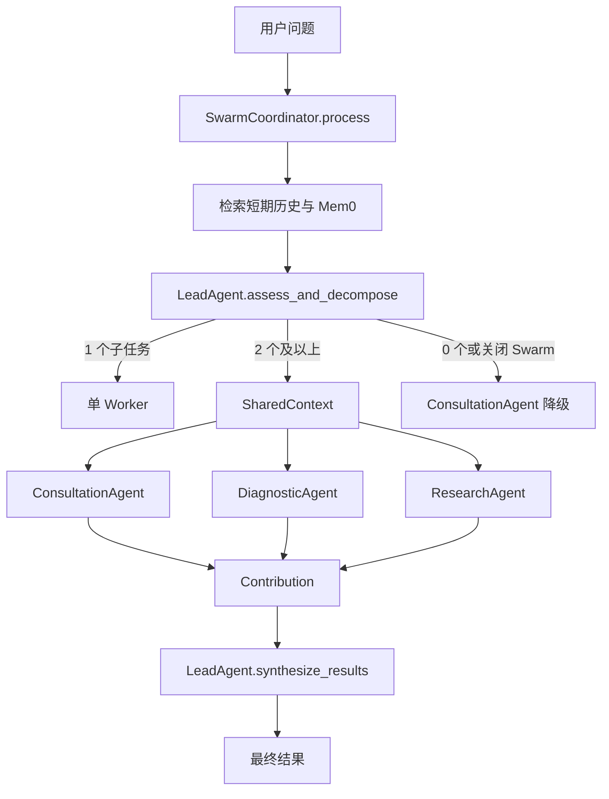
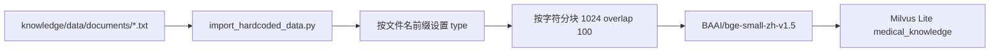
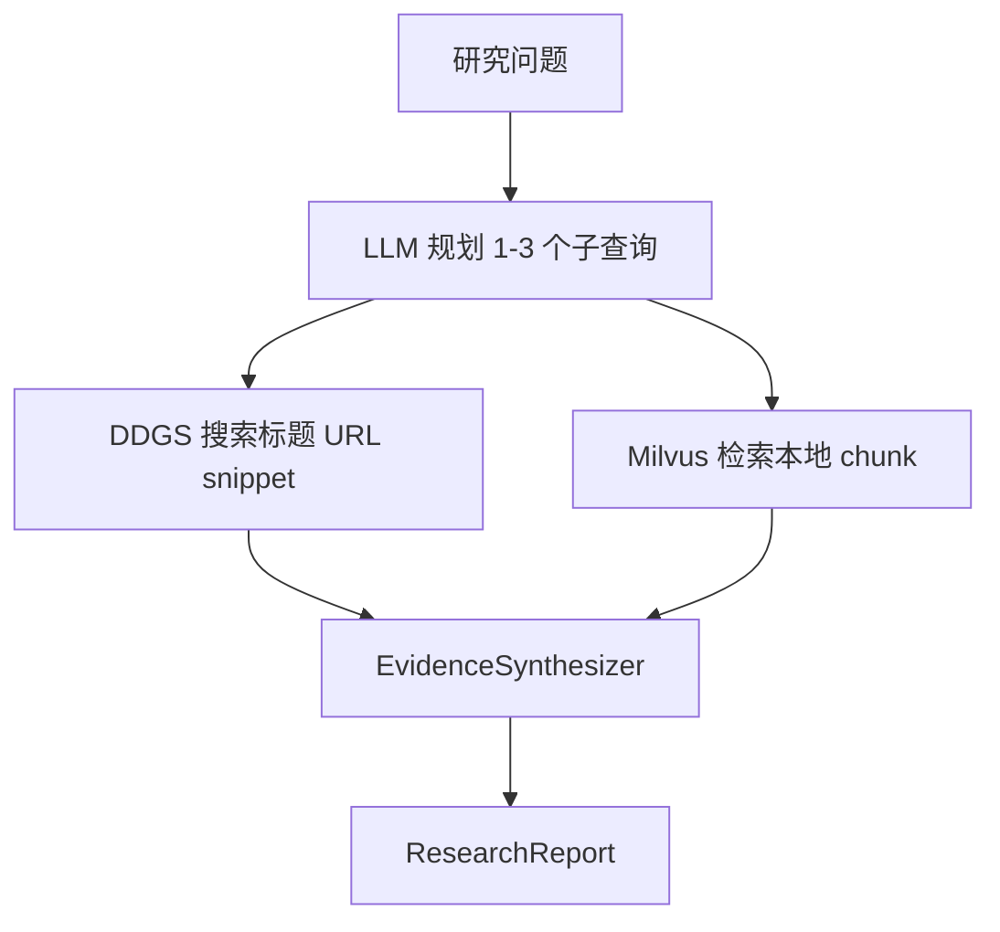

# medix-agent-swarm 从零到一：从单 Agent、Skills 到并行多 Agent 协作

> 适用对象：第一次接触 LLM Agent、Function Calling、RAG、向量数据库、记忆系统和多 Agent 协作的读者。  
> 审查基线：本仓库本地提交 `8d516ade1228cb3a51b5c23740ff41684cca333e`，审查日期为 **2026-08-05**。  
> 事实口径：本文以 `medix-agent-swarm/` 的当前源码为准；README 中的目标描述与当前代码不一致时，会明确区分“设计意图”和“实际行为”。  
> 医疗边界：这是教学/原型项目，不应直接用于诊断、处方或真实临床决策。  
> 配套阅读：[MediX-R1 从零到一](./medix-r1-从零到一.md)。如果你更关心医学 VLM 是如何训练、打分和评测的，可以先读配套文档。

---

## 目录

1. [先看结论：它是什么、现在能不能直接运行](#1-先看结论它是什么现在能不能直接运行)
2. [它和 MediX-R1 的关系](#2-它和-medix-r1-的关系)
3. [零基础必须先懂的概念](#3-零基础必须先懂的概念)
4. [项目结构与组件职责](#4-项目结构与组件职责)
5. [一条用户请求的真实调用链](#5-一条用户请求的真实调用链)
6. [Agent Loop：模型如何选择并调用 Skill](#6-agent-loop模型如何选择并调用-skill)
7. [Skill 系统：9 个 Skill 如何被发现、注册和执行](#7-skill-系统9-个-skill-如何被发现注册和执行)
8. [三个 Worker Agent 到底有什么不同](#8-三个-worker-agent-到底有什么不同)
9. [Swarm：当前实现的真实协作模型](#9-swarm当前实现的真实协作模型)
10. [Milvus Lite 与 RAG](#10-milvus-lite-与-rag)
11. [短期记忆、长期记忆与 SessionSummary](#11-短期记忆长期记忆与-sessionsummary)
12. [Deep Research 的真实数据流](#12-deep-research-的真实数据流)
13. [Harness Engineering：哪些已实现，哪些只是配置](#13-harness-engineering哪些已实现哪些只是配置)
14. [从零运行：按阻塞顺序处理](#14-从零运行按阻塞顺序处理)
15. [测试现状与推荐验证顺序](#15-测试现状与推荐验证顺序)
16. [如何调试完整链路](#16-如何调试完整链路)
17. [如何新增 Skill 和 Agent](#17-如何新增-skill-和-agent)
18. [如何接入 MediX-R1](#18-如何接入-medix-r1)
19. [生产化差距与优先改造路线](#19-生产化差距与优先改造路线)
20. [FAQ、术语表与源码阅读索引](#20-faq术语表与源码阅读索引)

| 阅读目标 | 建议路线 |
|---|---|
| 先建立整体心智模型 | 1 → 3 → 5 → 9 |
| 想运行和排障 | 1 → 14 → 15 → 16 |
| 想扩展 Skill/Agent | 6 → 7 → 8 → 17 |
| 想接入 MediX-R1 | 2 → 18 → 配套 R1 文档 |

---

## 1. 先看结论：它是什么、现在能不能直接运行

### 1.1 一句话定位

`medix-agent-swarm` 是一个**基于 OpenAI-compatible Chat Completions 的医疗问答 Agent 原型**。它让 LeadAgent 先用 LLM 把问题拆成子任务，再根据子任务数量选择单 Agent 或多 Agent 路径；Worker Agent 在 Agent Loop 中可调用规则、Milvus、Mem0 和网络搜索等 Skills，复杂问题的多个结果最终由 LeadAgent 再次调用 LLM 汇总。

最准确的架构描述不是“完全去中心化的群体智能”，而是：

> **LLM 驱动的中心化任务分配 + 多 Worker 并行执行 + SharedContext 黑板式结果聚合。**

### 1.2 当前快照的可运行状态

截至本次审查，源码可以通过 Python 语法编译，但 `swarm` 最小导入失败，因此不能把 README 的“全部功能可用”“26 个测试全部通过”当作当前工作区结论。

| 检查项 | 当前结果 | 能证明什么 |
|---|---|---|
| `python3 -m compileall -q medix-agent-swarm` | 通过 | Python 文件语法基本可解析 |
| `cd medix-agent-swarm && PYTHONPATH=.. python3 -c "import swarm"` | 失败：`No module named 'swarm.events'` | 当前主入口会被缺失模块阻塞 |
| `examples/test_all.py` 中测试函数数量 | 26 个 | 只证明定义了 26 个函数，不证明它们当前通过 |
| 工作区根 `config.py` | 文件存在；本文未读取或验证任何凭证值 | 只能确认配置入口存在，不能据此声明外部服务可用 |

直接阻塞有两个文件名错位：代码导入 `swarm/events.py`，目录中却是 `swarm/events_20260428_231035.py`；`validation/__init__.py` 导入 `validation/auto_fixer.py`，目录中却是 `validation/auto_fixer_20260428_231043.py`。前者导致 `swarm` 无法导入，后者会使 AgentLoop 捕获 `ImportError` 后同时关闭约束验证器和自动修复器。

### 1.3 读这个项目时要分三种口径

| 口径 | 示例 | 阅读方法 |
|---|---|---|
| 已进入主链路的能力 | LeadAgent 分解、按子任务数量路由、Worker 并行执行 | 可以按实际调用链理解 |
| 已写代码但未接入主链路 | `validate_task_decomposition()`、`get_required_agents()`、AgentIdentity | 只能称为“已有组件/原型”，不能称为已生效 |
| README 或 Prompt 中的目标描述 | 去中心化认领、Agent 间相互读取、上下文利用率 100% | 必须回到调用方验证，不能按文字直接相信 |

---

## 2. 它和 MediX-R1 的关系

### 2.1 两个项目处在不同层

| 项目 | 主要层次 | 解决的问题 |
|---|---|---|
| `MediX-R1` | 医学视觉语言模型训练与评测 | 如何让 VLM 更好地处理医学图文问答与推理 |
| `medix-agent-swarm` | Agent 应用与运行时 | 如何让模型分解任务、调用工具、检索知识、保存记忆并协作 |

可以把 MediX-R1 类比为“某位医生的大脑能力”，把 medix-agent-swarm 类比为“分诊台、科室、资料库、工作流和安全护栏”。两者可以结合，但并不是同一类系统。

### 2.2 当前 Swarm 没有加载 MediX-R1 权重

`core/llm_client.py` 创建的是 `AsyncOpenAI` 客户端：

```python
self.client = AsyncOpenAI(
    api_key=self.config["api_key"],
    base_url=self.config["base_url"]
)
```

当前代码没有调用 Transformers 的 `from_pretrained()`，也没有直接读取 `MediX-R1` 目录中的模型权重。工作区根 `config.py` 配置的是一个 OpenAI-compatible 远程端点和模型名，因此 Swarm 与模型通过 HTTP API 解耦。

这种解耦意味着：后端只要兼容当前使用的 Chat Completions 请求格式，就可能承担普通文本生成；但 AgentLoop 还依赖标准 `tool_calls`，所以“能生成医学回答”不等于“能稳定完成 Function Calling”。将 MediX-R1 接入前必须单独验证工具 schema、JSON 参数、结束条件和多模态消息格式。

---

## 3. 零基础必须先懂的概念

### 3.1 LLM、Agent 与 Skill

LLM 是模型；Agent 是围绕模型搭建的应用角色；Skill 是 Agent 可调用的函数能力。可以用下面的工程表达理解：

```text
Agent = LLM Client + System Prompt + Skill Registry + Agent Loop + State + Optional Memory
```

以 `DiagnosticAgent` 为例，它并不是一个独立训练出的诊断模型，而是“同一类 OpenAI-compatible 模型客户端 + 诊断角色 Prompt + 9 个可见 Skills + 迭代循环 + 结果后处理”。

### 3.2 Function Calling

Function Calling 不是让 LLM 直接运行 Python。LLM 只返回结构化调用意图，例如：

```json
{
  "name": "assess_risk",
  "arguments": {
    "symptoms": "胸痛、呼吸困难、冒冷汗"
  }
}
```

真正的执行者是运行时：`LLMClient` 解析 tool call，`AgentLoop` 调用 `agent.execute_tool()`，`SkillRegistry` 找到 Python 函数并执行，然后把结果包装成 `role=tool` 消息送回 LLM。

### 3.3 Agent Loop

Agent Loop 是“模型—工具—模型”的循环：

```text
构造消息和工具定义
  → 调 LLM
  → 如果返回 tool_calls：执行 Skill 并追加 tool 消息
  → 再调 LLM
  → 如果不再返回 tool_calls：把文本作为最终答案
```

没有 Agent Loop 时，开发者通常要写死工具顺序；有了 Loop，模型可以根据中间结果决定下一步，但也必须增加迭代上限、工具调用上限、超时、错误处理和协议校验。

### 3.4 RAG

RAG（Retrieval-Augmented Generation）是“先检索，再生成”。当前项目把本地医学文本切块并向量化到 Milvus Lite；Skill 用查询向量检索相关片段，再由 LLM 组织最终回答。Milvus 只负责检索，不负责生成答案。

### 3.5 Swarm 与普通并发

多 Agent 不等于真正的群体智能。判断一个实现是否“去中心化”，要看谁分解任务、谁指定执行者、Worker 能否竞争认领、是否能相互读取和修正结果、谁做最终决策。当前项目虽然有 SharedContext 和事件数据结构，但任务执行者由 LeadAgent 的 `assigned_agent` 明确指定，Coordinator 统一启动和等待任务，最终仍由 LeadAgent 汇总。

### 3.6 Memory

短期记忆负责当前 session 的消息历史；长期记忆负责跨 session 搜索；SessionSummary 是落到本地 Markdown 的执行摘要。三者不是一回事，也不是所有路径都完整使用它们。

### 3.7 Harness Engineering

Harness 是围绕不确定模型行为建立的工程设施，包括约束、验证、修复、状态、日志、重试、预算和评测。当前项目实现了其中一部分，但“YAML 中写了规则”并不等于规则已经进入运行时。

---

## 4. 项目结构与组件职责

### 4.1 当前真实目录

```text
medix-agent-swarm/
├── main.py
├── README.md
├── requirements.txt
├── setup.py
├── .claude/skills/                 # 9 个 Skill 目录
├── agents/                         # 3 个 Worker Agent + 基类和 Mixin
├── core/                           # LLM、Loop、Skill、State
├── swarm/                          # Lead、Coordinator、SharedContext、事件文件
├── knowledge/                      # Milvus Lite、文档、导入脚本
├── memory/                         # 短期/长期记忆、摘要、身份、熵管理
├── research/                       # Deep Research、Web Search、证据综合
├── constraints/                    # YAML 约束和 Validator
├── validation/                     # AutoFixer 文件
└── examples/test_all.py            # 单文件异步测试脚本
```

README 的目录树包含一些当前快照中不存在或口径不一致的内容，例如将事件和 AutoFixer 写成无时间戳文件名、把 Skills 数量分别描述为 7/8/9/10，以及列出当前不存在的附加文档。学习时应以 `find` 得到的实际目录为准。

### 4.2 核心文件职责

| 文件 | 主职责 | 当前主链路是否使用 |
|---|---|---|
| `main.py` | CLI 交互、session_id、结果展示 | 是 |
| `core/llm_client.py` | Chat Completions 与 tool call 解析 | 是 |
| `core/agent_loop.py` | 模型与 Skill 的迭代循环 | 是 |
| `core/skill_loader.py` | 扫描 `.claude/skills/` 并动态导入 | 是 |
| `core/skill_registry.py` | 注册、执行、转 OpenAI tools schema | 是 |
| `swarm/lead_agent.py` | 子任务分解与最终汇总 | 是 |
| `swarm/swarm_coordinator.py` | 路由、并发、超时、结果包装 | 是 |
| `swarm/shared_context.py` | 保存子任务、贡献和事件 | 是，但只使用部分能力 |
| `constraints/validator.py` | 检查部分工具调用和输出规则 | 设计上是；当前因 AutoFixer import 错位整体关闭 |
| `memory/agent_identity.py` | Agent 身份、协作和工具统计原型 | Coordinator 未接入 |
| `research/knowledge_base.py` | Qdrant/内存知识库原型 | Deep Research 主链路未使用；主链路使用 Milvus |

### 4.3 运行目录为什么重要

多处路径是相对当前工作目录而不是相对源码文件：Milvus 默认路径是 `./knowledge/data/milvus_lite.db`，SessionSummary 默认路径是 `memory/swarm/session_summaries`。因此应从 `medix-agent-swarm/` 根目录启动，否则可能在错误位置创建数据库或摘要目录。

`setup.py` 使用 `find_packages()`，但 `.claude/skills/`、知识文档和现有数据库并不是普通 Python package data。这个仓库更像“从源码目录直接运行的原型”，不能默认 `pip install .` 后所有运行资产都会被正确打包。

---

## 5. 一条用户请求的真实调用链

假设用户在 CLI 输入：“我胸闷、气短、冒冷汗，最近还有心悸，需要马上去医院吗？”

### 5.1 CLI 创建并复用 session_id

`main.py` 启动一次交互会话时生成一个 `session_id`，同一 CLI 会话的多次问题复用它：

```python
result = await process_with_swarm(user_input, session_id=session_id)
```

`process_with_swarm()` 每次问题都会新建一个 `SwarmCoordinator`。因此 Coordinator、LeadAgent、Worker 和 LongTermMemory 对象会重建；ShortTermMemory 之所以仍可能保留历史，是因为它在当前进程内实现了单例。

### 5.2 Coordinator 先检索记忆

`SwarmCoordinator.process()` 读取最近 10 条短期消息和最多 3 条 Mem0 相似会话，然后组成 `enhanced_context`。这个上下文首先会被 LeadAgent 使用：

```python
assessment = await self.lead_agent.assess_and_decompose(
    question,
    enhanced_context
)
```

### 5.3 LeadAgent 让 LLM 生成 JSON

LeadAgent 没有独立规则分类器，而是调用普通文本 `chat()`，Prompt 要求模型返回：

```json
{
  "subtasks": [
    {
      "description": "评估症状风险和紧急程度",
      "assigned_agent": "diagnostic_agent"
    },
    {
      "description": "给出当前处理和就医建议",
      "assigned_agent": "consultation_agent"
    }
  ]
}
```

解析方式是用贪婪正则 `\{.*\}` 截取 JSON 后执行 `json.loads()`，没有 Pydantic/JSON Schema 校验。解析不到 JSON 时会降级成一个 ConsultationAgent 子任务；LLM 调用抛异常时则返回 0 个子任务。

### 5.4 子任务数量决定路由

| 子任务数量与开关 | 路由 |
|---|---|
| 1 个 | 直接调用 `assigned_agent` 对应的单个 Worker |
| 2 个及以上，且 `enable_swarm=True` | 进入 Swarm 并行路径 |
| 0 个 | 降级到 ConsultationAgent |
| 2 个及以上，但 Swarm 关闭 | 降级到 ConsultationAgent，不会逐个执行这些任务 |

所以这里的“复杂度判断”实质上是“LeadAgent 最终生成了多少个子任务”，并不是稳定、可解释的独立复杂度分类模型。

### 5.5 上下文在不同路径中的真实可见性

这是理解当前实现最容易出错的地方：

| 路径 | 短期历史 | `context` / Mem0 相似案例 | 原始 session_id 是否进入 Worker 输入 |
|---|---|---|---|
| LeadAgent 分解 | 通过 `enhanced_context` 可见 | 可见 | 不作为独立字段使用，但包含在背景字符串中 |
| 单路由 ConsultationAgent | AgentLoop 会加载历史；Prompt 中还会格式化 context | 可见 | 可见 |
| 单路由 DiagnosticAgent / ResearchAgent | AgentLoop 会根据 session_id 加载历史 | `BaseAgent.format_user_input()` 忽略 context，因此不会直接拼入当前用户消息 | AgentLoop 收到 session_id，但 Prompt 不显示其值 |
| Swarm Worker | 不加载，因为 `process_subtask()` 没传 session_id | 不传，只收到子任务描述 | 否 |

因此 README 的“所有模式上下文利用率 100%”不符合当前调用链。更准确的结论是：LeadAgent 能看到增强上下文；单 Agent 的短期历史恢复基本存在；不同 Worker 对额外 context 的利用不一致；Swarm 子任务目前丢失 session 和增强 context。

### 5.6 最终结果如何产生

单 Agent 路径直接返回 AgentLoop 的答案。Swarm 路径把各 Worker 的 `Contribution.result` 转成字符串，交给 LeadAgent 再调用一次 LLM 汇总。最终结果字典还会增加 `swarm_enabled`、`agents_involved`、`subtasks_completed`、`timeout_occurred`、`suggestions` 和 `disclaimer` 等字段。

LeadAgent 的汇总 Prompt 要求在“相关 Agent 提供了内容时”组织风险、诊断、证据、建议和免责声明；这些栏目并不是程序结构化保证，仍依赖模型按格式生成。

---

## 6. Agent Loop：模型如何选择并调用 Skill

### 6.1 初始化阶段

`AgentLoop.run()` 创建一个 `AgentState`，状态从 `PENDING` 切到 `IN_PROGRESS`，然后构造消息：System Prompt → 最近历史 → 当前用户消息。若注入了 ShortTermMemory 且有 session_id，当前用户消息会先被保存。

```python
messages = self._initialize_messages(agent, input_data, session_id)
tools = agent.get_tools_for_llm()
```

### 6.2 一轮循环

```python
while state.should_continue():
    response = await agent.llm_client.chat_with_tools(
        messages=messages,
        tools=tools,
        tool_choice="auto"
    )

    if response.has_tool_calls():
        messages.append(assistant_tool_call_message)
        for call in response.tool_calls:
            result = await agent.execute_tool(call.name, call.arguments)
            messages.append(tool_result_message)
        continue

    final_answer = response.content
    validate_and_maybe_fix(final_answer)
    return final_answer
```

工具结果必须作为 `role=tool` 送回 LLM，因为 Skill 返回的字典只是证据或中间结果，不一定适合直接展示给用户。第二轮模型需要把这些结果解释、合并，并遵守角色输出格式。

### 6.3 两类预算

Agent 的 `max_iterations` 通常是 5；AgentLoop 的 `max_tool_calls` 默认是 2。迭代次数约束的是 LLM 循环轮数，工具次数约束的是累计调用数，两者不能混为一谈。

当前工具上限并非严格逐调用截断：代码只在处理一整批 tool calls 前检查累计值。如果模型在累计值为 0 时一次返回 3 个 tool calls，这 3 个都会执行，累计值可超过 2。达到上限后，如果模型仍返回 tool calls，Loop 会追加一条“请给最终答复”的 user 消息并继续，但不会立即禁用 tools；模型若继续请求工具，可能一直消耗迭代，最后才进入无工具的强制总结。

### 6.4 错误与降级

单轮异常会被捕获；只要尚未到最大迭代，Loop 会继续下一轮。达到上限但任务未完成时，会再调用一次 `chat_with_tools(tools=None)` 强制生成总结；如果这一步也失败，返回固定错误文案。

需要注意两个结果差异：正常文本路径会执行 Agent 的 `post_process_result()`；达到最大迭代后的强制总结路径不会执行各 Agent 的后处理，因此 Diagnostic/Research 的结构化字段或 Consultation 的建议提取可能缺失，Coordinator 只能补默认字段。

### 6.5 LLMClient 的协议边界

`chat_with_tools()` 对 `tc.function.arguments` 直接执行 `json.loads()`；一条不合法 JSON 参数会让整个 LLM 调用抛错，而不是只把某个 tool call 标为失败。`temperature = temperature or self.temperature` 还意味着显式传入 `0` 会被当作假值并替换成默认温度，这在追求确定性测试时需要修正为 `if temperature is None`。

### 6.6 并发安全问题

每个 Worker 实例只有一个 `AgentLoop`，而 Coordinator 会让同一 Worker 收到的多个子任务并发执行。`AgentLoop.tool_call_count` 是实例字段，每次 `run()` 开始都会重置；如果同一 Agent 同时运行两个子任务，它们会竞争修改同一个计数器。StateManager 虽按 task_id 保存多个状态，但工具调用预算不是任务局部变量，因此当前实现不适合让同一 Worker 并发多个子任务。

---

## 7. Skill 系统：9 个 Skill 如何被发现、注册和执行

### 7.1 实际数量

当前 `.claude/skills/` 下有 9 个目录：7 个医疗业务 Skill，加 2 个记忆 Skill。

| Skill | 输入 | 真实实现 | 主要限制 |
|---|---|---|---|
| `search_knowledge` | `query`, `max_results` | Milvus 全库检索 | 返回 score 语义需要校验 |
| `recommend_lifestyle` | `diagnosis` | 过滤 `lifestyle` 文档并取首条 | 并非独立处方/规则引擎 |
| `assess_risk` | `symptoms` | 关键词规则 + Milvus 补充 | 代码实际只设置 low/medium/high，不会设置 emergency |
| `analyze_symptoms` | `symptoms` | 系统关键词分类 + Milvus 补充 | 疾病候选是演示性映射，排序可能因 `set` 不稳定 |
| `disease_code` | `disease_name` | 过滤 ICD-10 文档并解析文本 | metadata 不直接提供完整标准编码结构 |
| `clinical_guideline` | `query`, `max_results` | 过滤指南文档 | 即使 `max_results>1`，代码也只使用 `results[0]` |
| `deep_research` | `query`, `max_iterations` | 查询规划 + Web + Milvus + LLM 综合 | `max_iterations` 实际被换算成结果数量，不调用 refinement 循环 |
| `search_history` | `session_id`, `limit` | ShortTermMemory | 需要模型自己提供正确 session_id |
| `search_similar_cases` | `query`, `max_results` | 新建 LongTermMemory 并查 Mem0 | Mem0 未启用时直接返回空能力说明 |

### 7.2 自动发现流程

`SkillRegistryMixin.register_all_skills()` 调用 `discover_skills(project_root)`：扫描 `.claude/skills/*`，查找 `SKILL.md`，读取 YAML frontmatter，进入 `script/`，取第一个非 `__init__.py` 的 Python 文件，将目录名由 kebab-case 转为 snake_case，再动态导入同名函数。

```text
.claude/skills/search-knowledge/
  ├── SKILL.md
  └── script/search.py

目录名 search-knowledge
  → 推断函数名 search_knowledge
  → 动态导入 script/search.py
  → 查找 search_knowledge
  → 注册到 SkillRegistry
```

函数名由目录名决定，不是由 frontmatter 的 `name` 决定；当前注册时真正使用的 frontmatter 字段主要是 `description`。SKILL.md 正文中的使用场景和示例供人阅读，不会自动转为完整工具规则。

### 7.3 参数 schema 的推断很简化

`_infer_skill_parameters()` 用函数签名判断 required，再根据参数名猜类型：名称包含 `count`、`limit`、`max`、`iterations` 时设为 `number`，其他都设为 `string`。它不读取类型注解来生成 `integer`、array、object、enum 或嵌套 schema，也不会把 docstring 中的参数说明带入 schema。

因此新增复杂 Skill 时，最好显式维护 schema 或改用 Pydantic/JSON Schema，而不是继续扩大基于变量名的猜测规则。

### 7.4 动态发现的隐含约束

当前每个 Skill 的 `script/` 只有一个业务 Python 文件，所以“取第一个文件”暂时可用；如果将来同一目录放入多个非 `__init__.py` 文件，`iterdir()` 的顺序没有业务语义，可能加载到错误脚本。应在 SKILL.md 中显式声明入口，或规定固定文件名。

### 7.5 SkillRegistry 如何执行

`SkillRegistry.execute()` 对 async 函数直接 `await`，对同步函数使用默认线程池。异常不会继续抛到 AgentLoop，而是包装成：

```json
{
  "success": false,
  "error": "Skill execution failed: ...",
  "skill": "..."
}
```

这种设计让 LLM 有机会看到失败并降级，但也意味着工具失败不一定让任务失败；最终答案是否正确处理失败信息仍依赖模型。

### 7.6 记忆 Skill 的 session_id 问题

`search_history` 的 schema 把 `session_id` 设为必填。ConsultationAgent 会把 session_id 明文放进当前用户消息，因此模型可能正确调用；DiagnosticAgent 和 ResearchAgent 继承 BaseAgent 的默认格式化逻辑，不会把 session_id 放进消息。AgentLoop 虽然内部持有 session_id，却没有自动注入 tool arguments，所以“所有 Agent 都注册 search_history”不等于所有 Agent 都能可靠使用它。

---

## 8. 三个 Worker Agent 到底有什么不同

### 8.1 共同点

三个 Worker 都继承 `BaseAgent` 与 `SkillRegistryMixin`，初始化时都会动态注册当前发现的全部 9 个 Skills。它们通常读取同一份模型配置，因此不是三个不同权重的模型，而是三个角色 Prompt、能力标签和后处理逻辑不同的 Agent 实例。

### 8.2 差异表

| Agent | Prompt 定位 | 能力标签 | 后处理 |
|---|---|---|---|
| ConsultationAgent | 通用咨询、风险初筛、生活方式和就医建议 | `general_health_advice`、`risk_assessment`、`symptom_triage` | 正则提取核心建议和免责声明 |
| DiagnosticAgent | 症状模式、鉴别诊断、检查建议 | `symptom_analysis`、`differential_diagnosis`、`clinical_reasoning`、`multi_system_analysis` | 用简单字符串规则推断 high/medium/low |
| ResearchAgent | 指南、文献、证据综合 | `literature_search`、`evidence_synthesis`、`fact_checking`、`guideline_lookup` 等 | 查找 A/B/C 字样，并用“文献”出现次数充当数量 |

后处理都不是严格结构化解析。DiagnosticAgent 只要最终文本同时包含“风险等级”和任意“高”字就可能判成 high；ResearchAgent 的 `literature_count` 是字符串出现次数，不是实际文献条目数。它们适合演示，不应当作可靠评测标签。

### 8.3 Prompt 中的 Swarm 描述不等于真实能力

DiagnosticAgent 和 ResearchAgent 的 Prompt 写着“可以从 SharedContext 读取其他 Agent 的结果”“结果会被其他 Agent 使用”，但 BaseAgent 的 `process_subtask()` 只把 `subtask.description` 作为问题送入 Loop。当前没有把 SharedContext 数据、事件或其他贡献拼进消息，也没有 Worker 间的第二轮通信。

### 8.4 全量 Skill 注册的利弊

全量注册让代码简单，新 Skill 自动对三个 Agent 可见；代价是工具选择空间过大、角色权限边界偏软。YAML 中的 `allowed_tools` 只是推荐列表，Validator 检查失败后当前设计仍继续执行 Skill。生产系统更适合按 Agent 构建最小权限工具集，并在执行层真正拒绝越权调用。

---

## 9. Swarm：当前实现的真实协作模型

### 9.1 全景图



### 9.2 SharedContext 保存什么

`SharedContext` 是进程内对象，包含 `data`、`events`、`task_decomposition`、`agent_contributions` 和 `memory_pool`。主链路实际使用最充分的是子任务、贡献和事件列表；`data` 与 `memory_pool` 没有成为 Worker Prompt 的上下文来源。

### 9.3 SubTask 状态

```python
@dataclass
class SubTask:
    id: str
    type: str
    description: str
    assigned_agent: str
    status: TaskStatus = TaskStatus.PENDING
    result: Optional[Dict[str, Any]] = None
    dependencies: List[str] = field(default_factory=list)
```

状态枚举包含 `PENDING`、`CLAIMED`、`IN_PROGRESS`、`COMPLETED`、`FAILED`，但当前 `start()` 会从 PENDING 直接切到 IN_PROGRESS，没有代码进入 CLAIMED。`dependencies` 也没有被 `can_be_executed()` 检查，因此顺序依赖尚未实现。

### 9.4 任务不是 Worker 自主认领

LeadAgent 的 JSON 明确给出 `assigned_agent`；`create_subtasks()` 将其写入 SubTask；每个 Worker 只调用 `get_subtasks_for_agent(worker.agent_id)` 读取分给自己的任务。这是中心化分配，不是竞价、能力匹配或竞争认领。

能力标签当前主要是描述性数据。Coordinator 路由不根据 `get_capabilities()` 匹配任务，`ConstraintValidator.get_required_agents()` 也没有被主链路调用。

### 9.5 并行粒度

Coordinator 为三个 Worker 各创建一个 asyncio task；每个 Worker 如果收到多个子任务，又会为这些子任务分别创建 task。因此存在两层并发：不同 Worker 并发，同一 Worker 的多个子任务也并发。

这种结构可以降低 I/O 等待时间，但并不自动保证加速。三个 Worker 各自可能调用远程 LLM、Web 或本地 embedding；同一 Worker 多任务并发还会触发前述共享 `tool_call_count` 竞争。

### 9.6 事件系统目前更像审计列表

事件数据结构支持类型、来源、目标、时间戳和过滤，SharedContext 会在启动、任务创建、任务开始、任务完成和上下文更新时追加 Event。但当前没有订阅器、事件循环、回调或等待某事件的 Worker；所以它更像“带类型的内存审计记录”，不是主动驱动执行的事件总线。

### 9.7 Worker 失败处理的缺口

`_execute_single_subtask()` 捕获异常后只写日志，没有调用 `subtask.fail()`。外层 `asyncio.gather(..., return_exceptions=True)` 也不会重新抛出子任务异常。因此失败任务可能长期保持 IN_PROGRESS，没有 Contribution，LeadAgent 最后只汇总已完成部分，且结果中缺少明确的失败任务结构。

### 9.8 超时分支有三个问题

整体超时硬编码为 90 秒，并未从 `swarm_constraints.yaml` 读取。发生超时时，日志列表筛选的是 `status == "claimed"`，但当前状态不会进入 CLAIMED；列表表达式还引用不存在的 `subtask.assigned_to`，正确字段是 `assigned_agent`。随后 LeadAgent 统计未完成任务时只检查 pending/claimed，没有包含 in_progress，所以真正被取消的执行中任务可能不会出现在超时说明里。

### 9.9 SessionSummary 指标不是实测指标

Swarm 完成后会尝试生成本地 SessionSummary，但当前 `parallel_efficiency=0.8`、`information_coverage=0.9`、`redundancy=0.15` 是硬编码占位值；`tool_calls` 统计的是成功 Contribution 数量，不是真正的工具调用次数；每个 Agent 的执行时间用总时间除以参与 Agent 数量估算；`lessons_learned` 固定为空，`context` 固定为空。因此该文件适合查看一次会话的基本记录，不应作为真实性能报告。

---

## 10. Milvus Lite 与 RAG

### 10.1 数据导入链路



当前有 10 个文本文件：4 个 lifestyle、1 个 emergency symptoms、3 个 ICD-10 分类、2 个 clinical guideline。导入脚本按编号分类：01–09 是 lifestyle，10–19 是 disease_classification，20–29 是 clinical_guideline，其他是 general。

### 10.2 分块与向量化

`_chunk_text()` 按字符截取，默认 `chunk_size=1024`、`overlap=100`，不会按标题、句子或段落语义切分。每个 chunk 保存原文、原文档 ID、chunk_id、total_chunks 和源 metadata，再使用 BGE small 中文 embedding 在 CPU 上编码。

首次没有本地缓存时会从 Hugging Face 下载模型；如果 `~/.cache/huggingface/.../snapshots` 存在，则选修改时间最新的 snapshot。这个“最新”只是本地文件时间排序，不校验 revision 是否与数据库中已有向量一致。

### 10.3 检索与过滤

查询先编码，再调用 MilvusClient.search。类型过滤是对 JSON 字符串字段执行 `like`：

```python
filter_expr = f'metadata like "%\\"type\\": \\"{filter_type}\\"%"'
```

这比把 `type` 建成独立标量字段脆弱，也不利于索引优化；但在小型演示库中能表达基本过滤意图。

### 10.4 score 语义必须先校验

代码把 Milvus 返回的 `hit["distance"]` 转为：

```python
score = 1 - hit["distance"]
```

对于 COSINE，不同客户端/API 版本可能把返回值称为 distance，但实际排序语义可能是“越大越相似”的相似度。若当前版本已经返回 cosine similarity，再做 `1 - distance` 会反转分数。多个 Skill 又使用 `score > 0.1` 或 `score > 0.5` 过滤，因此这个问题会直接影响召回结果。修复前应构造“完全相同文本、明显相关文本、完全无关文本”三组查询，打印原始 distance 和排序验证。

### 10.5 重复导入不是幂等的

Collection 使用 `auto_id=True`，导入时每次 insert 都生成新 ID，没有按 `doc_id + chunk_id` upsert，也没有导入前查重。仓库已经包含 `knowledge/data/milvus_lite.db`，再次运行导入脚本可能插入重复 chunk。不要在不了解现有数据的情况下反复执行初始化命令。

### 10.6 当前知识库的适用边界

10 个文本文件足以演示 RAG、类型过滤和模糊语义检索，但不足以覆盖真实医学知识。文档 metadata 也没有完整记录指南版本、发布日期、适用人群、证据级别和原始链接，因此不能满足临床证据追溯。

---

## 11. 短期记忆、长期记忆与 SessionSummary

### 11.1 ShortTermMemory

ShortTermMemory 支持内存字典和 Redis 两种后端。内存模式进程退出即丢失；Redis 模式使用 `session:<session_id>`，过期时间为 1 小时。Coordinator 当前固定初始化 `storage_type="memory"`，没有从配置切换 Redis。

它实现了进程级单例，且 `__init__()` 在第一次初始化后直接返回。这意味着第一次选定的 storage_type 会固定，后续 `ShortTermMemory(storage_type="redis")` 不会重新配置同一实例；测试若不清理 session，也可能互相污染。多进程部署中，每个进程仍有自己的单例，并不能共享内存历史。

### 11.2 AgentLoop 如何恢复历史

AgentLoop 调用：

```python
history = self.short_term_memory.get_history(session_id, limit=5)
```

`get_history()` 先从最近 `limit * 2` 条原始消息中取数据，再只保留 user 和 assistant。这里的“5 轮”不是严格的五组问答，因为工具调用会被另存为 assistant 文本“调用工具：...”，tool 结果则被过滤掉。后续模型可能看到工具调用提示，却看不到对应历史 tool 消息。

当前用户消息、工具调用提示、工具结果摘要和最终回答都会写入短期记忆；但由于 Swarm 子任务没有 session_id，Swarm Worker 的这些消息不会保存到对应会话。

### 11.3 熵管理的真实含义

MemoryEntropyManager 不是信息论熵计算器。它统计消息数量、平均长度和完全重复率，用 MD5 检测完全相同内容；超过消息上限时，把较早的 user/assistant 配对截断成简单 system 摘要。

长记忆去重存在一个实现偏差：`LongTermMemory` 格式化结果使用 `content` 字段，而 `deduplicate_sessions()` 拼接的是 `question` 与 `summary` 字段，因此这些字段通常为空，多条不同 Mem0 结果可能得到相同哈希并被误判为重复。这里需要统一数据契约。

### 11.4 LongTermMemory / Mem0

Mem0 包可导入且 API key 非空时，LongTermMemory 才启用；初始化失败会降级为 disabled，不阻断普通问答。保存内容是“问题 + 回答前 500 字”，并附带 session_id、时间和模式等 metadata。

当前 `user_id` 固定为 `medix_user`。这意味着所有真实用户若共用服务，就会写入同一逻辑用户空间；相似历史还会被 Coordinator 自动拼入后续背景。生产环境必须使用经过认证和授权的真实用户/租户隔离键，并明确删除、保留和第三方传输策略。

### 11.5 SessionSummary

SessionSummary 是本地 Markdown 审计资产，不是 Mem0。它只在 Swarm 路径生成，默认保存到相对目录 `memory/swarm/session_summaries/<date>/`。当前 `load_summary()` 固定返回 None，“相似会话搜索”只按文件修改时间返回最近文件，并不计算语义相似度；Coordinator 也没有使用 SessionSummaryManager 的该搜索方法做长期记忆。

### 11.6 AgentIdentity 尚未进入主流程

`agent_identity.py` 定义了 AgentIdentity、协作记录和工具使用统计，也实现 Markdown 保存/加载的部分逻辑；但 Coordinator 没有创建 AgentIdentityManager，也没有调用 `attach_identity_manager()`。所以“Agent 持续学习、根据历史协作自我进化”目前是设计方向，不是运行时事实。

---

## 12. Deep Research 的真实数据流

### 12.1 主流程



Deep Research Skill 创建 `DeepResearchWorkflow`，先让 LLM 生成最多 3 个子查询，然后并发执行 Web Search 和 Milvus 检索，最后把搜索摘要和知识库片段送给 EvidenceSynthesizer 再调用 LLM。

### 12.2 `max_iterations` 名称具有误导性

Skill 参数叫 `max_iterations`，但实际调用的是：

```python
workflow.run(
    max_web_results=max_iterations * 5,
    max_kb_results=max_iterations * 3
)
```

它控制的是结果数量预算，不是调用 `research_with_refinement()` 的迭代次数。默认 2 不代表完成两轮查询细化。

### 12.3 网络搜索没有自动启用所有辅助能力

`WebSearchTool` 实现了域名白名单过滤、网页正文抓取和 `search_with_content()`，但 DeepResearchWorkflow 主链路只调用 `web_search.search()`，没有调用 `filter_by_domain()`，也没有抓取完整网页。因此送入 EvidenceSynthesizer 的主要是搜索引擎返回的 title、URL 和 snippet，而不是经过全文验证的论文或指南正文。

搜索会尝试 `bing → duckduckgo → auto` 后端并重试，但没有强制来源必须属于医学白名单。Prompt 中要求权威证据不能替代程序级来源校验。

### 12.4 EvidenceSynthesizer 的解析边界

EvidenceSynthesizer 要求 LLM 输出【关键发现】【证据等级】【置信度】【信息冲突】【综合总结】【建议】。解析器用正则和行首 `-` 提取内容；模型若改用编号列表，关键发现或建议可能解析为空。

A/B/C 证据等级和置信度是模型根据片段自报，不是代码读取研究设计、样本量、偏倚风险、GRADE 或正式文献元数据计算。来源列表只是把搜索结果和知识库结果复制到 ResearchReport；格式化后的 Skill 回答只显示“参考来源数量”，没有逐条输出 URL。

### 12.5 `research/knowledge_base.py` 不是当前主 RAG

仓库另有一个支持 Qdrant/内存的 `research/knowledge_base.py`，但 `DeepResearchWorkflow` 实际导入的是 `knowledge.milvus_kb.MedicalKnowledgeBase`。因此 README 或测试报告中把 Deep Research 主知识库描述成 Qdrant，会与当前调用链不符。

---

## 13. Harness Engineering：哪些已实现，哪些只是配置

### 13.1 YAML 中定义了什么

`agent_constraints.yaml` 为三个 Agent 配置 capabilities、allowed_tools、forbidden_actions 和 output_constraints；`swarm_constraints.yaml` 配置任务分解规则、Agent 选择规则、最大并行、超时、质量控制、冲突处理以及 parallel/sequential/debate 模式。

这些文件表达了设计意图，但运行时只执行了其中一小部分。

### 13.2 Validator 真正检查的内容

`validate_tool_call()` 只检查工具是否位于 allowed_tools，并返回 warning 级别；AgentLoop 即使收到 `valid=False` 仍继续执行工具。

`validate_output()` 实现的主要检查是：Consultation 是否缺免责声明、是否超过最大长度；Diagnostic 高危关键词出现时是否建议就医；Research 是否出现“指南/文献/研究”；Consultation 是否出现部分明确诊断短语或具体剂量处方模式。YAML 中诸如尊重语气、术语解释、不制造恐慌、区分事实和观点等规则没有通用执行器。

### 13.3 AutoFixer 真正会修什么

Validator 目前只会把“缺免责声明”和“高危未提醒就医”加入 `auto_fixable`，所以 AgentLoop 能触发的修复只有这两类。AutoFixer 虽还有截断过长回答、替换明确诊断语句的方法，但主流程没有调用它们。

### 13.4 当前 Harness 为什么整体关闭

AgentLoop 在同一个 try-block 中导入 ConstraintValidator 和 AutoFixer：

```python
try:
    from constraints import ConstraintValidator
    from validation import AutoFixer
    CONSTRAINTS_ENABLED = True
except ImportError:
    CONSTRAINTS_ENABLED = False
```

由于 `validation/__init__.py` 找不到 `.auto_fixer`，整个 try-block 失败，连本来可导入的 ConstraintValidator 也被关闭。修复文件名或 import 后才会进入实例化流程。

### 13.5 Swarm 约束没有进入主链路

Validator 已实现 `validate_task_decomposition()` 和 `get_required_agents()`，但 LeadAgent 与 Coordinator 都没有调用它们；90 秒超时也是 Coordinator 硬编码值，而不是读取 YAML。sequential 和 debate 在 YAML 中明确标注“当前未实现”。

要让 Harness 真正成为护栏，应在三个边界做强制校验：LeadAgent JSON 进入系统时验证结构和必选 Agent；Skill 执行前按最小权限拒绝越权；最终输出发布前进行可解释、可审计的安全判定和降级。

---

## 14. 从零运行：按阻塞顺序处理

### 14.1 环境与目录

建议使用 Python 3.10–3.12，并始终从项目根目录运行：

```bash
cd MedicalAssistant/medix-agent-swarm
python3 -m venv .venv
source .venv/bin/activate
python -m pip install -r requirements.txt
```

依赖包含 torch、sentence-transformers、pymilvus、Mem0、Qdrant、DuckDuckGo 搜索等，安装体积和版本兼容成本较高。首次使用 BGE 还可能需要网络下载模型。

### 14.2 第一阻塞：事件模块名

当前代码需要：

```text
swarm/events.py
```

实际只有：

```text
swarm/events_20260428_231035.py
```

应通过版本控制可审查的方式统一“文件名”和“所有 import”。不要只在本地临时改某一处，因为 `swarm/__init__.py`、`shared_context.py`、`lead_agent.py` 和 `swarm_coordinator.py` 都依赖 `.events`。

### 14.3 第二阻塞：AutoFixer 模块名

当前 `validation/__init__.py` 需要 `validation/auto_fixer.py`，实际文件带时间戳后缀。统一后再验证：

```bash
python -c "from constraints import ConstraintValidator; from validation import AutoFixer; print('harness import ok')"
```

### 14.4 第三阻塞：配置导入路径

工作区根已经有 `config.py`，但 `core/llm_client.py` 把旧机器路径 `/Users/saintgeo/Desktop/self-learn/swarm` 插入 `sys.path`。从 `medix-agent-swarm/` 目录直接执行时，父目录不一定在 Python 模块搜索路径中，因此 `from config import LLM_CONFIG` 不可靠。

更合理的方向是：把配置迁移为环境变量或项目内部配置模块；若必须保留根 `config.py`，则使用 `Path(__file__).resolve()` 计算父目录，不要写死用户目录。密钥只通过本地未跟踪文件或环境变量注入，不要提交。

### 14.5 配置模型

工作区根 `config.py` 定义了所需配置入口；本文不读取、展示或判断其中的真实凭证值。配置结构至少需要：

```python
LLM_CONFIG = {
    "api_key": "<YOUR_API_KEY>",
    "model_name": "<TOOL_CALLING_MODEL>",
    "base_url": "<OPENAI_COMPATIBLE_BASE_URL>",
    "temperature": 0.7,
    "max_tokens": 8192,
}

MEM0_CONFIG = {
    "api_key": "<OPTIONAL_MEM0_API_KEY>",
}
```

没有 Mem0 key 时长期记忆会降级关闭；没有 LLM key 时 LeadAgent、Worker 和 EvidenceSynthesizer 都无法工作。模型还必须真正兼容 OpenAI tool calls，仅支持普通聊天不够。

### 14.6 知识库不要盲目重复初始化

仓库已经包含 `knowledge/data/milvus_lite.db`。先验证现有库能否打开、collection 是否存在、已有哪些实体，再决定是否执行：

```bash
python knowledge/scripts/import_hardcoded_data.py
```

因为当前导入不是幂等的，反复执行可能产生重复 chunk。更稳妥的初始化工具应支持 `--rebuild`、`--dry-run`、数据版本和稳定主键。

### 14.7 最小验证顺序

完成修复后，不要直接把 `python main.py` 当第一项测试。建议依次执行：

```bash
python -m compileall -q .
python -c "import swarm; print('swarm import ok')"
python -c "from validation import AutoFixer; print('validation import ok')"
python -c "from core.skill_loader import discover_skills; print(len(discover_skills()))"
```

第四条会动态导入 9 个 Skill 脚本，但通常不会在发现阶段加载 embedding；真正执行 Milvus Skill 时才会创建 MedicalKnowledgeBase。

修复并配置完成后再运行：

```bash
python main.py --verbose
```

---

## 15. 测试现状与推荐验证顺序

### 15.1 26 个函数不等于 26 个独立可靠单测

`examples/test_all.py` 的确定义并在 `tests` 列表中注册了 26 个异步测试函数，但它是一个自定义脚本，不是标准 pytest 隔离测试套件。测试共享全局单例和外部状态，其中多项会调用真实 LLM、Mem0、Milvus、Web Search 或完整 Swarm，结果容易受网络、模型随机性、API 配额和历史数据影响。

测试脚本还会生成一份大量状态写死为 ✅ 的 TEST_REPORT 模板；报告中的“去中心化认领”“Qdrant 作为 DeepResearch 主库”“工具调用成功率 100%”等表述不能替代真实断言和本次运行证据。

### 15.2 推荐分层

| 层级 | 应测内容 | 是否需要外部服务 |
|---|---|---|
| 1. 纯单元 | SubTask 状态、Event 过滤、SkillRegistry schema、Validator、Entropy | 否 |
| 2. Fake LLM Loop | tool call → tool result → final answer、上限、非法 JSON | 否 |
| 3. 本地 Skill | assess_risk/analyze_symptoms 规则；临时 Milvus 库 | Embedding 可本地缓存 |
| 4. 路由 | LeadAgent 返回固定 JSON 时单/多路由 | 用 Fake LLM |
| 5. 并发与失败 | 同 Worker 多任务、异常、超时、取消、状态收敛 | 否 |
| 6. 外部集成 | 真实 LLM tool calls、Mem0、Web Search | 是 |
| 7. 医疗评测 | 急症召回、危险建议、引用一致性、多轮隐私 | 专门数据集与人工审核 |

### 15.3 Fake LLM 示例

```python
import json
from core.llm_client import LLMResponse, ToolCall

class FakeLLMClient:
    def __init__(self, responses):
        self.responses = iter(responses)

    async def chat_with_tools(self, **kwargs):
        return next(self.responses)

    def create_tool_message(self, tool_call_id, tool_name, result):
        return {
            "role": "tool",
            "tool_call_id": tool_call_id,
            "name": tool_name,
            "content": json.dumps(result, ensure_ascii=False),
        }

responses = [
    LLMResponse(
        content=None,
        tool_calls=[ToolCall(
            id="call-1",
            name="assess_risk",
            arguments={"symptoms": "胸痛、呼吸困难"},
        )],
        finish_reason="tool_calls",
    ),
    LLMResponse(
        content="基于风险评估结果生成的最终回答",
        tool_calls=[],
        finish_reason="stop",
    ),
]
```

将该 Fake 挂到一个具有 `execute_tool()` 的测试 Agent 上，就可以稳定验证 `LLM Tool Call → Skill → Tool Message → LLM Final Answer`。这里必须返回真实的 `LLMResponse`/`ToolCall` 数据结构，并实现 `create_tool_message()`；只伪造 `chat_with_tools()` 只能覆盖“直接返回最终文本”的路径。

### 15.4 关键回归用例

至少增加：同一响应返回 3 个 tool calls 时的严格预算；同一 Worker 两个并发子任务的计数隔离；Worker 抛异常后 SubTask 必须进入 FAILED；超时后 IN_PROGRESS 任务必须被报告；LeadAgent 返回缺字段/未知 Agent/非 JSON 时的 schema 降级；Diagnostic/Research context 传递；Swarm session 记忆；Milvus 原始 distance 的排序语义；Mem0 去重字段一致性。

---

## 16. 如何调试完整链路

### 16.1 从入口向下追

```text
main.py
  → swarm.process_with_swarm
  → SwarmCoordinator.process
  → LeadAgent.assess_and_decompose
  → 单 Agent process 或 _process_with_swarm
  → BaseAgent.run_loop / process_subtask
  → AgentLoop.run
  → LLMClient.chat_with_tools
  → SkillRegistry.execute
  → 具体 Skill
```

### 16.2 日志应围绕边界而不是打印一切

| 边界 | 建议记录 |
|---|---|
| 请求入口 | trace_id、session_id、问题长度、脱敏摘要 |
| Lead 分解 | 原始模型响应哈希、解析状态、子任务数、assigned_agent |
| AgentLoop | task_id、iteration、finish_reason、tool 名、参数 schema 校验结果 |
| Skill | 开始/结束、耗时、成功/错误码、返回条数，不记录敏感全文 |
| RAG | embedding revision、collection、filter、top_k、原始 distance、chunk_id |
| Swarm | 子任务状态迁移、Worker、取消原因、超时剩余任务 |
| 汇总 | 贡献数量、缺失 Agent、输入字符/token 预算、最终安全检查 |

不要记录 API key、Mem0 token、真实身份信息、完整病历或未脱敏图像地址。医疗日志需要用户隔离、最小化、访问控制和保留期限。

### 16.3 先观察返回结构

不要只看打印出的自然语言。单 Agent 和 Swarm 的结果字段不同，建议在开发环境打印脱敏后的 key/type：

```python
print({k: type(v).__name__ for k, v in result.items()})
```

重点确认 `answer`、`agent_id`、`iterations`、`swarm_enabled`、`agents_involved`、`subtasks_completed`、`timeout_occurred`、`suggestions` 和 `disclaimer` 是否在对应路径存在。

---

## 17. 如何新增 Skill 和 Agent

### 17.1 新增 Skill 的最小结构

```text
.claude/skills/check-drug-interactions/
├── SKILL.md
└── script/
    ├── __init__.py
    └── interactions.py
```

`SKILL.md`：

```markdown
---
name: check-drug-interactions
description: Check potential interactions between medications. Use only for education and screening.
---

# Check Drug Interactions

用于药物相互作用初筛，不能替代医生或药师审核。
```

脚本必须暴露由目录名推断出的函数：

```python
async def check_drug_interactions(drug_names: str) -> dict:
    return {
        "success": True,
        "answer": "...",
        "warning": "请由医生或药师确认"
    }
```

当前自动发现不要求修改三个 Agent；新 Skill 会自动对所有 Worker 可见。这一点方便，但新增高风险医疗 Skill 时应同步修改权限模型，不能仅靠 Prompt 自律。

### 17.2 新 Skill 的必要测试

应覆盖正常输入、空输入、参数 schema、数据源失败、超时、稳定返回结构、敏感信息、越权输出和医疗安全降级。对于药物 Skill，还要覆盖药名歧义、剂型、剂量单位、重复成分、孕妇/儿童/肝肾功能和高风险相互作用，但不要让原型自动给出处方调整。

### 17.3 新增 Agent

```python
class MedicationAgent(BaseAgent, SkillRegistryMixin):
    def __init__(self, config=None):
        config = config or {"max_iterations": 5}
        super().__init__("medication_agent", config)
        self.set_capabilities([
            "medication_education",
            "interaction_screening"
        ])

    def register_tools(self):
        self.register_all_skills()

    def get_system_prompt(self):
        return "你负责药物科普和相互作用初筛，不开处方，不调整剂量。"
```

然后必须同步更新 Coordinator 初始化、`worker_pool`、`_get_agent_by_id()`、LeadAgent Prompt 和约束配置。若不更新 LeadAgent，模型不会稳定输出新的 `assigned_agent`；若只更新 Prompt 不更新映射，单路由会降级到 ConsultationAgent，Swarm 中也没有对应 Worker 完成任务。

### 17.4 更好的扩展方向

当前 Agent、路由映射、Prompt 和约束分散在多个文件。后续可建立统一 AgentCatalog：每个 Agent 注册 ID、描述、capabilities、允许 Skills、工厂函数和输出 schema；LeadAgent Prompt、路由校验和 Worker 池都从 Catalog 生成，减少字符串漂移。

---

## 18. 如何接入 MediX-R1

### 18.1 方案 A：让 MediX-R1 直接承担 Agent LLM

```text
AgentLoop
  → OpenAI-compatible endpoint
  → vLLM / 其他 serving
  → MediX-R1
```

这种方案改动小，但要求 MediX-R1 服务稳定支持当前 Chat Completions tools 协议。必须测试：tools schema 是否被识别、arguments 是否为合法 JSON、tool result 后是否继续推理、是否会把调用写成普通文本、是否能在预算内结束，以及图像消息是否符合 serving 接口。

### 18.2 方案 B：把 MediX-R1 包装成医学多模态 Skill

```text
通用 tool-calling LLM
  ├── assess_risk
  ├── search_knowledge
  └── medix_r1_medical_vqa
        → MediX-R1 serving
```

这通常更稳妥：通用模型负责路由和 Function Calling，MediX-R1 专注医学图像问答；两者可独立设置 GPU、超时、版本、缓存、回退和 A/B 评测。

```python
async def medix_r1_medical_vqa(
    image_ref: str,
    question: str
) -> dict:
    ...
```

建议返回模型版本、模态、答案、置信边界、输入图像哈希和安全警告，不要默认回传包含隐私的原始图像地址或完整 raw response。

### 18.3 当前入口不支持图像

`main.py` 只读取文本。接入医学图像还需增加：上传/引用接口、文件大小和格式校验、DICOM/PNG/JPEG 处理、去标识化、恶意文件检测、存储生命周期、多模态消息 schema、图像与 session 授权绑定，以及不支持模态时的明确拒绝。

模型侧的训练、Reward、checkpoint 合并和评测细节见配套文档 [MediX-R1 从零到一](./medix-r1-从零到一.md)；本章只负责 Agent 侧的 Skill schema、路由、图像入口、超时回退和安全审查。

---

## 19. 生产化差距与优先改造路线

### 19.1 医疗安全与证据

生产系统需要经临床验证的分诊规则、急症召回评测、危险建议测试集、特殊人群规则、人工升级通道和地域化急救信息。每条关键结论应能追溯到来源版本、发布时间、chunk ID、检索分数和原文片段，并区分“来源事实”和“模型综合”。

### 19.2 隐私与租户隔离

至少需要真实用户/租户隔离、PII/PHI 脱敏、传输和静态加密、最小权限、审计日志、删除与保留策略，以及对外部 LLM、Mem0、Web Search 的数据处理评估。固定 `medix_user` 必须优先移除。

### 19.3 可靠性

需要任务级超时、取消传播、失败状态收敛、重试预算、熔断、限流、幂等、缓存、结构化错误码、trace/span、多进程共享记忆和配置化并发。AgentLoop 的可变计数应改成每次 `run()` 的局部状态。

### 19.4 推荐优先级

| 优先级 | 改造项 | 原因 |
|---|---|---|
| P0 | 修复 events/AutoFixer import 与配置路径 | 当前无法启动或 Harness 被关闭 |
| P0 | 给 Lead 输出加 schema 校验；修复 Worker 失败/超时状态 | 防止任务静默丢失和错误汇总 |
| P0 | 用户隔离与敏感数据策略 | 当前 Mem0 固定用户存在隐私风险 |
| P1 | 传递 Swarm session/context；统一三个 Agent 的 input formatter | 多轮上下文口径不一致 |
| P1 | 工具权限改成执行层硬限制 | warning 不能充当安全边界 |
| P1 | 校验 Milvus score；导入幂等 | 影响检索正确性和数据质量 |
| P1 | AgentLoop 任务局部预算与 Fake LLM 测试 | 并发稳定性和可复现性 |
| P2 | AgentCatalog、结构化输出、事件订阅 | 降低扩展成本 |
| P2 | 真实性能和质量指标 | 替换 SessionSummary 占位数值 |

### 19.5 应建立的评测指标

| 维度 | 示例 |
|---|---|
| 医疗安全 | 急症召回率、危险漏报率、不当处方建议率 |
| 路由 | Agent 选择准确率、未知 Agent 率、过度分解率 |
| 工具 | Skill 选择率、参数合法率、失败后正确降级率 |
| RAG | Recall@K、证据命中率、引用一致性、过期来源率 |
| 多轮 | 指代解析、历史利用、错误记忆、跨用户泄漏 |
| Swarm 收益 | 相比最佳单 Agent 的质量提升、延迟和成本增量 |
| 系统 | P50/P95、超时率、取消成功率、token/API/GPU 成本 |

---

## 20. FAQ、术语表与源码阅读索引

### 20.1 FAQ

**Q1：三个 Agent 是三个不同的大模型吗？** 不是必然。当前通常是同一模型配置下的三个实例，主要差异是 Prompt、能力标签和后处理。

**Q2：LeadAgent 是规则分类器吗？** 不是。它调用 LLM 生成 JSON；子任务数量间接决定单 Agent 或 Swarm。

**Q3：Skills 是 Agent 吗？** 不是。Skill 是可执行函数，没有自己的长期规划循环。

**Q4：Milvus 会生成回答吗？** 不会。它返回相关文档 chunk，最终自然语言由 LLM 生成。

**Q5：Mem0 是模型吗？** 不是。这里把它作为跨会话记忆存储与相似搜索服务。

**Q6：当前是去中心化 Swarm 吗？** 不是。LeadAgent 指定 assigned_agent，Coordinator 统一启动与等待，Worker 不竞争认领。

**Q7：Worker 会互相讨论吗？** 当前不会。它们并行独立处理子任务，最后由 LeadAgent 汇总。

**Q8：为什么三个 Agent 都有 9 个 Skill？** 因为使用统一自动注册 Mixin；这是简化实现，不代表最安全的权限设计。

**Q9：README 为什么写 7/8/9/10 个 Skills？** 这是版本口径漂移。当前目录实际是 9 个：7 个医疗业务 + 2 个记忆。

**Q10：现在可以直接运行吗？** 当前快照不可以，首先会被缺失 `swarm.events` 阻塞；修复后还需处理 AutoFixer import、配置路径和真实 API 配置。

**Q11：26 个测试是不是都通过？** 不能这样说。当前只确认脚本定义了 26 个测试函数；最小 import 已失败，完整测试未在本次审查中执行。

**Q12：这个系统可以直接给患者用吗？** 不建议。知识、证据、隐私隔离、安全评测、故障处理和审计能力都未达到真实临床使用要求。

### 20.2 术语表

| 术语 | 简明解释 |
|---|---|
| LLM | 负责语言理解、规划和生成的大模型 |
| VLM | 同时处理图像与文本的视觉语言模型 |
| Agent | 模型、Prompt、工具、循环和状态组成的应用角色 |
| Skill | 可由 Agent 调用的 Python 函数能力 |
| Tool Call | 模型输出的结构化函数调用请求 |
| Agent Loop | 模型与工具反复交互直到完成或耗尽预算的循环 |
| LeadAgent | 负责子任务分解和最终汇总的模型角色 |
| Worker Agent | 执行具体子任务的专业角色 |
| SharedContext | 进程内共享黑板，保存任务、贡献和事件 |
| RAG | 检索外部资料后再让模型生成 |
| Embedding | 把文本映射为向量 |
| Milvus Lite | 本项目使用的本地单文件向量数据库 |
| Mem0 | 本项目尝试使用的跨会话记忆服务 |
| Harness | 约束、验证、预算、状态、日志和评测等工程护栏 |
| OpenAI-compatible | 请求/响应协议兼容 OpenAI API 的服务，不代表模型能力完全相同 |

### 20.3 推荐阅读顺序

第一阶段先看单 Agent：`main.py` → `agents/base_agent.py` → `agents/consultation_agent.py` → `core/agent_loop.py` → `core/llm_client.py`。目标是能讲清“模型如何看到 tools、程序如何执行函数、工具结果如何回到模型”。

第二阶段看 Skill：`.claude/skills/search-knowledge/` → `agents/skill_registry_mixin.py` → `core/skill_loader.py` → `core/skill_registry.py`。目标是理解目录名、函数名、frontmatter 和 OpenAI schema 的映射。

第三阶段看 Swarm：`swarm/lead_agent.py` → `swarm/shared_context.py` → `swarm/swarm_coordinator.py`。阅读时重点追踪 `assigned_agent`，不要被“自主认领”和“去中心化”的注释带偏。

第四阶段看数据与记忆：`knowledge/milvus_kb.py` → `knowledge/scripts/import_hardcoded_data.py` → `memory/short_term.py` → `memory/long_term.py` → `memory/session_summary.py`。

第五阶段看安全与研究：`constraints/validator.py` → `validation/auto_fixer_*.py` → `memory/entropy_manager.py` → `research/deep_research_workflow.py` → `research/web_search.py` → `research/evidence_synthesizer.py`。

### 20.4 最终心智模型

把整个项目压缩成一句话：

> 一个 OpenAI-compatible LLM 先作为 LeadAgent 生成带 `assigned_agent` 的子任务；一个子任务直接进入对应 Worker，多个子任务则由三个 Worker 并行扫描自己的任务；每个 Worker 在 AgentLoop 中可选择 9 个 Skills，结果写入 SharedContext，最后由 LeadAgent 再调用 LLM 汇总。

还要保留第二句：

> 当前代码是一个架构想法丰富但存在明显版本漂移和运行阻塞的原型；README、Prompt、注释、YAML 和测试报告描述的是不同层次的意图，判断能力是否存在必须追到真实调用方、状态变化和返回值。
