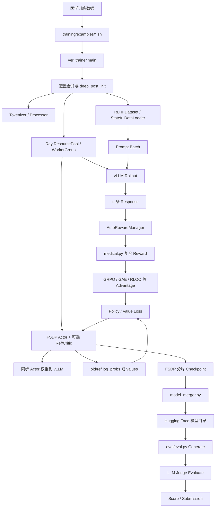

# MediX-R1 代码阅读一：从训练脚本到 Checkpoint、模型合并与评测的完整链路

> 本文基于本地仓库提交 `111966f42027ba34fcfd50fb104538f6f8127bd2` 和 2026 年 8 月 18 日的工作区快照撰写。本文优先描述**当前源码实际执行路径**；对于 README 中存在、但本地文件缺失的能力，会明确标为“文档意图”而不是“已可运行”。

## 系列导航

1. [完整训练链路与全部主要分支](./01-完整训练链路与全部主要分支.md)
2. [配置、数据协议与多模态模型适配](./02-配置数据协议与多模态模型适配.md)
3. [Ray、FSDP、vLLM、Reward 与强化学习算法](./03-分布式训练运行时与强化学习算法.md)
4. [Checkpoint、模型合并、评测流水线与源码风险](./04-Checkpoint模型合并评测与源码风险.md)

已有的概念型长文 [MediX-R1 从零到一](../medix-r1-从零到一.md) 更偏算法背景与入门知识；本系列更偏向“沿着当前代码逐层追踪”。

## 1. 先看最短结论

MediX-R1 不是一个单独的模型类，也不是一个只需执行 `train.py` 的小型工程。它是基于 EasyR1/veRL 风格代码构建的医学视觉语言模型强化学习训练与评测仓库，主链可以压缩成：

```text
医学图文 Dataset
→ RLHFDataset 构造多模态 Prompt
→ DataLoader 形成 prompt batch
→ Ray Driver 调度 FSDP WorkerGroup
→ vLLM 为每个 prompt 采样 n 条 response
→ 医学复合 Reward 打分
→ GRPO 等方法计算 Advantage
→ PPO/DAPO/GSPO 风格 Policy Loss
→ FSDP Actor 反向传播和更新
→ 保存分片 Checkpoint
→ model_merger.py 合并 Hugging Face 权重
→ eval/eval.py 生成、Judge 评分和汇总
```

当前两个医学实验脚本的核心区别不是“训练框架完全不同”，而是同一训练骨架上的参数差异：2B 脚本启用 GRPO Advantage、online filtering 和非对称 clip，8B 脚本使用 `gspo_token` importance ratio 与序列平均；两者都关闭 Reference Policy/KL。

必须先说明：**当前快照不能从 `run_train.sh` 顺利进入训练主循环。**本地已确认至少存在以下源码级阻断：

| 阻断 | 当前事实 | 影响 |
|---|---|---|
| 总启动脚本目标缺失 | `training/run_train.sh` 调用 `examples/medix-r1_8b_dapo.sh`，该文件不存在 | 直接执行总入口会由 Bash 报错 |
| Ray Controller 实现缺失 | `trainer/main.py` 与 `ray_trainer.py` 导入 `verl.single_controller.ray`，本地没有该文件或目录 | 即使依赖齐全，训练入口仍无法完成 import |
| FSDP-vLLM 文件名不匹配 | package 导入 `fsdp_vllm.py`，实际只有 `fsdp_vllm_20260428_224950.py` | `FSDPWorker` 导入链被阻断 |
| README 中的 Reward 服务脚本缺失 | README 要求执行 `training/vllm_serve.sh`，本地无此文件 | README 所述启动步骤不能照抄执行 |

后文仍然会完整解释阻断修复后代码**准备执行的链路**，但不会把静态源码分析冒充成已经跑通的训练证据。

## 2. 项目全景：训练、合并和评测是三个阶段



这三个阶段分别回答不同问题：训练阶段负责“怎样让参数变化”，合并阶段负责“怎样把分布式训练产物变成推理模型”，评测阶段负责“怎样在多个医学任务上生成回答并形成分数”。不能把 `global_step_600/actor/` 直接等同于一个可被普通 vLLM 加载的 Hugging Face 模型目录。

## 3. 阶段零：究竟应该从哪个脚本启动

### 3.1 `training/run_train.sh` 是选择器，不是训练实现

这个文件只有一个真正的执行动作：

```bash
bash examples/medix-r1_8b_dapo.sh
```

注释列出了 2B DAPO、7B GRPO、8B DAPO、8B GRPO、30B DAPO 等多个配置，但当前 `training/examples/` 里只有两个医学脚本：

```text
medix-r1_2b_dapo.sh
medix-r1_8b_gspo.sh
```

因此当前最接近可分析入口的是直接执行这两个实际存在的脚本，而不是 `run_train.sh`。本文不自动修改总入口，因为这属于源码修复，不属于文档生成。

### 3.2 两个实际医学脚本做什么

两个 Shell 文件都调用：

```bash
python3 -m verl.trainer.main config=examples/config.yaml key=value ...
```

这里的 `key=value` 不是 Bash 变量，而是 OmegaConf CLI override。它会覆盖 `examples/config.yaml` 和 Python dataclass 默认值。

| 维度 | 2B DAPO | 8B GSPO |
|---|---|---|
| 基座模型 | `Qwen/Qwen3-VL-2B-Instruct` | `Qwen/Qwen3-VL-8B-Instruct` |
| 数据 | 本地相对路径 `../data/medix-rl-data/data@train/test` | Hugging Face `MBZUAI/medix-rl-data@train/test` |
| GPU 数 | 2 | 8 |
| 每题采样数 `n` | 3 | 5 |
| Advantage | 配置继承 `grpo` | 配置继承 `grpo` |
| Policy loss | 默认 token-level PPO/DAPO clip | `gspo_token` |
| Loss 平均方式 | 默认 `token` | `seq` |
| Online filtering | 开启 | 未开启 |
| KL / Reference | 关闭 | 关闭 |

当前本地没有 `MediX-R1/data/medix-rl-data`，所以 2B 脚本的数据路径也不能在本快照直接解析成功；8B 脚本会依赖网络或本地 Hugging Face cache。

## 4. 配置合并：一次实验的真实配置从哪里来

`verl.trainer.main.main()` 按以下优先级构造最终配置：

```text
PPOConfig dataclass 默认值
→ examples/config.yaml
→ Shell CLI key=value 覆盖
→ OmegaConf.to_object()
→ PPOConfig.deep_post_init()
```

伪代码是：

```python
cli_args = OmegaConf.from_cli()
default_config = OmegaConf.structured(PPOConfig())
file_config = OmegaConf.load(cli_args.pop("config"))
merged = OmegaConf.merge(default_config, file_config, cli_args)
config = OmegaConf.to_object(merged)
config.deep_post_init()
```

### 4.1 `deep_post_init()` 不只是路径标准化

它递归调用每个 dataclass 的 `post_init()`，完成几类派生工作：

| 配置对象 | 关键动作 |
|---|---|
| `DataConfig` | 把图像目录、Prompt 模板、Chat Template 解析为绝对路径 |
| `RewardConfig` | 把 `file.py:function` 拆成文件路径和函数名，并解析绝对路径 |
| `ModelConfig` | 补齐 tokenizer 路径；本地模型路径转绝对路径 |
| `WorkerConfig` | 把 Actor 的 experience micro batch、padding-free、dynamic batching、Ulysses 设置传播给 Ref |
| `PPOConfig` | 把 prompt/response 长度传给 rollout；把 KL 选项传给 Actor |
| `TrainerConfig` | 生成默认 checkpoint 目录，解析恢复路径 |

因此只看 YAML 不足以知道 Worker 最终拿到什么。特别是 `worker.rollout.prompt_length`、`response_length`、`worker.actor.disable_kl` 都是运行前派生出来的字段。

### 4.2 配置校验分布在多个位置

配置不是在一个统一 validator 中一次性检查，而是在不同构造阶段逐步失败：

| 检查位置 | 典型条件 |
|---|---|
| `RayPPOTrainer.__init__()` | rollout batch 能否被 Actor global batch 整除；GRPO/RLOO 是否 `n>1` |
| `FSDPWorker._init_dist_mesh()` | 每设备 global batch 是否大于 0；能否被 update micro batch 整除 |
| `vLLMRollout.__init__()` | TP size 是否不大于 world size；batched token 上限是否覆盖 prompt+response |
| `ResourcePoolManager._check_resource_available()` | Ray 集群 GPU 数是否满足声明 |
| `AutoRewardManager.__init__()` | Reward 文件和目标函数是否存在、能否动态导入 |

这意味着一个“YAML 能被解析”的实验不等于一个“配置已完整合法”的实验。

## 5. Ray 启动：Driver 与远程 Runner

### 5.1 `main()` 的职责

完成配置构造后，`trainer/main.py` 会：

1. 如果 Ray 未初始化，则以一组 NCCL、vLLM、CUDA 环境变量调用 `ray.init()`；
2. 创建 `Runner.remote()`；
3. 在远程 Runner 中执行 `run(config)`；
4. Driver 使用 `ray.get()` 等待训练结束；
5. 如果配置了 timeline，则输出 Ray profiling 文件。

虽然仓库有 `examples/runtime_env.yaml`，当前 `main()` 并没有读取这个 YAML，而是在 Python 中硬编码了基本相同的 `runtime_env`。因此修改 `runtime_env.yaml` 不会自动改变主入口行为。

### 5.2 当前缺失的 Ray Controller 层

`Runner` 需要 `RayWorkerGroup`，`RayPPOTrainer` 还需要 `RayClassWithInitArgs`、`RayResourcePool` 和 `create_colocated_worker_cls`。这些符号应来自：

```text
verl/single_controller/ray/
```

但当前仓库只保留了通用 `single_controller/base/`，没有 Ray 子包。Base 层能告诉我们 dispatch/collect 的抽象契约，却不能替代具体 Ray Actor 的创建、placement、调用和结果收集实现。本文后续描述 WorkerGroup 调用时，会把“调用方当前写了什么”和“缺失实现应承担什么”分开。

## 6. `Runner.run()`：构造训练所需的全部对象

`Runner.run()` 的顺序是：

```text
打印最终配置
→ 加载 tokenizer
→ 加载 processor
→ 建立 role → FSDPWorker 映射
→ 建立 GPU ResourcePool 映射
→ 创建训练 RewardManager Ray Actor
→ 创建验证 RewardManager Ray Actor
→ 创建 train/val DataLoader
→ 创建 RayPPOTrainer
→ init_workers()
→ fit()
```

### 6.1 Hybrid Engine 的角色映射

源码把 `Role.ActorRolloutRef` 映射为同一个 `FSDPWorker` 类型，并让它们共用同一 GPU 资源池。这代表当前代码只实现 Hybrid Engine：训练时同一组资源承担 PyTorch/FSDP Actor，生成时唤醒 vLLM，必要时还构造 Reference Policy。

`Role.Critic` 也被放进映射表，但只有 Advantage estimator 为 GAE 时，`RayPPOTrainer` 才会真正创建 Critic Worker。当前两个医学脚本继承 `adv_estimator=grpo`，所以正常设计下不会创建 Critic。

### 6.2 RewardManager 为什么是独立 Ray Actor

`AutoRewardManager` 被包装成 `ray.remote`，训练和验证各创建一个实例。训练主循环可以先发出 `compute_reward.remote(batch)`，随后并行计算 old log-prob，最后再 `ray.get(reward_ref)`。这减少了远程 LLM Judge 或 Embedding 计算完全阻塞 GPU Actor 的时间。

但是 `medical.py` 在模块导入时会立即加载 `SentenceTransformer`，并且 RewardManager 默认只申请配置中的 CPU 数，没有显式声明 GPU。模型放到何种设备、是否与其他任务争抢显存，取决于 SentenceTransformer 和运行环境，而不是 Ray 资源声明明确控制。

## 7. 数据进入训练：`RLHFDataset` 到 `StatefulDataLoader`

`create_dataloader()` 分别构造训练集和验证集。数据路径支持：

```text
Hugging Face dataset ID[@split]
本地 Dataset save_to_disk 目录
本地 Parquet 目录
单个 Parquet 文件
```

对于医学脚本，字段映射被覆盖为：

```text
problem  → prompt
solution → ground_truth
image    → multi-modal input
```

`medical_format.jinja` 在原始问题前加上输出契约，并插入 `<image>` 占位符。`RLHFDataset._build_messages()` 再把 `<image>` 拆成 Transformers 多模态消息：

```python
{
    "role": "user",
    "content": [
        {"type": "text", "text": "..."},
        {"type": "image"},
        {"type": "text", "text": "..."},
    ],
}
```

### 7.1 单样本返回结构

`RLHFDataset.__getitem__()` 最终返回的核心字段是：

| 字段 | 类型/位置 | 用途 |
|---|---|---|
| `input_ids` | Tensor | 左填充后的 prompt token |
| `attention_mask` | Tensor | prompt 有效 token mask |
| `position_ids` | Tensor | 普通文本位置或 Qwen-VL 的文本+mRoPE 位置 |
| `raw_prompt_ids` | Python list | 交给 vLLM，避免从 padding 后输入重建 |
| `multi_modal_data` | 非 Tensor 对象 | 原始图像/视频路径或对象，供 rollout 和训练 forward 再处理 |
| `ground_truth` | 非 Tensor 字符串 | Reward 函数使用的标准答案 |

训练 DataLoader 使用带固定 seed 的 `RandomSampler` 和 `StatefulDataLoader`，目的是在 checkpoint 恢复时尽可能恢复样本顺序和迭代状态。训练 `drop_last=True`，验证 `drop_last=False`。

## 8. `DataProto`：贯穿 Driver、Worker、Actor、Rollout 和 Reward 的数据协议

DataLoader 输出普通字典后，Driver 使用 `DataProto.from_single_dict()` 将其拆成三部分：

```text
batch             TensorDict，保存可堆叠 Tensor
non_tensor_batch  NumPy object array，保存字符串、图像元数据等
meta_info         不沿 batch 维度变化的运行参数
```

训练过程中不是不停创建完全不同的数据对象，而是不断对同一个逻辑 batch 做 `pop()`、`union()`、`repeat()`、`reorder()` 和切片：

```text
Prompt DataProto
→ pop 生成所需字段形成 gen_batch
→ vLLM 返回 response DataProto
→ prompt 侧重复 n 次
→ union response
→ union old_log_probs
→ 可选 union ref_log_probs / values
→ 写入 token_level_scores
→ 写入 token_level_rewards
→ 写入 advantages / returns
→ 交给 Actor 更新
```

这也是阅读源码时最重要的主线：不要只问“调用了哪个函数”，还要持续记录 `DataProto` 当前有哪些 key。

## 9. `init_workers()`：远程 GPU Worker 如何组织

`RayPPOTrainer.init_workers()` 的设计顺序是：

1. 根据 `nnodes × n_gpus_per_node` 创建资源池；
2. 为 `ActorRolloutRef` 构造延迟实例化的 Worker class；
3. 如果需要 GAE，则额外构造 Critic；
4. 把同一资源池中的角色合并成 colocated Worker class；
5. 通过 RayWorkerGroup `spawn()` 创建远程 Worker；
6. 先初始化 Critic/Reward Model；
7. 最后初始化 ActorRolloutRef，让 vLLM 更准确估算剩余 KV Cache 显存。

最后一步体现了 Hybrid Engine 的显存策略：Actor 模型、优化器和 vLLM 并不是简单永久同时占满显存，而是通过 offload、sleep/wake 和权重同步轮换工作。

## 10. `FSDPWorker.init_model()`：一个 Worker 里创建哪些对象

`FSDPWorker` 根据 `role` 设置四个布尔标记：`_has_actor`、`_has_critic`、`_has_rollout`、`_has_ref`。如果 `disable_kl=True`，即使角色名包含 Ref，也会关闭 Reference Policy。

初始化顺序如下：

```text
构造 Actor/Critic 的 FSDP Hugging Face 模型和优化器
→ 可选构造 Ref FSDP 模型
→ 包装 DataParallelPPOActor 或 Critic
→ 构造 vLLMRollout
→ 构造 FSDPVLLMShardingManager
→ 构造 FlopsCounter 和 FSDPCheckpointManager
```

### 10.1 模型构造分支

`_build_model_optimizer()` 根据模型配置选择：

| 条件 | Hugging Face AutoClass |
|---|---|
| Critic | `AutoModelForTokenClassification` |
| VLM config 属于 image-to-text 映射 | `AutoModelForImageTextToText` |
| 其他 | `AutoModelForCausalLM` |

padding-free 开启时，会调用 `apply_ulysses_patch(model_type)` 修改 Transformers 的 FlashAttention 和 Qwen-VL forward。随后创建 FSDP wrapper、AdamW/AnyPrecisionAdamW 和学习率调度器，并按配置把参数或优化器 offload 到 CPU。

## 11. 一次训练 Step 的完整执行顺序

`RayPPOTrainer.fit()` 的核心循环可以概括为：

```python
prepare_rollout_engine()
batch = _make_batch_data()
release_rollout_engine()
balance_batch(batch)
reward_ref = reward_fn.compute_reward.remote(batch)
old_log_probs = actor.compute_log_probs(batch)
ref_log_probs = ref.compute_log_probs(batch)       # 可选
values = critic.compute_values(batch)              # 可选
reward = ray.get(reward_ref)
apply_kl_penalty_or_copy_reward()
compute_advantage()
critic.update_critic(batch)                        # 可选
actor.update_actor(batch)
validate_if_needed()
save_checkpoint_if_needed()
log_metrics()
```

下面逐段解释其中的分支。

## 12. 切换到 Rollout：同步 Actor 权重并唤醒 vLLM

`prepare_rollout_engine()` 最终调用 `FSDPVLLMShardingManager.load_vllm_and_sync_weights()`：

1. 必要时把 FSDP Actor 参数从 CPU 载回 GPU；
2. 唤醒 vLLM 权重区；
3. 使用 `get_model_state_dict()` 收集 Actor 权重；
4. 修正 Transformers 与 vLLM 可能不同的权重 key；
5. 调 vLLM model 的 `load_weights()`；
6. 唤醒 KV Cache；
7. 重置可能存在的多模态 cache；
8. 切换到用于生成的 CUDA RNG 状态。

生成结束后，`release_rollout_engine()` 让 vLLM `sleep(level=1)`，恢复训练 RNG，并把 Actor 切回 train mode。可以把它理解成同一组 GPU 在“推理场景”和“训练场景”之间切换。

## 13. `_make_batch_data()`：生成 batch 的全部主要分支

### 13.1 获取 prompt batch

Driver 从 `StatefulDataLoader` 取一批数据。若迭代器耗尽，则重新创建迭代器并从数据集开头继续。每条原始 prompt 会分配一个 UUID，后续同一 prompt 的 `n` 条 response 共享这个 `uid`。

### 13.2 构造 `gen_batch`

生成只需要：

```text
Tensor: input_ids, attention_mask, position_ids
Non-tensor: raw_prompt_ids, multi_modal_data
Meta: min_pixels, max_pixels, video_fps
```

这些字段通过 `DataProto.pop()` 从主 batch 移出，传给 WorkerGroup 的 `generate_sequences()`。

### 13.3 vLLM 生成 `n` 条 response

`vLLMRollout.generate_sequences()` 将原始 prompt token 和图像/视频转换成 vLLM 输入，调用 `LLM.generate()`。当 `n>1` 时，prompt tensor 和多模态数据都会重复对齐。

返回对象新增：

```text
prompts
responses
input_ids = prompt + response
attention_mask
response_mask
position_ids
multi_modal_data（如有）
```

### 13.4 ReMax 特殊分支

如果 `adv_estimator == remax`，代码会额外以 `temperature=0,n=1` 生成 baseline response，计算 baseline reward，存入 `reward_baselines`，随后再处理正常采样结果。当前两个医学脚本不进入该分支。

### 13.5 Online filtering 分支

2B DAPO 脚本开启此分支：

1. 立即调用 RewardManager 对所有 response 评分；
2. 按 `uid` 将同一 prompt 的多条 response 分组；
3. 计算每组指定 reward key 的平均值；
4. 只保留均值严格位于 `(filter_low, filter_high)` 的组；
5. 如果保留 prompt 数不足目标 `rollout_batch_size`，继续取新 prompt 并生成；
6. 达到 `max_try_make_batch` 仍不足时抛出异常。

默认阈值是 `(0.01,0.99)`，所以“所有回答全错”和“所有回答全对”的 prompt 都可能被过滤。目标是保留能产生区分度的题目，而不是简单只保留高分样本。

### 13.6 Online filtering 的失败情况

| 情况 | 当前行为 |
|---|---|
| 当前尝试一个样本都没保留 | 立即 `RuntimeError("No sample is kept...")` |
| 有保留但累计数量不足 | 继续生成下一批 |
| 尝试次数超过限制 | `RuntimeError("Generated too many...")` |
| Reward 持续失败并返回 0 | 大量组会被低阈值过滤，最终可能无法凑 batch |

## 14. Reward：复合医学分数怎样形成

`AutoRewardManager` 动态导入 `medical.py:compute_score`，把 response token 解码为字符串，并构造：

```python
{
    "response": response_str,
    "response_length": valid_token_count,
    "ground_truth": ground_truth,
}
```

`medical.py` 为每条样本计算格式、LLM Judge、Embedding 相似度和图像模态四个分项。默认 `format_weight=0.1` 时，总分为：

$$R=0.5175R_{llm}+0.3375R_{embed}+0.045R_{modality}+0.1R_{format}$$

Reward Manager 不会把标量复制到每个 response token，而是只写到**最后一个有效 response token**。因此 `token_level_scores.sum(-1)` 等于序列级总分，GRPO 再用这个标量做组内标准化。

## 15. old log-prob、Reference 和 Critic 分支

### 15.1 old log-prob

即使 response 是 vLLM 刚生成的，Hybrid Engine 仍会用当前 PyTorch Actor 重新计算 response token 的 log-prob，并保存为 `old_log_probs`。原因是 vLLM 生成结果与 Actor 训练 forward 的数据布局、实现和梯度环境不同；Policy update 需要稳定的旧策略概率作为 importance ratio 基准。

### 15.2 Reference Policy

只有 `disable_kl=False` 时才构造和调用 Ref。KL 可以有两种接入方式：

| 配置 | 行为 |
|---|---|
| `use_kl_loss=False` | 先从 token reward 中减去 KL penalty，再算 Advantage |
| `use_kl_loss=True` | Reward 不减 KL，Actor loss 里额外加入 KL loss |

当前两个医学脚本都设置 `disable_kl=True`，因此不构造 Ref，也不记录真实 Reference KL。

### 15.3 Critic

只有 `adv_estimator=gae` 时 `use_critic=True`，才计算 values、returns 和 value loss。GRPO/DAPO/GSPO 当前实验不需要 Critic。训练日志里仍使用 `critic/score/mean` 等历史命名，但这不代表真的训练了 Critic。

## 16. Advantage：当前医学实验实际走 GRPO

GRPO 将同一 prompt 的 `n` 个 response 按 `uid` 分组。对第 $i$ 个 response，总 reward 为 $R_i$，组内均值和标准差为 $\mu_g$ 与 $\sigma_g$，代码计算：

$$A_i=\frac{R_i-\mu_g}{\sigma_g+\epsilon}$$

随后把同一个标量 Advantage 复制到该 response 的所有有效 token 位置。因为当前两个医学脚本设置 `n=3` 或 `n=5`，满足源码对 `n>1` 的要求。

如果同组所有 response reward 完全相同，标准差为 0，分子也为 0，最终 Advantage 接近 0。这组样本几乎不向 Actor 提供有效更新信号；2B 脚本用 online filtering 尝试减少这种情况。

## 17. Actor 更新：Policy Loss 怎样落到参数上

`DataParallelPPOActor.update_policy()` 会：

1. 从 `DataProto` 选择输入、response、mask、old/ref log-prob 和 Advantage；
2. 按每设备 global batch 切 mini-batch；
3. 按固定 micro batch 或动态 token budget 再拆分；
4. 重新 forward 得到当前 `log_probs`；
5. 调 `compute_policy_loss()`；
6. 可选叠加 KL loss；
7. 按全局有效 token 数修正 loss scale；
8. `backward()`；
9. 梯度裁剪和 optimizer step；
10. 更新学习率并返回 metrics。

默认 PPO/DAPO 路径先计算 token ratio $r_t=\exp(\log\pi_\theta-\log\pi_{old})$，再使用非对称上下界和 dual clip。8B 脚本的 `gspo_token` 先用序列平均 log-ratio 构造 forward ratio，同时保留 token 级梯度通道；具体数学与代码会在第三篇展开。

## 18. 验证、日志和 Checkpoint 分支

### 18.1 验证

验证也会经历：唤醒 vLLM、生成、Reward 打分、记录样本、释放 vLLM。区别是使用 `rollout.val_override_config`，默认 `temperature=0.6,top_p=0.95,n=1`。当前两个医学脚本设置 `val_before_train=False`，且基础 YAML 的 `val_freq=-1`，所以训练前和训练中都不验证，但训练循环结束后仍会执行一次最终验证。

### 18.2 日志

`Tracker` 可以同时写 console、file、MLflow、SwanLab、TensorBoard 和 W&B。基础 YAML 使用 `file` 与 `wandb`。指标包括 Reward 分项、response/prompt 长度、policy loss、clip fraction、吞吐、每阶段耗时、GPU/CPU 内存与 MFU。

### 18.3 Checkpoint

如果达到 `save_freq` 就定期保存；即使 `save_freq<=0`，训练完成时也会保存一次。保存内容包括：

```text
actor/model_world_size_<N>_rank_<r>.pt
actor/optim_world_size_<N>_rank_<r>.pt
actor/extra_state_world_size_<N>_rank_<r>.pt
actor/huggingface/config + tokenizer/processor
可选 critic/
dataloader.pt
checkpoint_tracker.json
```

恢复时会恢复 Actor/Critic 分片、optimizer、scheduler、随机数状态和 DataLoader 状态，并把 `global_step` 设置为目录名中的 step。

## 19. 训练结束后：为什么还要模型合并

FSDP checkpoint 是按 rank 保存的分片，不适合直接作为普通 Hugging Face 模型加载。`training/scripts/model_merger.py` 会：

```text
读取 rank0 分片和 DeviceMesh 信息
→ 并行读取其他 rank 分片
→ 按 DTensor placement 拼接或取副本
→ 读取 checkpoint/huggingface/config
→ 创建空 Hugging Face 模型
→ save_pretrained(..., state_dict=merged)
→ 输出 actor/huggingface/
```

`training/merge_model.sh` 仍保留占位路径，必须修改；`eval2/merge.sh` 则把路径固定到本地 `global_step_600`，但当前快照中该 checkpoint 不存在。

## 20. 评测：Generate、Evaluate、Score

合并后的模型可进入 `eval/eval.py` 或 `eval2/eval.py`。

### 20.1 Generate

```text
读取 tasks.yaml
→ 加载并统一 17 个任务中的选定任务
→ 启动 candidate vLLM server，端口 8005
→ OpenAI-compatible client 发送文本/图像消息
→ 结果逐条追加到 <model>.jsonl
→ 已完成 ID 可跳过
```

### 20.2 Evaluate

```text
读取生成结果
→ 启动本地 Judge，或连接 OpenRouter/configapi
→ 每个样本连续判断 3 轮
→ 普通任务多数投票得到 0/1
→ MIMIC 任务平均得到 0-5 分
→ 追加到 <model>_eval.jsonl
```

### 20.3 Score

```text
读取 eval JSONL
→ 按 task 累计正确数或 MIMIC 分数
→ 计算各任务分数
→ 对任务做宏平均
→ 写入 <model>_score.txt
```

`eval2/` 是针对本地 2B checkpoint 的定制副本：默认只跑 `rad_vqa`，Candidate 仍是本地 vLLM，Judge 改为工作区 `config.py` 中的 OpenAI-compatible API。

## 21. 四条典型执行轨迹

### 21.1 轨迹一：2B DAPO 正常设计路径

```text
medix-r1_2b_dapo.sh
→ GRPO, n=3, online_filtering=True, KL disabled
→ 每批 16 个 prompt，各生成 3 条 response
→ Reward 按 uid 分组过滤过难/过易题
→ 凑满 16 个 prompt、48 条 response
→ GRPO Advantage
→ 非对称 clip_ratio_low=0.2 / high=0.28
→ Actor update
→ 训练结束保存 checkpoint
```

### 21.2 轨迹二：8B GSPO 正常设计路径

```text
medix-r1_8b_gspo.sh
→ GRPO Advantage, n=5, no online filtering, KL disabled
→ 每批 16 个 prompt、80 条 response
→ gspo_token sequence-level importance ratio
→ loss_avg_mode=seq
→ Actor update
→ 保存 checkpoint
```

这里“GSPO”主要体现在 Policy Loss ratio 和平均方式，Advantage estimator 仍是 GRPO。不要把脚本名理解成训练框架完全切换成另一套独立算法实现。

### 21.3 轨迹三：Reward API 持续失败

```text
medical.py 调 Judge API失败
→ llm_answer_match 返回0
→ Embedding/格式/模态分项仍可能有分
→ 若 ground_truth 契约也不匹配，多项返回0
→ online filtering 可能把整组过滤
→ 反复生成仍凑不满 batch
→ 达到 max_try_make_batch 后训练 step 失败
```

### 21.4 轨迹四：训练可以保存，但推理模型尚不可用

```text
FSDP checkpoint 保存成功
→ actor/huggingface/ 只有配置和 tokenizer/processor
→ 未执行 model_merger.py
→ 缺少合并后的 safetensors
→ eval2/eval.sh 检查失败并要求先 merge
```

## 22. 当前主链中“存在组件，但本快照不能证明可用”的部分

| 能力 | 代码状态 | 当前结论 |
|---|---|---|
| Ray WorkerGroup 调度 | 调用方与 Base 抽象存在，Ray 具体实现缺失 | 不能从本地完成 import，更不能声称分布式启动已验证 |
| FSDP↔vLLM 权重同步 | 实现存在于时间戳文件 | package 导入名错误，主链当前不可达 |
| Critic/GAE | Critic 和算法代码存在 | 医学脚本不使用；Critic 初始化还有单独代码问题，不能由 GRPO 运行推断它正常 |
| README Reward vLLM server | README 有说明 | 对应脚本和函数名与当前代码不一致 |
| 本地 2B 训练数据 | Shell 路径存在 | 当前仓库没有数据目录 |
| eval2 本地 checkpoint/数据 | Shell/YAML 固定路径 | 当前仓库没有 checkpoint 和 `datasets_local/vqa-rad` |
| 端到端训练证据 | 有训练曲线图片和报告 | 本轮只完成静态源码、AST 和 Shell 语法检查，没有复现 GPU 训练 |

## 23. 阅读完本文后，你应该形成的心智模型

MediX-R1 的核心不是某个神秘 `MediXR1Model` 类，而是五类状态在不同执行域之间流动：配置决定资源和算法，Dataset 产生 prompt 与多模态元数据，DataProto 携带 batch 在 Driver/Worker 间流转，Hybrid Engine 在 FSDP 训练与 vLLM 生成间切换，Reward 与 Advantage 把生成质量转换成 Actor 梯度。Checkpoint 和 Eval 则位于训练闭环之外，分别解决“如何交付权重”和“如何测量模型”。

建议下一步阅读第二篇，从 `DataConfig → RLHFDataset → DataProto → Qwen3-VL patch` 逐层理解每个 batch 在进入 GPU 之前究竟长什么样。
