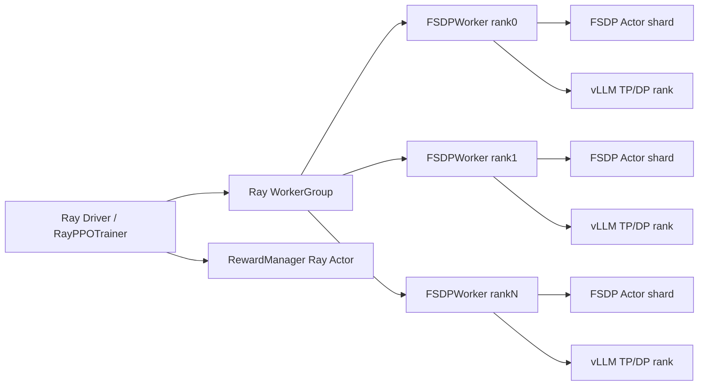

# MediX-R1 代码阅读三：Ray、FSDP、vLLM、复合 Reward 与强化学习算法

> 本文聚焦训练运行时和数学核心：Driver 怎样调度 Worker，FSDP Actor 怎样与 vLLM 共用 GPU，医学 Reward 怎样变成 token-level tensor，GRPO、DAPO 与 GSPO 在当前源码里分别对应哪些实现。文中会把“脚本名称”“配置组合”和“算法实现”分开，避免仅凭文件名过度归因。

## 系列导航

1. [完整训练链路与全部主要分支](./01-完整训练链路与全部主要分支.md)
2. [配置、数据协议与多模态模型适配](./02-配置数据协议与多模态模型适配.md)
3. [Ray、FSDP、vLLM、Reward 与强化学习算法](./03-分布式训练运行时与强化学习算法.md)
4. [Checkpoint、模型合并、评测流水线与源码风险](./04-Checkpoint模型合并评测与源码风险.md)

## 1. 先把六个角色分清

| 角色 | 当前实现 | 是否更新参数 | 输入/输出 |
|---|---|---:|---|
| Driver | `RayPPOTrainer` | 否 | 组织 DataProto、计算轻量 Advantage、发 RPC |
| Actor | `DataParallelPPOActor` + FSDP 模型 | 是 | response token log-prob、Policy update |
| Rollout | `vLLMRollout` | 否 | prompt → 采样 response |
| Reference Policy | 无优化器的 `DataParallelPPOActor` | 否 | ref log-prob，用于 KL |
| Critic | `DataParallelPPOCritic` | 是 | value 估计与 value loss，仅 GAE 路径 |
| Reward | Ray Actor 中的 `AutoRewardManager` | 否 | response/ground truth → 标量分项和 reward tensor |

当前医学脚本使用的是 Actor + Rollout + Reward；因为 `disable_kl=True`，Reference 被关闭；因为 `adv_estimator=grpo`，Critic 不创建。

## 2. 当前分布式架构到底是什么



这是一种 Single Controller 架构：Driver 不直接做大型模型 forward，而是通过 WorkerGroup 的动态方法调用远程 Worker。Worker 方法上的 `@register` 描述参数怎样切分、在哪些 rank 执行、结果怎样收集。

但是当前仓库缺少 `verl/single_controller/ray` 具体实现。因此上图是由调用方和 Base 抽象共同表达的**设计路径**，不是本快照已经成功启动的运行证据。

## 3. `ResourcePoolManager`：GPU 资源声明

`Runner.run()` 创建一个 `global_pool`：

```python
resource_pool_spec = {
    "global_pool": [n_gpus_per_node] * nnodes,
}
```

例如单机 8 卡得到 `[8]`，双机每机 8 卡得到 `[8,8]`。ActorRolloutRef 与 Critic 都映射到同一个 pool，具体是否真正创建 Critic 由 Trainer 决定。

`ResourcePoolManager._check_resource_available()` 只比较 Ray 当前可见 GPU 总数和声明需要数。它不验证显存容量、GPU 型号一致性、NVLink/IB、CUDA/NCCL 兼容性，也不验证每个节点是否满足对应数量；更细的 placement 应由缺失的 RayResourcePool 层承担。

## 4. `Worker` 与环境变量

通用 `Worker` 基类依赖以下环境变量：

```text
WORLD_SIZE, RANK
LOCAL_WORLD_SIZE, LOCAL_RANK
MASTER_ADDR, MASTER_PORT
CUDA_VISIBLE_DEVICES
WG_PREFIX
```

rank 0 负责选择 master address/port，并通过一个 detached Ray register-center actor 共享。`Worker._configure_with_meta()` 把元数据写回实例和环境变量，随后 `FSDPWorker` 才能调用 `dist.init_process_group(backend="nccl")`。

### 4.1 当前 Base 层能证明什么

Base 代码能证明：作者设计了 rank 元数据、register center、WorkerGroup 动态方法绑定和多种 dispatch 策略。它不能证明远程 Actor 怎样 spawn、每个 GPU 怎样设置、`execute_all()` 怎样实现，因为这些应在缺失的 Ray 子包中。

## 5. `FSDPWorker.__init__()`：角色和并行网格

### 5.1 角色布尔值

```text
actor               → Actor
critic              → Critic
rollout             → Rollout
ref                 → Reference
actor_rollout       → Actor + Rollout
actor_rollout_ref   → Actor + Rollout + Reference
```

如果 Actor 与 Critic 同时出现会报错；如果 `actor.disable_kl=True`，`_has_ref` 被强制置为 False。

### 5.2 FSDP/HSDP DeviceMesh

`_init_dist_mesh()` 根据 `fsdp_size` 构造：

| 条件 | Mesh | 含义 |
|---|---|---|
| `fsdp_size<=0` 或 `>=world_size` | `(world_size,)`，名为 `fsdp` | 全部 rank 做一组 FSDP |
| `0<fsdp_size<world_size` | `(world_size/fsdp_size,fsdp_size)`，名为 `ddp,fsdp` | 组间 DDP、组内 FSDP/HSDP |

如果 `ulysses_size>1`，另建 `(dp,sp)` 网格用于 Sequence Parallel。

### 5.3 global batch 的派生

当 rollout `n>1` 时，Worker 内把 Actor/Critic 的 `global_batch_size` 乘以 `n`。例如 2B 脚本原始值 16、`n=3`，Actor 实际更新 batch 为 48 条 response；8B 脚本为 80 条 response。

随后计算：

$$B_{device}=\frac{B_{global}}{world\_size/ulysses\_size}$$

并要求每设备 batch 能被 update micro batch 整除。这里的 global batch 指 response 条数，不再是原始 prompt 数。

## 6. FSDP 模型构造

`_build_model_optimizer()` 先加载 tokenizer、processor、AutoConfig 和 GenerationConfig，然后根据 role 选择 AutoModel。

### 6.1 Rank0 初始化

`enable_rank0_init=True` 时，FSDP mesh 中 local rank 0 正常从 pretrained 加载，其余 rank 在 `no_init_weights()` 和 `init_empty_weights()` 下创建 meta/empty model，再由 FSDP `sync_module_states=True` 同步状态。这降低每个进程都从磁盘或 Hub 读取完整模型的 CPU 内存开销。

### 6.2 Mixed Precision

默认：

```text
FSDP param dtype: bf16
reduce dtype: fp32
buffer dtype: fp32
初始 Actor/Critic model dtype: fp32（除非显式配置）
Reference 初始 dtype: bf16
```

随后模型被 `.to(torch_dtype)` 并包进 FSDP。实际参数保存和计算精度由 AutoModel dtype、FSDP mixed precision、optimizer 策略共同决定，不能只看 YAML 中一个 `dtype` 字段。

### 6.3 FSDP Sharding Strategy

| Mesh | `enable_full_shard` | 策略 |
|---|---:|---|
| 1D | True | `FULL_SHARD` |
| 1D | False | `SHARD_GRAD_OP` |
| 2D HSDP | True | `HYBRID_SHARD` |
| 2D HSDP | False | `_HYBRID_SHARD_ZERO2` |

### 6.4 优化器和调度器

支持 fused `torch.optim.AdamW` 与自定义 `AnyPrecisionAdamW`。学习率调度支持 constant warmup 和 cosine warmup。`training_steps` 在 `RayPPOTrainer.__init__()` 计算后写回 OptimConfig。

## 7. Hybrid Engine：FSDP Actor 和 vLLM 为什么能共用 GPU

`vLLMRollout` 创建 vLLM 时使用：

```text
load_format="dummy"
distributed_executor_backend="external_launcher"
enable_sleep_mode=True
```

`load_format="dummy"` 表示 vLLM 初始化结构但不从模型目录正常加载完整权重，权重随后由 `FSDPVLLMShardingManager` 从 FSDP Actor 同步。创建完成后立即 `sleep(level=1)` 释放权重相关显存。

### 7.1 生成前

```text
Actor 参数必要时从 CPU 回 GPU
→ vLLM wake_up(weights)
→ FSDP get_model_state_dict
→ DTensor full_tensor / key rename
→ vLLM model.load_weights
→ vLLM wake_up(kv_cache)
→ reset_mm_cache
```

### 7.2 生成后

```text
vLLM sleep(level=1)
→ 记录释放显存量
→ Actor train()
→ empty_cache
→ 恢复训练 RNG
```

这不是零成本切换。每个训练 step 都可能涉及权重收集、同步、显存 allocator 切换和 cache 重建，换来的是不需要为独立 rollout 模型永久预留另一组 GPU。

## 8. vLLM Rollout 初始化约束

`vLLMRollout.__init__()` 的关键检查：

```text
tensor_parallel_size ≤ torch.distributed world_size
max_num_batched_tokens ≥ prompt_length + response_length
```

医学脚本设置 prompt 4352、response 4096，总和 8448，同时把 `max_num_batched_tokens` 设为 8448，刚好满足下界。

### 8.1 采样参数

基础配置默认：`temperature=1.0,top_p=1.0,n=5`，医学脚本只覆盖 `n`。vLLM SamplingParams 还会从 RolloutConfig 中挑选同名字段，如 top_k、seed、ignore_eos。`max_tokens` 固定为 response length，`detokenize=False`，因为训练需要 token IDs。

### 8.2 禁止生成 image token

`_get_logit_bias()` 把 processor 的 image token ID bias 设为 -100，减少模型在文本 response 中输出图像占位 token。当前代码留有 TODO，没有对 video token 做对应处理。

## 9. `generate_sequences()`：输入和输出 shape

假设每 rank 收到 $B$ 个 prompt、固定 prompt 长度 $P$、最大 response 长度 $R$、采样数 $n$：

| 字段 | 生成前 | 生成后 |
|---|---|---|
| `input_ids` | `(B,P)` | `(B×n,P+R)` |
| `prompts` | 无 | `(B×n,P)` |
| `responses` | 无 | `(B×n,R)` |
| `attention_mask` | `(B,P)` | `(B×n,P+R)` |
| `response_mask` | 无 | `(B×n,R)` |
| `position_ids` | `(B,P)` 或 `(B,4,P)` | 延伸到 `P+R` |

response 用 pad token 补到固定长度，`get_response_mask()` 在 EOS 后置 0。后续 Reward、Advantage 和 Loss 都必须使用这个 mask，避免 padding token 影响统计。

## 10. TP 数据预处理与后处理

`FSDPVLLMShardingManager.preprocess_data()` 在 Tensor Parallel group 内 all-gather DataProto，让每个 TP rank 获得一致输入。vLLM 各 TP rank 协同执行同一批生成。生成后 `postprocess_data()` 按 TP rank 重新 chunk，只保留本 rank 对应数据，避免收集时重复 $tp\_size$ 份结果。

如果 `vLLMRollout` 发现 batch size 与 `raw_prompt_ids` 数量不一致，会报“vllm sharding manager is not work properly”，这是 TP 数据同步失败的显式保护。

## 11. 医学 Reward 模块的生命周期

`AutoRewardManager` 动态加载 `medical.py` 时，模块顶层立即执行：

```python
embed_model = SentenceTransformer(
    "abhinand/MedEmbed-large-v0.1",
    trust_remote_code=True,
)
```

这意味着 RewardManager 初始化本身就可能下载模型、读取 cache、占用内存或 GPU。加载失败会被 AutoRewardManager 包装为 `RuntimeError("Failed to load reward function...")`，训练尚未开始就终止。

`medical.py` 还把工作区根目录插入 `sys.path`，从根 `config.py` 读取 `LLM_CONFIG`。本轮只确认该文件存在，没有读取或展示其中的密钥值。

## 12. `AutoRewardManager`：batch 与 sequential 两种协议

Reward 模块可以定义：

```text
REWARD_TYPE="batch" 或 "sequential"
REWARD_NAME="..."
```

若未定义，默认 `REWARD_TYPE="batch"`。当前 `medical.py` 没有定义这两个常量，因此使用默认 batch 模式，`compute_score()` 一次接收整个 batch 的 list。

### 12.1 RewardInput

每个输入包含 response 文本、有效 response 长度和 ground truth。`skip_special_tokens=True` 时 tokenizer 会去除特殊 token 后再交给 Reward。

### 12.2 标量放到最后一个 token

Reward tensor 初始化为与 `responses` 同 shape 的全 0 Tensor，只在索引 `response_length-1` 写入 `score["overall"]`：

```text
[0,0,0,...,R]
```

因此它仍是 token-level 数据结构，但表达的是 outcome reward。

### 12.3 空 response 的边界

如果有效 response length 为 0，索引会变成 `-1`，标量写入最后一个 padding 位置。正常 vLLM 通常至少返回一个 token，但代码没有显式拒绝空 response，这属于应在单元测试中覆盖的边界。

## 13. 医学复合 Reward 四个分项

### 13.1 Format Reward

它寻找第一个 `<thinking>`，截掉前面的模态文本，然后要求剩余内容完整匹配：

```text
<thinking>...</thinking><answer>...</answer>
```

允许两个标签之间有空白，不允许 `<answer>` 后再有其他文本。它不要求 reasoning 非空，也不验证模态标签。

### 13.2 LLM Accuracy Reward

执行顺序：

```text
提取 <answer> 内容
→ 从 ground_truth 去掉模态前缀
→ 拒绝空、单字符或含 __/:/? 的答案
→ 完全相等则直接 1
→ 否则调用远程 LLM Judge
→ Judge 回复含 YES 则 1，否则 0
```

HTTP 请求没有显式 timeout 和 retry；`raise_for_status()` 后解析 OpenAI-compatible response。任何异常在 `llm_answer_match()` 或外层 accuracy 函数中转为 0。

“回复含 YES”而不是“严格以 YES 开头”意味着诸如 `NOT YES` 也可能被判 1，虽然 Judge Prompt 要求严格输出 YES/NO。

### 13.3 Embedding Accuracy Reward

使用 MedEmbed 对预测答案和标准答案编码，计算 cosine similarity，阈值默认 0.8。输出仍是二值 0/1，而不是连续相似度。

### 13.4 Modality Reward

取 `<thinking>` 前所有文本作为预测模态，与 ground truth 第一个 `>` 之前的前缀比较，忽略大小写但不做多余文本清洗。若模型输出模态后附带解释，会失分。

## 14. Reward 权重

`content_weight=1-format_weight`，默认 `format_weight=0.1`。内容内部三项权重和为 1：

```text
LLM Accuracy     0.575
Embedding        0.375
Modality         0.050
```

所以实际总分：

$$R=(1-w_f)(0.575R_{llm}+0.375R_{embed}+0.05R_{modality})+w_fR_{format}$$

默认值展开为：

$$R=0.5175R_{llm}+0.3375R_{embed}+0.045R_{modality}+0.1R_{format}$$

这里四个分项都是二值，因此 overall 只能落在有限离散组合上，而不是连续质量分。Embedding 虽计算连续 cosine，最终也阈值化了。

## 15. Reward 并发

`compute_score()` 使用 `ThreadPoolExecutor(max_workers=16)`，为每条 response 并发执行 `_score_single()`。每条任务里又会串行计算 LLM Judge、Embedding 和其他分项。

这带来几个工程后果：

| 现象 | 原因 |
|---|---|
| Judge API QPS 突增 | 每个 RewardManager 可同时发 16 个请求 |
| 大 batch 等待最慢请求 | `scores=[f.result() for f in futures]` 按 future 列表取结果 |
| HTTP 永久挂起可卡住 batch | `requests.post()` 无 timeout |
| 两个 RewardManager 各加载一份 embedding 模型 | 训练和验证各一个 Ray Actor |
| API 错误可能被掩盖为低 Reward | 多数异常只打印或静默返回 0 |

## 16. Reward 与 Online Filtering 的耦合

2B DAPO 的 filtering 使用 `reward_metrics[filter_key]`，默认 `filter_key="overall"`。它按同一 prompt 的 response 平均分过滤，而不是按最大分或方差过滤。

保留条件是严格不等式：

$$\mathrm{filter\_low}<\frac{1}{n}\sum_{i=1}^{n}R_i<\mathrm{filter\_high}$$

默认 0.01 与 0.99 可以排除全 0 和接近全 1 的组，但无法保证组内 response 真有差异。例如三条 response 都是 0.5，均值合格却标准差为 0，GRPO Advantage 仍为 0。

## 17. Advantage registry

`core_algos.py` 用 decorator 将名字映射到函数：

```text
gae
grpo
grpo_passk
rloo
reinforce_plus_plus
remax
```

`compute_advantage_return(name, **kwargs)` 只做查表调用。配置写错但未在枚举校验前暴露时，可能出现 KeyError；`RayPPOTrainer` 也检查 estimator 是否属于枚举。

## 18. GAE 路径

GAE 的标准递推是：

$$\delta_t=r_t+\gamma V_{t+1}-V_t$$

$$A_t=\delta_t+\gamma\lambda A_{t+1}$$

实现从后向前遍历 response token，最后令 returns 为 `advantages+values`，再对 Advantage 做 masked whiten。

### 18.1 当前 GAE 实现的代码风险

循环内写了：

```text
if response_mask[:, t]:
```

当 batch size 大于 1 时，这通常会触发“多元素 Tensor 的布尔值不明确”。合理实现应做逐元素 mask 更新，而不是 Python `if`。当前医学 GRPO 路径不触发 GAE，但这意味着不能据源码存在就认为 Critic/GAE 可用。

## 19. GRPO Advantage

当前医学脚本都使用该实现。先对 token reward 求和得到每条 response 的 $R_i$，再按 `uid` 分组：

$$\mu_g=\frac{1}{n}\sum_{i=1}^{n}R_i$$

$$\sigma_g=\operatorname{std}(R_1,\ldots,R_n)$$

$$A_i=\frac{R_i-\mu_g}{\sigma_g+\epsilon}$$

最后：

$$A_{i,t}=A_i\cdot \mathrm{mask}_{i,t}$$

源码返回 `(returns,returns)`，即在无 Critic outcome 方法中把 Advantage 与 Returns 设为同一张量。

### 19.1 为什么 `n>1`

单个 response 无法计算有意义的组内相对表现，所以 Trainer 对 GRPO/RLOO 显式要求 `rollout.n>1`，GRPO 函数内部也 assert 每个 uid 至少两个分数。

## 20. 其他 Advantage 实现

| 方法 | 核心思想 | 当前医学脚本 |
|---|---|---|
| `grpo_passk` | 每组只让最好 response 获得与第二名差值相关的 Advantage | 未使用 |
| `rloo` | 用其余 $n-1$ 条 response 均值作 leave-one-out baseline | 未使用 |
| `reinforce_plus_plus` | 从后向前算 discounted return，再 masked whiten | 未使用 |
| `remax` | 额外贪心生成 baseline，Reward 差作为 Advantage | 未使用 |
| `gae` | Critic value + TD residual | 未使用，且当前实现有边界问题 |

## 21. old log-prob 与 current log-prob

Rollout 由 vLLM 完成，但 `compute_log_probs()` 会让 PyTorch Actor 对完整 prompt+response 再 forward，得到 `old_log_probs`。Actor update 时再次 forward 得到带梯度的 `log_probs`。

importance ratio 为：

$$r_t(\theta)=\exp(\log\pi_\theta(a_t|s_t)-\log\pi_{old}(a_t|s_t))$$

在每个 training batch 开始时 old policy 就是生成 response 时的 Actor 快照；一个 batch 内可做多个 PPO epoch，而 old log-prob 保持不变。

## 22. `compute_policy_loss()`：默认 PPO/DAPO 路径

代码允许上下 clip 不对称：

$$r_t^{clip}=\exp(clip(\log r_t,\log(1-\epsilon_l),\log(1+\epsilon_h)))$$

构造：

$$L_1=-A_t r_t$$

$$L_2=-A_t r_t^{clip}$$

$$L_3=-A_t C$$

先取 `max(L1,L2)` 做普通 clip，再在 $A_t<0$ 时取 `min(...,L3)` 做 dual clip。2B DAPO 脚本设置 `clip_ratio_low=0.2`、`clip_ratio_high=0.28`，上界比下界更宽，这是当前代码里最明确的 DAPO-style 非对称 clipping。

### 22.1 为什么不能只凭脚本名说“完整复现 DAPO”

当前 2B 配置还包含 GRPO Advantage、online filtering、dual clip 和关闭 KL，但没有单独的 `dapo` estimator/class。它是若干 DAPO 风格机制的配置组合。是否完整对应某篇论文的所有细节，需要逐项对论文与实验配置，不应由文件名自动推出。

## 23. GSPO 与 `gspo_token`

当 `loss_type in ["gspo","gspo_token"]`，先计算每条 response 的平均 log-ratio：

$$\overline{\Delta}_i=\frac{\sum_t \mathrm{mask}_{i,t}(\log\pi_\theta-\log\pi_{old})}{\sum_t \mathrm{mask}_{i,t}}$$

`gspo` 直接把序列级值广播到 token；`gspo_token` 使用：

$$\log r_{i,t}=stopgrad(\overline{\Delta}_i)+(\log\pi_{\theta,i,t}-stopgrad(\log\pi_{\theta,i,t}))$$

forward 数值来自序列级 ratio，但梯度仍通过 token log-prob 传播。8B 脚本选择 `gspo_token`，并设置 `loss_avg_mode=seq`，即先对每条序列的有效 token loss 求平均，再对 batch 求平均。

### 23.1 8B 脚本仍使用 GRPO Advantage

它没有覆盖 `algorithm.adv_estimator`，所以继承 YAML 中的 `grpo`。准确描述应是：

```text
GRPO outcome advantage
+ GSPO-token style importance ratio
+ sequence-level loss averaging
+ n=5
+ no KL
```

## 24. `cispo` 分支

当 `loss_type="cispo"`，loss 为：

$$L=-A_t\log\pi_\theta\cdot stopgrad(r_t^{clip})$$

当前医学脚本不使用，但 core 算法为实验扩展保留了入口。

## 25. Loss 平均：token 与 seq

`average_loss()` 支持：

$$L_{token}=\frac{\sum_{i,t}\mathrm{mask}_{i,t}L_{i,t}}{\sum_{i,t}\mathrm{mask}_{i,t}}$$

$$L_{seq}=\frac{1}{B}\sum_i\frac{\sum_t \mathrm{mask}_{i,t}L_{i,t}}{\sum_t \mathrm{mask}_{i,t}}$$

`token` 会让长 response 贡献更多 token 权重，`seq` 让每条 response 的整体权重更接近。8B GSPO 脚本选择 `seq`。

## 26. Entropy 指标不是真正的分布熵

`compute_policy_loss()` 记录的 `entropy_loss` 是 `average_loss(-log_probs)`，即采样 token 的负 log-prob 代理，而不是对整个 vocabulary 分布计算 $-\sum p\log p$。它可以反映输出置信度变化，但解读训练曲线时不应把它当作精确 Shannon entropy。

## 27. KL 的三种状态

| 状态 | 配置 | 行为 |
|---|---|---|
| 完全关闭 | `disable_kl=True` | 不创建 Ref，KL 系数置 0 |
| Reward penalty | Ref 开启，`use_kl_loss=False` | `reward = score - beta*KL` |
| Actor loss | Ref 开启，`use_kl_loss=True` | `loss = pg_loss + beta*kl_loss` |

支持 `kl`、`abs`、`mse`、`low_var_kl`、`full` 五种估计。当前医学两个脚本处于第一种状态。

## 28. Actor forward 的关键细节

### 28.1 Temperature

计算 log-prob 前 logits 会除以 rollout temperature。`temperature` 必须存在于 `DataProto.meta_info`，代码注释明确说这是为了避免 silent error。

### 28.2 response 区间

模型预测 token $t+1$，因此从完整 logits 中截取 `[-response_length-1:-1]` 与 response IDs 对齐。这个 off-by-one 是语言模型训练的标准 shift，而不是少算一个 response token。

### 28.3 Dynamic micro-batch

token budget 近似为：

$$T_{max}=micro\_batch\_size\times padded\_sequence\_length$$

`prepare_dynamic_batch()` 根据实际有效长度重新组合样本，降低长短差异带来的 OOM 或浪费。

## 29. Actor update 的全局 token 归一化

每个 rank 统计本 mini-batch 的有效 response token 数，然后 all-reduce 得到全局总数。每个 micro-batch 的 loss 乘：

$$scale=\frac{local\_valid\_tokens\times world\_size}{global\_valid\_tokens}$$

这样在各 rank token 数不完全相等时，Distributed Data Parallel 的梯度平均仍接近按全局有效 token 加权的目标。

## 30. 梯度与优化器分支

`_optimizer_step()` 先做 grad norm clip。如果 grad norm 非有限值，只打印并跳过 `optimizer.step()`，随后仍 `zero_grad()`。当前没有自动降低学习率、保存故障 batch 或终止训练。

Actor 每个 mini-batch 做一次 optimizer step，而不是每个 micro-batch；micro-batch 之间累积梯度。`ppo_epochs` 控制同一 rollout batch 被重复使用多少遍，默认 1。

## 31. Critic 路径与当前实现问题

若改成 GAE，`init_workers()` 会创建 Critic FSDPWorker，理论上执行 values、value loss 和更新。但 `FSDPWorker.init_model()` 当前写了：

```python
self.critic = DataParallelPPOCritic(
    config=self.config,
    critic_module=self.fsdp_module,
    critic_optimizer=self.optximizer,
)
```

存在两个明显问题：应传 `self.config.critic`，却传了整个 `WorkerConfig`；`self.optximizer` 拼写错误，实际优化器字段是 `self.optimizer`。因此 Critic 初始化在当前源码中不可用。医学 GRPO 不触发，所以不能用医学训练曲线证明 Critic 正常。

## 32. Validation 与训练的资源切换

验证调用同一个 ActorRolloutRef WorkerGroup：

```text
prepare_rollout_engine
→ val DataProto pad 到 world_size 整除
→ generate_sequences
→ unpad
→ val RewardManager
→ decode/log samples
→ release_rollout_engine
```

当前 `_validate()` 没有用 `try/finally` 包住 release。如果生成或 Reward 中途抛异常，vLLM 可能停留在 loaded 状态，下一次 prepare 会触发 `loaded is False` assertion 或显存状态异常。训练 step 的 prepare/_make_batch/release 也有同类风险。

## 33. Metrics：如何读日志

| 指标 | 实际含义 |
|---|---|
| `reward/<component>` | RewardManager 返回的分项均值 |
| `critic/score/mean` | sequence-level 原始 score 均值，与是否有 Critic 无关 |
| `critic/rewards/mean` | 应用 KL 后的 sequence reward 均值 |
| `critic/advantages/*` | 有效 response token 上的 Advantage 统计 |
| `actor/pg_loss` | 当前 micro/mini-batch 聚合后的 Policy Gradient loss |
| `actor/entropy_loss` | 采样 token 的负 log-prob 代理 |
| `actor/ppo_kl` | new-old log-prob 差的指标，不等于 Reference KL |
| `response_length/clip_ratio` | response 是否生成到最大长度的比例 |
| `perf/mfu_actor` | 估算 FLOPs / GPU 理论 FLOPs |
| `timing_s/*` | 生成、Reward、old/ref、update 等阶段耗时 |

训练报告中“pg_loss 接近 0 表示收敛”“熵 V 形一定由 online filtering 恢复”等说法属于解释或假设，单凭曲线不能确立因果。更可靠的诊断需要同时查看 Reward 分布、clip fraction、grad norm、样本输出和 checkpoint 对照实验。

## 34. 运行时失败矩阵

| 阶段 | 失败例子 | 当前行为 |
|---|---|---|
| import | 缺少 Ray Controller 或 `fsdp_vllm.py` | 训练入口直接失败 |
| FSDP init | GPU 不足、batch 不可整除 | 显式 ValueError |
| vLLM init | token 上限小于 P+R、TP 不整除 world size | 显式 ValueError |
| Reward import | config/embedding 模型加载失败 | AutoRewardManager 初始化失败 |
| Reward HTTP | 超时、5xx、响应结构错误 | 无显式 timeout；异常通常转 0 |
| Filtering | 没有样本保留 | RuntimeError |
| GRPO | 某 uid 只有 1 条 response | assert 失败 |
| Actor | FlashAttention 未安装但 padding-free 开启 | 运行到未定义函数时失败 |
| Grad | grad norm 非有限 | 跳过 step，继续训练 |
| Validation | 中途异常 | 可能未 release vLLM |
| Critic | 切换 GAE | 当前初始化参数与字段错误 |

## 35. 本篇相关文件与职责索引

| 文件 | 关键类/函数 | 作用 |
|---|---|---|
| `trainer/main.py` | `Runner.run()`,`main()` | Ray Driver 入口与对象装配 |
| `trainer/ray_trainer.py` | `RayPPOTrainer`,`ResourcePoolManager`,`compute_advantage()` | 全局训练循环和 RPC 编排 |
| `single_controller/base/*` | `Worker`,`WorkerGroup`,`register()` | 通用远程 Worker 抽象 |
| `workers/fsdp_workers.py` | `FSDPWorker` | 模型、优化器、rollout、offload、RPC 方法 |
| `workers/rollout/vllm_rollout_spmd.py` | `vLLMRollout` | 多模态 vLLM 采样 |
| `workers/sharding_manager/fsdp_vllm_*.py` | `FSDPVLLMShardingManager` | FSDP↔vLLM 权重和 TP 数据切换 |
| `workers/sharding_manager/fsdp_ulysses.py` | `FSDPUlyssesShardingManager` | Sequence Parallel 数据聚合/还原 |
| `workers/actor/dp_actor.py` | `DataParallelPPOActor` | log-prob 与 Policy update |
| `workers/critic/dp_critic.py` | `DataParallelPPOCritic` | values 与 Value update |
| `workers/reward/function.py` | `AutoRewardManager` | 动态 Reward 加载和 tensor 化 |
| `examples/reward_function/medical.py` | `compute_score()` 等 | 医学复合 Reward |
| `trainer/core_algos.py` | Advantage、Policy/Value loss、KL | 强化学习数学核心 |
| `trainer/metrics.py` | length/data/timing/throughput | 训练指标计算 |
| `utils/fsdp_utils.py` | offload/load/wrap | FSDP 显存管理 |
| `utils/flops_counter.py` | `FlopsCounter` | MFU 估算 |

## 36. 两个医学实验的准确描述

### 36.1 2B DAPO

```text
Qwen3-VL-2B
+ GRPO group-normalized outcome advantage
+ n=3
+ online filtering by mean overall reward
+ asymmetric PPO clipping [0.8,1.28]
+ dual clip constant 3.0（继承默认）
+ token-level loss averaging
+ KL disabled
```

### 36.2 8B GSPO

```text
Qwen3-VL-8B
+ GRPO group-normalized outcome advantage
+ n=5
+ gspo_token sequence-level forward importance ratio
+ sequence-level loss averaging
+ default asymmetric clip [0.8,1.3]
+ no online filtering
+ KL disabled
```

这里 `[0.8,1.28]` 来自 ratio 下界 $1-0.2$ 和上界 $1+0.28$；8B 未覆盖 clip high，继承默认 0.3。

## 37. 推荐的最小算法实验

在修复 import 后，不应先跑完整医学训练。建议按以下顺序验证：

1. 用纯 Tensor 手工构造两组 reward，验证 GRPO Advantage 均值接近 0、同分组为 0；
2. 比较 `loss_avg_mode=token` 和 `seq` 对长短 response 的权重；
3. 构造固定 old/new log-prob，比较 default、gspo、gspo_token 的 forward ratio；
4. 使用 Fake Reward，不加载 MedEmbed/LLM API，验证 `_make_batch_data()` 与 Actor update；
5. 使用一张图、两个 prompt、`n=2` 验证 Hybrid Engine 权重切换；
6. 最后再接医学 Reward API 和真实数据。

## 38. 阅读完成后的自检

你应该能够解释：为什么 vLLM 不直接从 checkpoint 永久加载权重；FSDP Actor 与 vLLM 的 sleep/wake 边界在哪里；Reward 标量为何只写到最后一个 response token；2B DAPO 的 online filtering 按什么分组和阈值；8B GSPO 为什么仍使用 GRPO Advantage；`gspo_token` 的 forward ratio 与梯度通道如何不同；关闭 KL 后为什么 Reference 完全不创建；为什么日志中出现 `critic/score/mean` 不代表训练了 Critic；以及当前 GAE/Critic 路径为什么仍需单独修复和验证。
