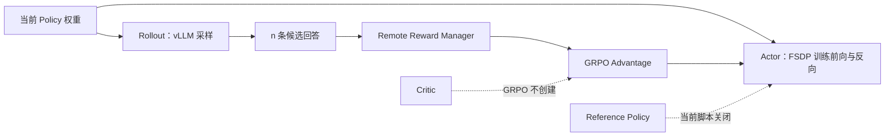
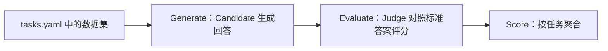
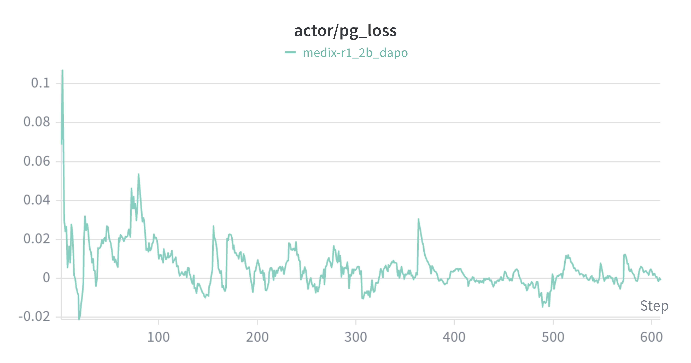
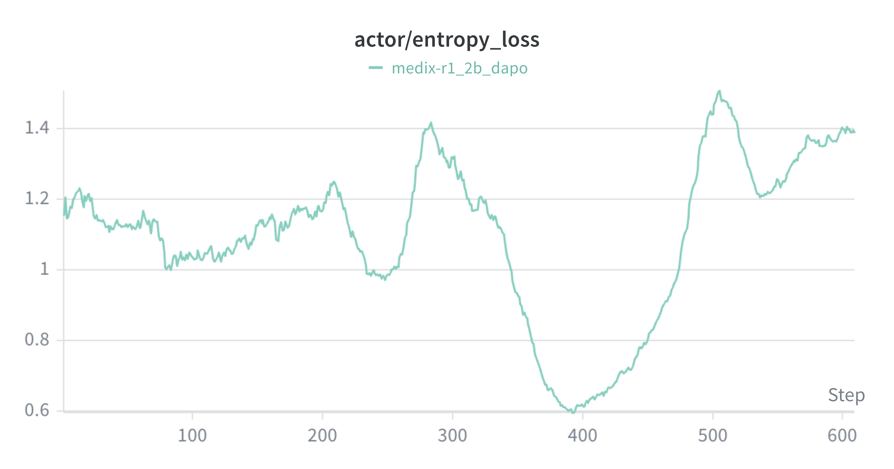
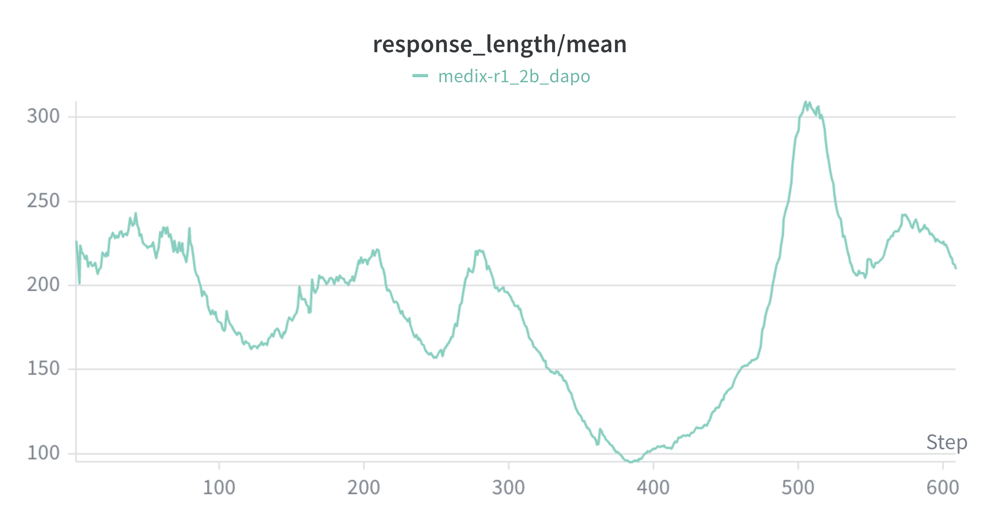
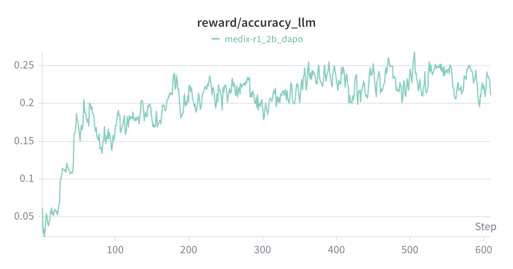
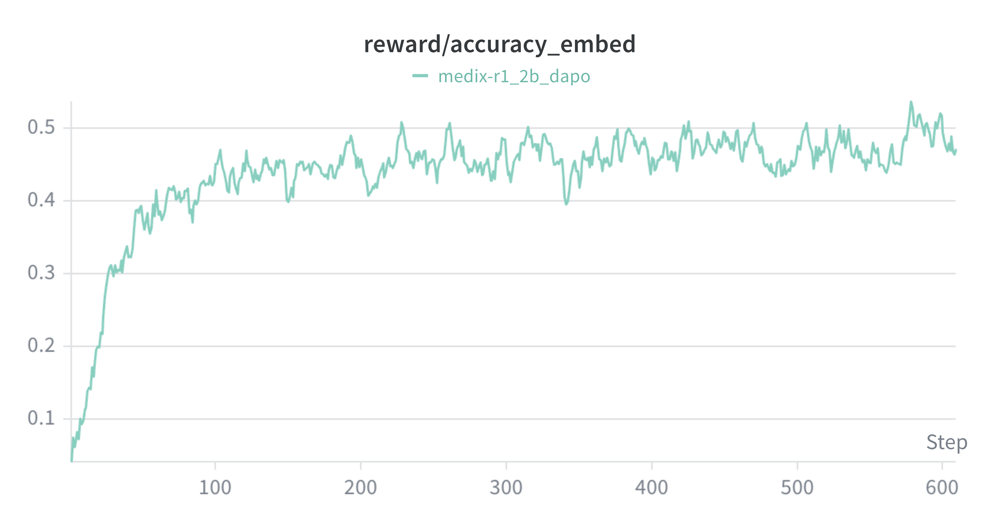
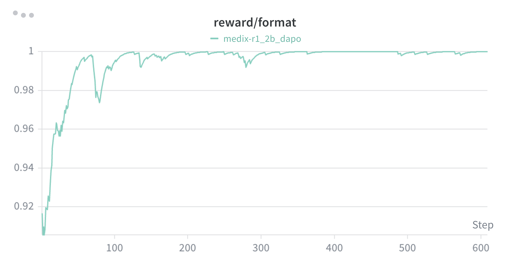
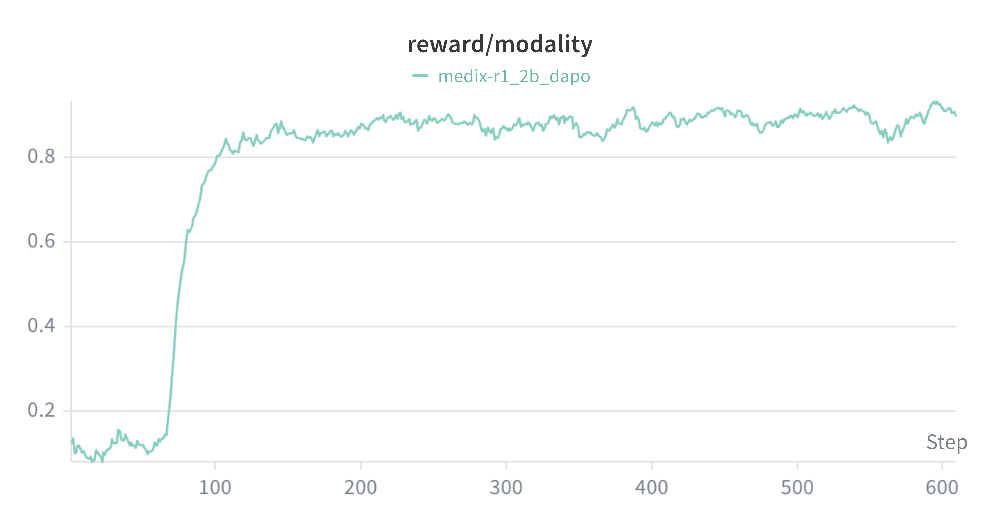
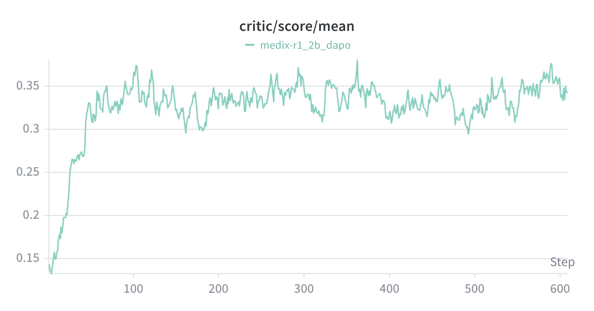

# MediX-R1 从零到一：从医学 VQA、复合奖励到 GRPO、DAPO、GSPO 与评测

> **适用读者**：第一次接触视觉语言模型（VLM）、医学视觉问答（Medical VQA）、PPO/GRPO、DAPO、GSPO、Ray、FSDP 和 vLLM，希望能够沿着真实源码理解并运行项目的人。  
> **审查基准**：本文逐项对照本仓库提交 `8d516ade1228cb3a51b5c23740ff41684cca333e` 下的 `MediX-R1/` 本地快照重写，审查日期为 **2026-08-05**。文中明确区分“源码当前会做什么”“本地 README 声称什么”“已有训练报告观察到了什么”和“尚未实际验证什么”。  
> **安全说明**：本文不会展示或读取工作区根 `config.py` 中可能存在的密钥，只描述代码要求的字段结构。  
> **配套阅读**：[medix-agent-swarm 从零到一](./medix-agent-swarm-从零到一.md)。如果你更关心训练后的模型如何作为 Skill 接入 Agent 系统，可以直接阅读配套文档第 18 章。

---

## 目录

1. [先建立最小心智模型](#1-先建立最小心智模型)
2. [MediX-R1、训练框架、数据与评测的边界](#2-medix-r1训练框架数据与评测的边界)
3. [零基础必须掌握的概念](#3-零基础必须掌握的概念)
4. [把医学图像问答映射成强化学习](#4-把医学图像问答映射成强化学习)
5. [本地仓库结构与源码阅读地图](#5-本地仓库结构与源码阅读地图)
6. [配置是如何合并成一次真实实验的](#6-配置是如何合并成一次真实实验的)
7. [2B DAPO 与 8B GSPO 脚本的实际配置](#7-2b-dapo-与-8b-gspo-脚本的实际配置)
8. [数据如何从 Dataset 进入 Qwen3-VL](#8-数据如何从-dataset-进入-qwen3-vl)
9. [输出格式契约与医学模态标签](#9-输出格式契约与医学模态标签)
10. [复合 Reward 的真实实现](#10-复合-reward-的真实实现)
11. [Reward 如何变成 token-level tensor](#11-reward-如何变成-token-level-tensor)
12. [GRPO Advantage 的源码级解释](#12-grpo-advantage-的源码级解释)
13. [PPO、DAPO 与 GSPO 的 Policy Loss](#13-ppodapo-与-gspo-的-policy-loss)
14. [一次训练 Step 的完整数据流](#14-一次训练-step-的完整数据流)
15. [Actor、Rollout、Reference、Critic 与 Reward Manager](#15-actorrolloutreferencecritic-与-reward-manager)
16. [Ray、FSDP、vLLM 与 Hybrid Engine](#16-rayfsdpvllm-与-hybrid-engine)
17. [Batch、rollout.n 与显存配置](#17-batchrolloutn-与显存配置)
18. [Checkpoint、恢复训练与模型合并](#18-checkpoint恢复训练与模型合并)
19. [评测流水线：Generate、Evaluate、Score](#19-评测流水线generateevaluatescore)
20. [eval 与 eval2 的区别](#20-eval-与-eval2-的区别)
21. [如何正确阅读本地训练曲线](#21-如何正确阅读本地训练曲线)
22. [从零运行的推荐顺序](#22-从零运行的推荐顺序)
23. [当前本地快照的已知偏差与缺陷](#23-当前本地快照的已知偏差与缺陷)
24. [最小学习实验](#24-最小学习实验)
25. [常见故障与排查](#25-常见故障与排查)
26. [如何安全扩展数据、Reward 与 Agent 接入](#26-如何安全扩展数据reward-与-agent-接入)
27. [FAQ、术语表与源码阅读路线](#27-faq术语表与源码阅读路线)
28. [证据索引与官方资料](#28-证据索引与官方资料)

| 阅读目标 | 建议路线 |
|---|---|
| 只想理解原理 | 1 → 3 → 4 → 10 → 12 → 13 → 15 |
| 想复现实验 | 5 → 6 → 7 → 8 → 14 → 17 → 22 → 23 |
| 想做评测 | 18 → 19 → 20 → 21 |
| 想接入 Agent | 2 → 18 → 26.5 → 配套 Swarm 文档 |

---

## 1. 先建立最小心智模型

MediX-R1 的本地训练可以先压缩为一句话：**以 Qwen3-VL 为当前策略，让它针对同一个医学图像问题生成多条回答，用复合 Reward 分别打分，再按同一问题的组内相对表现计算 Advantage，最后用 clipped policy loss 更新模型。**

```text
医学图像 + 医学问题
  ↓
Qwen3-VL 为每个问题生成 n 条候选回答
  ↓
LLM 正确性 + Embedding 正确性 + 模态 + 格式
  ↓
每条回答得到一个 overall reward
  ↓
同一问题内标准化，得到 GRPO advantage
  ↓
default PPO / DAPO 风格 / GSPO 风格 policy loss
  ↓
FSDP 反向传播并更新 Actor
```

初学时只要先记住三个结论：第一，**模型真正优化的是生成概率，不是直接修改一张答案表**；第二，**本地 2B 和 8B 实验都使用 GRPO Advantage，因此当前训练不使用 Critic**；第三，脚本名中的 DAPO 或 GSPO 只代表本地启用了一组对应特性，不能据此推断完整复现了相关论文的所有机制。

---

## 2. MediX-R1、训练框架、数据与评测的边界

很多理解错误来自把“模型”“训练器”“推理引擎”和“评测器”当成同一个东西。它们在本仓库中的边界如下。

| 对象 | 本地实例 | 职责 |
|---|---|---|
| 基础 VLM | `Qwen/Qwen3-VL-2B-Instruct`、`Qwen/Qwen3-VL-8B-Instruct` | 强化学习开始前的模型参数 |
| Actor / Policy | 正在训练的 Qwen3-VL | 计算 token 概率并通过梯度更新 |
| Rollout Engine | vLLM | 使用当前 Actor 权重高吞吐生成候选回答 |
| 训练框架 | `training/verl/` | 组织数据、rollout、reward、advantage、loss、分布式训练和 checkpoint |
| 分布式调度 | Ray | 创建 Worker、分配 GPU 资源并执行 RPC |
| 参数分片 | FSDP | 将模型参数、梯度与优化器状态分布到多张 GPU |
| 训练数据 | `MBZUAI/medix-rl-data` 或本地副本 | 提供图像、问题与标准答案 |
| 复合 Reward | `training/examples/reward_function/medical.py` | 对完整回答进行规则、Embedding 与 LLM Judge 打分 |
| 通用评测 | `eval/` | Candidate 生成、Judge 评分、任务汇总与提交打包 |
| 本地定制评测 | `eval2/` | 面向本地 2B checkpoint 和 `rad_vqa` 的定制流程 |

本地两条训练路线的参数规模必须一一对应：`Qwen3-VL-2B-Instruct → MediX-R1-2B`，`Qwen3-VL-8B-Instruct → MediX-R1-8B`；强化学习不会把 2B 模型“训练成”8B 模型。截至 **2026-08-05**，上游官方 Model Zoo 还列出了 30B 模型，但当前本地快照仍只有 2B DAPO 和 8B GSPO 两个医学训练脚本，因此本文以本地代码为教学主线，上游状态只作为补充。

因此，`training/verl/` 不是模型权重，vLLM 也不是训练算法。vLLM 负责“生成”，FSDP/Hugging Face 前向负责“训练与重算概率”，GRPO/DAPO/GSPO 描述的是 Advantage、采样筛选或 Policy Loss 的计算方式。

---

## 3. 零基础必须掌握的概念

### 3.1 Token、概率与 Log Probability

语言模型把文本变成 token ID，并逐 token 预测下一个 token。若某个 token 的概率为 $p=0.2$，则其 log probability 为 $\log p\approx-1.609$。整段回答 $y=(y_1,\ldots,y_T)$ 的条件概率可以写成 $\pi_\theta(y\mid x)=\prod_{t=1}^T\pi_\theta(y_t\mid x,y_{<t})$，工程实现通常使用 log probability 的求和，避免许多小概率相乘带来的数值问题。

### 3.2 Policy 与 Actor

Policy $\pi_\theta$ 是“给定当前上下文，下一个 token 的概率分布”。Actor 是承载这套 Policy 并被优化器更新的模型；在本项目里，它不是额外的小网络，而是完整的 Qwen3-VL。

### 3.3 State、Action、Trajectory 与 Episode

在语言模型 RL 中，State 是图像、问题以及已经生成的 token 前缀；Action 是下一个 token；Trajectory 是一整条回答；Episode 可以理解为“针对一个问题完成一次回答”。虽然人读到的是完整段落，优化器实际处理的是每个 response token 的 log probability。

### 3.4 Rollout

Rollout 是使用当前策略采样回答。若 `worker.rollout.n=3`，则同一个问题会生成 3 条候选回答。训练不是只看标准答案，而是比较这些候选回答中哪些获得了更高 Reward。

### 3.5 Reward 与 Advantage

Reward 回答“这条结果得了多少分”，Advantage 回答“它比所选基线好多少”。本地 GRPO 使用同一问题的其他候选回答建立基线；若某条回答高于组均值，Advantage 为正，反之为负。

### 3.6 Old Policy 与 Reference Policy

`old_log_probs` 表示本轮更新开始前，当前策略对已经生成回答的概率；它用于计算 PPO importance ratio。Reference Policy 则通常是冻结的初始模型，用于 KL 约束。二者不是同一个概念。当前两个医学训练脚本都设置 `algorithm.disable_kl=True`，因此 Reference Policy 不会被创建，但 `old_log_probs` 仍然必须计算。

### 3.7 Critic

Critic 估计状态价值 $V_\phi(s)$。传统 PPO + GAE 常使用它构造 Advantage，而本地 GRPO 直接使用组内相对 Reward，所以 Trainer 只在 `adv_estimator=gae` 时启用 Critic。**当前 2B DAPO 与 8B GSPO 均为 `adv_estimator=grpo`，不会训练 Critic。**

### 3.8 SFT 与 RL

SFT 让模型模仿给定标准序列，典型目标是：

$$\mathcal{L}_{\mathrm{SFT}}=-\sum_t\log\pi_\theta(y_t^*\mid x,y_{<t}^*)$$

RL 更关注完整回答的期望 Reward：

$$\max_\theta\mathbb{E}_{y\sim\pi_\theta(\cdot\mid x)}[R(x,y)]$$

医学答案经常存在同义表达，因此“字符串不完全相等”不必然意味着医学内容错误。MediX-R1 本地 Reward 同时使用精确相等、LLM Judge 和医学文本 Embedding 来缓解这一问题，但这些方法也会引入新的偏差，后文会逐项分析。

---

## 4. 把医学图像问答映射成强化学习

假设数据为：

```text
image: 一张胸部 X-ray
problem: What abnormality is present?
solution: <X_RAY> Cardiomegaly
```

对应关系如下。

| RL 元素 | 医学 VQA 中的含义 |
|---|---|
| 输入 $x$ | 医学图像、医学问题与 Prompt 模板 |
| Policy $\pi_\theta$ | 当前 Qwen3-VL |
| Action $a_t$ | 第 $t$ 个生成 token |
| Response $y$ | 模态标签、`<thinking>` 和 `<answer>` 组成的完整输出 |
| Outcome Reward $R(x,y)$ | 四个分项的加权总分 |
| Group | 同一个原始问题生成的 $n$ 条回答 |
| Advantage | 某回答的 Reward 相对组均值的标准化结果 |

一个回答并不是一个动作，而是一串动作；但当前 Reward 是 **outcome reward**，即完整回答完成后才给一个标量。框架先把该标量写到最后一个有效 response token，再由 GRPO 对整条回答求和并把同一个 Advantage 扩展到所有有效 response token。

---

## 5. 本地仓库结构与源码阅读地图

```text
MediX-R1/
├── training/
│   ├── README.md
│   ├── requirements.txt
│   ├── run_train.sh
│   ├── merge_model.sh
│   ├── examples/
│   │   ├── config.yaml
│   │   ├── medix-r1_2b_dapo.sh
│   │   ├── medix-r1_8b_gspo.sh
│   │   ├── format_prompt/medical_format.jinja
│   │   └── reward_function/medical.py
│   ├── scripts/model_merger.py
│   └── verl/
│       ├── trainer/
│       ├── workers/
│       ├── utils/
│       ├── models/
│       └── single_controller/
├── eval/
├── eval2/
└── images/train/
```

建议将源码分成五条链来读。

| 问题 | 入口文件 | 继续追踪 |
|---|---|---|
| 一次实验最终使用什么参数 | `examples/*.sh` | `examples/config.yaml` → `trainer/config.py` |
| 数据如何进入模型 | `trainer/data_loader.py` | `utils/dataset.py` |
| Reward 怎么算 | `reward_function/medical.py` | `workers/reward/function.py` |
| Advantage 与 loss 怎么算 | `trainer/core_algos.py` | `trainer/ray_trainer.py` → `workers/actor/dp_actor.py` |
| 模型如何分布式生成与更新 | `trainer/main.py` | `workers/fsdp_workers.py` → `rollout/vllm_rollout_spmd.py` |

本文后续所有“源码事实”都来自这份本地快照，而不是根据算法名称进行推测。

---

## 6. 配置是如何合并成一次真实实验的

训练入口是：

```bash
python3 -m verl.trainer.main \
  config=examples/config.yaml \
  data.train_files=... \
  worker.rollout.n=...
```

`training/verl/trainer/main.py` 的合并顺序是：

```text
PPOConfig dataclass 默认值
  ↓
examples/config.yaml
  ↓
Shell 脚本中的 CLI key=value
  ↓
deep_post_init() 传播派生字段
```

越靠后的配置优先级越高。`examples/config.yaml` 仍保留了数学任务默认值，例如 `hiyouga/math12k`、`math.jinja`、`math.py` 和 `Qwen/Qwen2.5-7B-Instruct`；医学脚本会在命令行覆盖数据、Prompt、Reward 与模型路径。因此，只看 YAML 会错误地认为项目正在训练数学模型，只看 Shell 又会漏掉学习率、FSDP、offload、采样温度和保存频率等继承值。

`deep_post_init()` 还会进行字段传播：数据最大长度写入 rollout，Actor 的 `trust_remote_code` 写入 rollout，算法的 KL 开关写入 Actor，Reward 的 `path:function_name` 被拆分成绝对路径和函数名。Worker 初始化时还会根据 GPU world size 与 `rollout.n` 计算真正的 per-device batch，详见第 17 节。

---

## 7. 2B DAPO 与 8B GSPO 脚本的实际配置

当前 `training/examples/` 只有两个医学训练脚本：`medix-r1_2b_dapo.sh` 和 `medix-r1_8b_gspo.sh`。README 中列出的其他多个脚本并不存在，不能直接运行。

### 7.1 共同配置

两个脚本都覆盖为医学数据契约：`prompt_key=problem` 来自 YAML 默认值，脚本显式设置 `answer_key=solution`、`image_key=image`、医学 Prompt 和 `medical.py:compute_score`。两者都设置最大 Prompt 长度 4352、最大 Response 长度 4096、`max_num_batched_tokens=8448`、rollout prompt batch 16、Actor 配置 batch 16、训练 2 个 epoch、训练前不验证，并关闭 KL。

共同继承的主要 YAML 值包括：Actor 学习率 $10^{-6}$、AdamW、weight decay 0.01、gradient checkpointing、padding-free、dynamic batching、FSDP full shard、Actor 参数和优化器手动 offload、rollout temperature 1、top-p 1、tensor parallel 1、vLLM `gpu_memory_utilization=0.3`、`save_freq=10`、`save_limit=1`、`val_freq=-1`。

### 7.2 2B DAPO 脚本

| 配置 | Shell 中的值 | 实际含义 |
|---|---:|---|
| 基础模型 | `Qwen/Qwen3-VL-2B-Instruct` | Actor 初始权重 |
| 可见 GPU | `0,1` | 脚本限定两张 GPU |
| `trainer.n_gpus_per_node` | 2 | Ray/FSDP 需要两张 GPU |
| 训练数据 | `../data/medix-rl-data/data@train` | 运行目录相对路径，本地当前缺失 |
| 验证数据 | `../data/medix-rl-data/data@test` | 同上 |
| `worker.rollout.n` | 3 | 每个问题生成 3 条回答 |
| `clip_ratio_low/high` | 0.2 / 0.28 | 非对称 PPO clip |
| `online_filtering` | `True` | 先打分并按组均值筛选 |
| `disable_kl` | `True` | 不创建 Reference Policy |
| checkpoint | `./checkpoints/medix-r1_2b_dapo` | 以 training 目录为当前目录时的保存位置 |

没有过滤时，每个 16-prompt rollout 会产生 $16\times3=48$ 条 response。需要特别注意：Shell 中 `worker.actor.global_batch_size=16` 是 **prompt 侧配置值**；Worker 初始化发现 `rollout.n=3` 后会原地乘 3，Actor 更新实际按 48 条 response 组织 global batch，而不是 16 条 response。

### 7.3 8B GSPO 脚本

| 配置 | Shell 中的值 | 实际含义 |
|---|---:|---|
| 基础模型 | `Qwen/Qwen3-VL-8B-Instruct` | Actor 初始权重 |
| 可见 GPU | 未在脚本固定 | 由外部环境决定 |
| `trainer.n_gpus_per_node` | 8 | Ray 必须看到 8 张 GPU |
| 训练数据 | `MBZUAI/medix-rl-data@train` | Hugging Face Dataset ID |
| 验证数据 | `MBZUAI/medix-rl-data@test` | Hugging Face Dataset ID |
| `worker.rollout.n` | 5 | 每个问题生成 5 条回答 |
| `loss_type` | `gspo_token` | 序列级 ratio 数值、token 级梯度代理 |
| `loss_avg_mode` | `seq` | 每条 response 先求平均，再对 response 求平均 |
| `online_filtering` | 未覆盖，继承 `False` | 不执行 DAPO 动态筛选 |
| `disable_kl` | `True` | 不创建 Reference Policy |

每个 rollout 产生 $16\times5=80$ 条 response；Actor Worker 同样会将配置中的 global batch 16 乘 5，实际按 80 条 response 组织一次 global update batch。

### 7.4 不要把脚本名当作完整算法证明

本地 2B “DAPO”明确启用了非对称 clip、online filtering、GRPO Advantage 和关闭 KL，但没有证据表明它实现了某篇 DAPO 论文的全部机制。本地 8B “GSPO”明确启用了 `gspo_token` 与序列平均，同时仍使用 GRPO Advantage。最准确的命名方式是：**2B 为 GRPO Advantage + DAPO 风格筛选/clip；8B 为 GRPO Advantage + GSPO 风格 policy loss。**

---

## 8. 数据如何从 Dataset 进入 Qwen3-VL

### 8.1 数据路径的四种形式

`RLHFDataset` 支持 Hugging Face Dataset ID、单个 Parquet 文件、本地目录中的 Parquet，以及 `datasets.load_from_disk()` 保存的目录。路径末尾可使用 `@split`，例如 `MBZUAI/medix-rl-data@train`；源码通过 `data_path.split("@")` 提取 split，因此路径本身如果包含额外 `@` 会产生不符合预期的拆分。

本地目录逻辑会优先寻找以 split 名开头的 `.parquet`，找不到时再加载目录内全部 `.parquet`；仍没有 Parquet 时才调用 `load_from_disk(data_path)[data_split]`。

### 8.2 医学字段映射

医学脚本最终要求每条样本至少满足以下契约。

| 字段 | 用途 | 进入框架后的名称 |
|---|---|---|
| `problem` | 医学问题 | 渲染 Prompt |
| `solution` | 模态标签 + 标准答案 | `ground_truth` |
| `image` | 图像列表或序列 | `multi_modal_data["images"]` |

`RLHFDataset.__getitem__()` 最后执行 `example["ground_truth"] = example.pop(self.answer_key)`。Reward Manager 不会再访问原始 `solution` 字段，只读取 `ground_truth`。

### 8.3 Prompt 模板和 `<image>` 占位符

`medical_format.jinja` 渲染后会在问题前增加角色、允许的模态标签和输出格式要求，并产生：

```text
Question:
<image>原始 problem
```

Dataset 按 `<image>` 切分字符串，每遇到一个占位符就在消息内容中加入 `{"type": "image"}`。这意味着 Prompt 中的占位符数量应与图像数量一致；当前代码没有在构建消息时显式检查二者是否匹配，最终错误可能在 processor 或 vLLM 阶段才暴露。

### 8.4 图像处理

`process_image()` 支持路径、包含二进制 `bytes` 的字典、原始 bytes 和 PIL Image。源码按像素总数进行等比例缩放，默认最小像素数 262144、最大像素数 4194304，并统一转成 RGB。缩放约束针对总像素，而不是固定宽高。

Dataset 在训练前向侧保存原始图像到 `multi_modal_data`，processor 负责生成 `input_ids`、`attention_mask` 和视觉张量；rollout 侧则会再次通过 `_process_multi_modal_data()` 将原始图像转换成 vLLM 可接收的多模态输入。

### 8.5 Qwen2-VL/Qwen3-VL 的位置编码

当 processor 的 image processor 类名包含 `Qwen2VLImageProcessor` 时，Dataset 会进入 Qwen-VL mRoPE 分支。若 processor 类名包含 `Qwen3VLProcessor`，调用本地 `qwen3_vl.get_rope_index()`，否则调用 Qwen2-VL 版本。最终把一行文本位置与三行视觉位置拼接成形如 `(4, sequence_length)` 的 `position_ids`。

### 8.6 过长 Prompt 过滤与截断

默认 `filter_overlong_prompts=true`，Dataset 初始化时用 16 个进程检查 chat template 后的长度，只保留不超过 `max_prompt_length` 的样本。DataLoader 又以 `truncation="right"` 创建 Dataset，因此理论上过滤后不应再大量触发截断；如果关闭过滤，超过长度的内容会右截断，可能把问题末尾裁掉。

### 8.7 DataLoader 与恢复训练

训练使用 `StatefulDataLoader`。若 shuffle 开启，代码显式创建带 seed 的 `RandomSampler`，目的是在 checkpoint 恢复时还原数据顺序。训练 `drop_last=True`，验证 `drop_last=False`；若 `val_batch_size=-1`，验证会尝试一次装入整个验证集，这在大数据集上可能造成 CPU 内存压力，但当前医学脚本没有覆盖该值。

---

## 9. 输出格式契约与医学模态标签

本地 Prompt 希望模型输出：

```text
<X_RAY><thinking>医学推理过程</thinking><answer>最终答案</answer>
```

允许的 16 个模态标签来自 `medical_format.jinja`：`<X_RAY>`、`<MICROSCOPY>`、`<CLINICAL_PHOTOGRAPHY>`、`<CT_SCAN>`、`<GRAPHICS>`、`<ANGIOGRAPHY>`、`<PET_SCAN>`、`<ULTRASOUND>`、`<MRI_SCAN>`、`<FUNDUS_PHOTOGRAPHY>`、`<OCT_SCAN>`、`<ENDOSCOPY>`、`<MAMMOGRAPHY>`、`<FLUOROSCOPY>`、`<OTHER>`、`<SPECT>`。

### 9.1 Format Reward 实际检查的范围

Reward 先找到第一个 `<thinking>`，丢弃它之前的所有文本，再对剩余部分执行完整匹配：

```regex
<thinking>.*?</thinking>\s*<answer>.*?</answer>
```

因此 Format Reward **不检查模态标签是否正确，甚至不检查 `<thinking>` 前是否只有一个合法标签**；模态由独立的 Modality Reward 判断。该正则中的 `.*?` 允许空 thinking 或空 answer，只要标签结构完整便可能得到格式分。

### 9.2 `<thinking>` 与 `<think>` 不可混用

当前 Prompt、Reward 和训练数据契约使用 `<thinking>...</thinking>`。`eval/utils.py` 同时能在评测时剥离 `</think>` 或 `</thinking>`，但训练 Reward 只认 `<thinking>`。本地 `images/train/training_report.md` 把格式奖励写成 `<think>...</think>`，这是报告文字与实际 Reward 代码不一致，不能据此修改训练输出。

### 9.3 输出推理文本的产品风险

本地训练显式奖励 `<thinking>` 结构，但模型接入真实产品时不应自动把内部推理文本原样展示给用户。工程上应将最终答案与内部推理、可解释依据、医生可审核证据分开设计；不要把“训练格式包含 thinking”误解成“产品必须暴露全部思维过程”。

---

## 10. 复合 Reward 的真实实现

核心文件是 `training/examples/reward_function/medical.py`。模块 import 时立即加载 `abhinand/MedEmbed-large-v0.1`，然后 `compute_score()` 使用最多 16 个线程并发处理一个 Reward batch。

### 10.1 预处理与答案提取

每条 response 会先执行：

```python
predict = re.sub(r"\s*(<|>|/)\s*", r"\1", response)
```

这会删除 `<`、`>`、`/` 周围的空白，使 `< thinking >` 一类标签变得更接近标准形式。随后 `_extract_answer()` 优先提取第一个 `<answer>...</answer>` 中的文本；若没有标签，则把完整预测作为答案。预测与标准答案都只通过 `strip(".")` 去掉首尾句点，不会统一大小写、其他标点或多余空白。

标准答案被强制按第一个 `>` 拆分：

```python
ground_truth = ground_truth.split(">", maxsplit=1)[1].strip()
```

这意味着 `ground_truth` 必须含有形如 `<X_RAY>` 的前缀。没有 `>` 时，LLM/Embedding 分项会在索引第二段时抛异常并各自返回 0；Modality 分项会把整条 ground truth 加上 `>` 后比较，通常也得到 0，但不会因为缺少 `>` 本身而索引越界。

### 10.2 无效答案规则

`_is_invalid_answer()` 将空字符串、长度恰好为 1 的答案，以及包含 `__`、`:`、`?` 任一字符串的答案判为无效。这个规则非常激进：合法的单字母选择题答案、包含冒号的医学表达或带问号的文本都会直接得到两个准确性分项的 0 分。扩展数据前必须先评估该规则是否适合目标任务。

### 10.3 LLM Accuracy Reward

逻辑依次为：解析答案；无效则 0；与 ground truth 完全相等则 1；否则调用根目录 `config.py` 指定的 OpenAI-compatible `/chat/completions` API，让 Judge 以 YES/NO 判断内容是否匹配。

Judge 请求使用温度 0、`max_tokens=4`。成功后代码只判断回复大写形式中是否包含子串 `YES`，因此 `YES` 出现在解释或否定上下文中也可能被判为 1；异常会打印错误并返回 0。请求没有显式 timeout，网络长期无响应时可能阻塞 Reward 线程。

### 10.4 Embedding Accuracy Reward

预测与标准答案完全相等时直接得 1，否则使用 MedEmbed 编码两段文本并计算余弦相似度；当相似度不低于 0.8 时得 1，否则得 0。它不是把余弦相似度本身作为连续 Reward，而是二值阈值 Reward。

Embedding 可以识别同义表达，但“向量相似”不等于“临床结论正确”。左右侧、肯定与否定、数值差异、疾病严重程度等关键差别可能被语义向量过度平滑。

### 10.5 Modality Reward

预测中第一个 `<thinking>` 之前的全部文本被视为预测模态；标准答案从开头到第一个 `>` 被重建为标准模态标签。两者转大写后必须完全相等。若模型在模态标签前增加解释、输出多个标签，或缺少 `<thinking>`，该分项为 0。

### 10.6 Format Reward

从第一个 `<thinking>` 开始的文本必须完整匹配 `<thinking>...</thinking><answer>...</answer>`，满足得 1，否则得 0。模态标签完全由另一分项负责。

### 10.7 实际权重

`medical.py` 中三个 content 子权重为：LLM 0.575、Embedding 0.375、Modality 0.05；`compute_score()` 默认 `format_weight=0.1`，因此 `content_weight=0.9`。总 Reward 为：

$$R=0.9\left(0.575R_{\mathrm{llm}}+0.375R_{\mathrm{embed}}+0.05R_{\mathrm{modality}}\right)+0.1R_{\mathrm{format}}$$

化简后的有效权重如下。

| 分项 | 有效权重 |
|---|---:|
| LLM accuracy | 0.5175 |
| Embedding accuracy | 0.3375 |
| Modality | 0.0450 |
| Format | 0.1000 |
| 合计 | 1.0000 |

若四个分项依次为 $1,1,0,1$，则 $R=0.5175+0.3375+0+0.1=0.955$。由于所有分项当前都是 0/1，总 Reward 只能落在有限的离散取值集合上。

### 10.8 Batch Reward 与并发边界

`medical.py` 没有声明 `REWARD_TYPE`，Reward Manager 因此使用默认值 `batch`。`compute_score()` 若收到的不是 list，会抛出一条仍写着 “math reward function” 的错误信息，这是复制遗留文字，不代表实际调用了数学 Reward。

每条样本由 `ThreadPoolExecutor(max_workers=16)` 并发执行，其中既包含 HTTP Judge，也包含共享 `SentenceTransformer` 实例的 `encode()`。并发可缩短网络等待，但共享模型在多线程下的吞吐、设备占用和线程安全需要实测；源码没有失败率、重试、timeout、缓存或熔断机制。

---

## 11. Reward 如何变成 token-level tensor

`AutoRewardManager` 解码每条 response 的有效 token，调用 Reward Function，并创建与 `responses` 同形状的全零 tensor。对第 $i$ 条回答，它将 `score["overall"]` 写到最后一个有效 response token：

```text
response tokens:      t1  t2  t3  ...  tL
response mask:         1   1   1  ...   1
raw reward tensor:     0   0   0  ...   R
```

各分项不进入反向传播 tensor，而是放进 `reward_metrics` 用于日志。训练时 `token_level_scores.sum(-1)` 恢复每条回答的 scalar Reward。

若启用了 Reference Policy 且选择“KL 加到 Reward”模式，框架会从 token-level score 中减去 KL penalty；当前医学脚本关闭 KL，所以 `token_level_rewards` 直接等于 `token_level_scores`。

一个边界问题是：如果某条 response 的有效长度为 0，代码会写入索引 `-1`。正常 vLLM 生成通常至少有 EOS 或内容，但 Reward Manager 没有显式拒绝零长度 response。

---

## 12. GRPO Advantage 的源码级解释

### 12.1 分组依据

Trainer 在每个原始 prompt 进入 rollout 前生成唯一 `uid`。prompt 侧数据重复 $n$ 次后，同一个问题的所有 response 共享该 uid。即使后续 `_balance_batch()` 重排样本顺序，GRPO 仍按 uid 聚合，不依赖相邻位置，因此不会因为重排而把不同问题混组。

### 12.2 公式

`compute_grpo_outcome_advantage()` 先对每条 response 的 token-level reward 求和得到 $r_i$，然后对同一 uid 的组 $G$ 计算均值与标准差：

$$A_i=\frac{r_i-\mu_G}{\sigma_G+\epsilon}$$

源码使用 `torch.std()` 的默认行为；在当前 PyTorch 语义下这是样本标准差（correction=1），不是总体标准差。代码要求每组样本数大于 1，否则断言失败；Trainer 也提前要求 GRPO/RLOO 的 `rollout.n>1`。

### 12.3 数值例子

若同一问题的三个 Reward 为 $0.1,0.5,0.9$，组均值为 0.5，样本标准差为 0.4，所以 Advantage 为 $-1,0,1$。源码随后执行：

```python
returns = scores.unsqueeze(-1) * response_mask
return returns, returns
```

因此 GRPO 分支中的 `advantages` 与 `returns` 完全相同，每条回答的同一个 Advantage 被复制到它所有有效 response token。

### 12.4 全组同分时发生什么

若组内所有 Reward 相同，则分子为 0；即使标准差为 0，分母还有 $\epsilon=10^{-6}$，最终 Advantage 仍为 0。这个组对当前 policy update 几乎没有直接学习信号，但如果启用了 online filtering，它是否被保留取决于组均值是否处于过滤区间，而不是取决于组内方差。

### 12.5 GRPO 不使用 Critic 的准确原因

`RayPPOTrainer` 仅在 `adv_estimator == GAE` 时设置 `use_critic=True`。当前默认与两个医学脚本均为 `grpo`，所以不会初始化 Critic Worker、计算 values 或更新 value loss。日志名 `critic/score/mean`、`critic/advantages/mean` 是 `metrics.py` 的历史命名，并不证明存在一个正在训练的 Critic 模型。

### 12.6 局限

GRPO 的组内相对基线降低了对 Critic 的依赖，但代价是每个问题必须生成多条回答；组小会导致统计噪声，Reward 偏差会直接变成排序偏差，而且 outcome Reward 无法指出具体哪个推理 token 导致错误。所有 token 共享同一 Advantage 也意味着“正确答案中的无关冗长文字”和“真正关键的医学判断”在 credit assignment 上没有精细区分。

---

## 13. PPO、DAPO 与 GSPO 的 Policy Loss

### 13.1 默认 token-level PPO ratio

设某 token 在当前 Actor 与 old policy 下的 log probability 差为 $d_t=\log\pi_\theta(a_t\mid s_t)-\log\pi_{\mathrm{old}}(a_t\mid s_t)$，则 importance ratio 为：

$$\rho_t=\exp(d_t)$$

源码先将 log ratio 限制到 $[-20,20]$ 防止指数溢出，再将 ratio clip 到 $[1-\epsilon_{\mathrm{low}},1+\epsilon_{\mathrm{high}}]$。默认 loss 会比较未裁剪与裁剪后的策略梯度损失，并在负 Advantage 时额外应用 dual-clip 上界 `clip_ratio_dual=3.0`。

这里的实现优化的是负目标，因此代码中使用 `max`、`min` 的方向可能和论文里“最大化 objective”的写法相反；阅读源码时应先确认当前变量是 loss 还是 objective。

### 13.2 本地 2B DAPO 做了什么

本地 2B 脚本仍使用默认 `loss_type=default` 和 `loss_avg_mode=token`，但将 clip 设置为下侧 0.2、上侧 0.28，并开启 online filtering。其数据筛选逻辑是：对同一 uid 的 $n$ 条 response 取 `filter_key` 的平均值，默认 key 为 `overall`，只保留满足 $0.01<\bar R_G<0.99$ 的整组。

这并不严格等价于“只保留有对有错的组”。因为 overall 是多个二值分项的加权和，即使组内每条回答分数相同，只要共同分数位于区间内，该组仍会被保留。更准确的说法是：**按组平均 Reward 排除极低分与极高分组，再持续生成直至凑够目标 prompt 数。**

若过滤后没有任何 response，立即抛出 `No sample is kept after filtering`；若累计 prompt 数不足 16，则继续从 DataLoader 取数据，最多尝试 `trainer.max_try_make_batch=20` 次。最终多出的样本被截断到 $16\times n$ 条 response。另一个重要细节是，online filtering 时 `reward/{k}` 日志先累计每次尝试中所有已生成 response 的分项，再做均值；它包含被过滤掉的 response，而后续 `critic/score/mean` 来自最终保留 batch，两类曲线不一定对应同一批样本。

### 13.3 本地 8B GSPO 的序列级 ratio

`loss_type=gspo_token` 时，源码先计算 response 内 log ratio 的 masked mean：

$$\bar d=\frac{1}{L}\sum_{t=1}^L d_t$$

纯序列级 ratio 的前向值为 $\rho_{\mathrm{seq}}=\exp(\bar d)$。`gspo_token` 进一步构造以下 log importance ratio：

$$\tilde d_t=\operatorname{stopgrad}(\bar d)+\log\pi_\theta(a_t\mid s_t)-\operatorname{stopgrad}\!\left(\log\pi_\theta(a_t\mid s_t)\right)$$

在前向数值上，后两项相互抵消，所以每个 token 都看到相同的序列级 ratio；在反向传播上，梯度仍通过当前 token 的 `log_probs` 传播。这就是文档中应称为“序列级 ratio 数值 + token 级梯度代理”的原因，而不是简单说“所有计算都变成序列级”。

### 13.4 `loss_avg_mode=seq`

`token` 模式把整个 batch 的全部有效 token 一起平均，长回答会贡献更多 token；`seq` 模式先对每条回答内部 token 平均，再对回答平均，使每条 response 在最终标量 loss 中更接近等权。8B GSPO 脚本明确使用 `seq`，2B DAPO 继承默认 `token`。

### 13.5 两个医学脚本都关闭 KL

两个脚本都设置 `disable_kl=True`。这会让 Trainer 不创建 Reference Policy，并让 Actor Worker 将 `_has_ref` 置为 False。由于同时继承 `use_kl_loss=True`，表面上 YAML 看起来要求 KL loss，但没有 `ref_log_probs` 时 `dp_actor.py` 的条件不会成立，最终只使用 policy gradient loss。

关闭 KL 可减少一个冻结模型及其前向成本，但也失去对基础模型漂移的显式约束。是否合理必须依赖训练稳定性、外部评测和安全审查，不能仅凭训练 Reward 上升判断。

---

## 14. 一次训练 Step 的完整数据流

下面严格按 `RayPPOTrainer.fit()` 与 `_make_batch_data()` 的顺序梳理。

### 14.1 生成训练 batch

1. 从 `StatefulDataLoader` 取得一个 mini rollout batch；若迭代器耗尽，重新创建迭代器继续取数。
2. 为每个原始 prompt 生成 UUID，存入 `non_tensor_batch["uid"]`。
3. 从 batch 中弹出 rollout 需要的 `input_ids`、`attention_mask`、`position_ids`、`raw_prompt_ids` 和 `multi_modal_data`。
4. 当前 Actor 权重已经同步到 vLLM，`generate_sequences()` 按 `rollout.n` 采样 response。
5. prompt 侧的 ground truth、uid 等数据 repeat-interleave $n$ 次，与生成结果 union。
6. 若使用 ReMax，会额外做温度 0 的 baseline rollout；当前医学脚本不是 ReMax。
7. 若开启 online filtering，立即计算 Reward、按 uid 的组均值筛选，并在不足时继续生成。
8. 返回恰好 `rollout_batch_size × n` 条 response。

### 14.2 从 rollout 切回训练

Trainer 先调用 `prepare_rollout_engine()`，Sharding Manager 唤醒 vLLM 并同步当前 FSDP 权重；生成完 batch 后调用 `release_rollout_engine()`，让 vLLM sleep/offload，为训练前向与反向释放显存。随后 `_balance_batch()` 根据每条样本的有效 token 数重新排序，使各 data-parallel rank 的总 token 更接近。

### 14.3 Reward、old/ref/value 与 Advantage

若 online filtering 阶段没有提前算 Reward，Trainer 异步提交 Reward RPC。接着无论 response 是由 vLLM 刚生成的，都会使用 Actor 的 Hugging Face/FSDP 前向重算 `old_log_probs`；源码注释明确写着 Hybrid Engine 应始终重算。若 Reference 开启，再算 `ref_log_probs`；若 GAE 开启，再算 Critic values。当前医学脚本跳过后两项。

Reward 到位后，根据 KL 配置生成 `token_level_rewards`，再计算 GRPO Advantage。此时 batch 已同时包含 prompts、responses、mask、old log probabilities、Reward、Advantage 和 ground truth 等数据。

### 14.4 Actor update

Actor 按 effective global batch 切 mini batch，再按每卡 micro batch 切分。每个 micro batch 重新计算当前 `log_probs`，用 old log probabilities 构造 ratio，结合 Advantage、clip 和 loss averaging 得到 policy loss，执行 backward。所有 micro batch 完成后进行 gradient clipping、optimizer step、zero grad，并推进 learning-rate scheduler。

### 14.5 日志、验证与保存

每个 step 会记录 Reward 分项、policy loss、entropy proxy、clip fraction、response/prompt length、吞吐、显存和耗时。`val_freq=-1` 表示训练中不定期验证，但训练结束仍会执行一次最终验证。`save_freq=10` 表示每 10 step 保存；训练结束时若当前 step 尚未保存，也会再保存一次。

---

## 15. Actor、Rollout、Reference、Critic 与 Reward Manager

### 15.1 Actor 与 Rollout 的关系

Actor 与 Rollout 使用同一套“当前策略”权重，但运行形态不同：Actor 是 Hugging Face 模型 + FSDP + autograd，负责 log probability 和参数更新；Rollout 是 vLLM inference engine，负责高吞吐采样。Sharding Manager 在二者之间同步权重并切换显存状态。

### 15.2 Reference Policy

Reference Policy 若启用，会在同一个 `actor_rollout_ref` Worker 进程中构建一份独立冻结 FSDP 模型，不应理解成“直接复用可训练 Actor 而不更新”。当前脚本关闭 KL，因此 Worker 初始化会把 `_has_ref=False`，这份模型不会构建。

### 15.3 Critic

`main.py` 始终在 role mapping 中声明 `Role.Critic`，但 Trainer 仅在 `use_critic=True` 时真正把 Critic class 放入资源池并初始化。当前 GRPO 不会进入该路径。值得注意的是，`fsdp_workers.py` 的 Critic 初始化代码传入了拼写错误的 `self.optximizer`；若切换到 GAE，该路径很可能在初始化 Critic 时失败，必须先修复并补测试。

### 15.4 Reward Manager

训练和验证各创建一个 Ray Remote `AutoRewardManager`。每个实例导入 `medical.py` 时都会各自加载 MedEmbed，因此即使它们只占 `num_cpus=1`，仍可能各持有一份较大的 Embedding 模型。Reward 是 Python 函数组合，不是本地另行训练的神经 Reward Model；其中的 LLM Judge 与 SentenceTransformer 是外部/预训练模型依赖。

### 15.5 角色关系图



---

## 16. Ray、FSDP、vLLM 与 Hybrid Engine

### 16.1 Ray

`main.py` 先初始化 Ray，再创建一个 Remote Runner。Runner 按 `trainer.n_gpus_per_node` 和 `nnodes` 构造全局 GPU 资源池，生成 Actor/Rollout/Ref WorkerGroup，并创建训练与验证 Reward Manager。Driver 上的 Trainer 通过 RPC 调用 Worker，不在 Driver 本身完成大模型训练。

### 16.2 FSDP

Actor 使用 FSDP full shard。模型加载时可只在 FSDP rank 0 初始化，再同步 module state；混合精度配置默认参数 bf16、reduce fp32、buffer fp32。YAML 中 `actor.offload.offload_params=true` 和 `offload_optimizer=true` 指的是框架手动在阶段之间把状态移到 CPU，不等同于 `fsdp.enable_cpu_offload`；后者当前为 false。

### 16.3 vLLM

vLLM 使用 `load_format="dummy"` 初始化，然后由 Sharding Manager 将 FSDP 权重同步进去。Rollout engine 开启 sleep mode，初始化后先 sleep；每轮生成前唤醒并加载权重，生成后 offload。它还通过 logit bias 抑制模型输出图像 token，但源码 TODO 表明视频 token 尚未做同样处理。

### 16.4 Tensor Parallel 与 Data Parallel

rollout 的 `tensor_parallel_size` 默认 1。Worker 要求 world size 能整除 TP size，并构造 `(dp_size,tp_size)` mesh。当前 2B/8B 医学脚本都没有覆盖 TP，因此 rollout 在每张 GPU 上形成 data-parallel 推理实例，而不是把单个模型切成多卡 TP；如果 8B 单卡放不下，需要显式调整 TP，并重新评估 Actor FSDP、rollout batch 与显存占用。

### 16.5 Hybrid Engine 的价值与代价

Hybrid Engine 避免同时常驻完全独立的训练模型和 rollout 模型，节省显存；代价是每个 step 都有权重同步、vLLM 唤醒/休眠和训练/推理切换开销。它还解释了为什么生成完成后仍要重算 `old_log_probs`：vLLM 负责采样，但 loss 需要训练前向路径中一致、可控的概率张量。

---

## 17. Batch、rollout.n 与显存配置

Batch 名称是本项目最容易误读的地方。

### 17.1 Prompt batch 与 Response batch

`data.rollout_batch_size=16` 表示一个最终更新 batch 对应 16 个原始 prompt。若 `n=3`，就有 48 条 response；若 `n=5`，就有 80 条 response。`data.mini_rollout_batch_size=16` 表示 DataLoader 每次先取 16 个 prompt，online filtering 不足时 Trainer 会多取几次。

### 17.2 Actor global batch 会被乘以 n

Trainer 构造时先检查 $B_{\mathrm{rollout}}\bmod B_{\mathrm{actor}}=0$。此时两份脚本都是 $16\bmod16=0$。进入 FSDP Worker 后，如果 `rollout.n>1`，源码执行：

```python
config.global_batch_size *= config.rollout.n
```

因此有效配置如下。

| 实验 | Shell global batch | $n$ | Worker 内 effective global response batch | GPU 数 | 每卡 effective batch |
|---|---:|---:|---:|---:|---:|
| 2B DAPO | 16 | 3 | 48 | 2 | 24 |
| 8B GSPO | 16 | 5 | 80 | 8 | 10 |

默认 `micro_batch_size_per_device_for_update=2`，所以 2B 每卡需要 12 个 update micro batch，8B 每卡需要 5 个。这里说的是样本维度；dynamic batching 还会按 token 数重新组织实际 micro batch。

### 17.3 Experience micro batch 约束

Trainer 还检查 $(B_{\mathrm{rollout}}\times n)$ 必须能被 `micro_batch_size_per_device_for_experience` 整除。默认 experience micro batch 为 4，48 和 80 都可整除。FSDP Worker 进一步要求 effective per-device global batch 能被 update micro batch 整除。

### 17.4 长度与 vLLM batched token

两个医学脚本设置 4352 prompt token、4096 response token，两者之和正好等于 8448；vLLM Rollout 构造器要求 `max_num_batched_tokens` 不小于二者之和。这里只满足了单序列最大长度下限，不代表 vLLM 一次可以同时容纳任意数量的最大长度序列；真实并发还受显存、调度和 chunked prefill 影响。

### 17.5 `gpu_memory_utilization=0.3`

这是训练 Hybrid Engine 中 vLLM 的目标显存比例，不能直接复制为独立服务的最佳值。调高可能增加 rollout 吞吐，也可能挤压 FSDP 权重同步和训练阶段的显存；调低则可能导致 KV cache 不足。排查 OOM 时应同时观察 prompt/response 长度、n、并发序列、TP、offload 和残留 GPU 进程。

---

## 18. Checkpoint、恢复训练与模型合并

### 18.1 保存内容

每个全局 step 目录通常为：

```text
checkpoints/<experiment>/global_step_<N>/
├── actor/
│   ├── model_world_size_<W>_rank_<R>.pt
│   ├── optim_world_size_<W>_rank_<R>.pt
│   ├── extra_state_world_size_<W>_rank_<R>.pt
│   └── huggingface/          # config/tokenizer/processor，合并后还有权重
├── critic/                   # 仅 use_critic=True 时
└── dataloader.pt
```

Actor 分片包含模型；若 `save_model_only=false`，还保存 optimizer、LR scheduler 和随机数状态。rank 0 会把 Hugging Face config、generation config 和 tokenizer/processor 写入 `actor/huggingface/`，为后续权重合并准备目录结构。

### 18.2 Tracker 与自动恢复

根 checkpoint 目录保存 `checkpoint_tracker.json`，记录 best validation step、last step 和 last actor path。`find_last_checkpoint=true` 时，Trainer 根据 tracker 找到最后一次 checkpoint，恢复 Actor、可选 Critic、DataLoader 状态与 global step。若只存在目录但 tracker 缺失，自动恢复不会扫描所有 `global_step_*` 自行推断最新值。

### 18.3 保存保留策略

YAML 默认 `save_freq=10`、`save_limit=1`。清理逻辑会尝试保留当前 checkpoint 与 best checkpoint，但当训练中验证关闭或 best step 信息不可靠时，实际保留行为应通过目录验证。源码使用 `shutil.rmtree()` 删除超出限制的旧 checkpoint，这是训练框架的自动清理行为；调整 `save_limit` 前应明确磁盘与恢复需求。

### 18.4 合并模型

`model_merger.py` 读取所有 FSDP rank 的模型分片，依据 DTensor placement 合并，在 CPU 上构建 bf16 Hugging Face 模型，并写入 `actor/huggingface/`。当前实现支持纯 FSDP 或 DDP×FSDP 的预期 placement，但明确不支持 FSDP + TP 二维模型分片合并。

通用命令为：

```bash
cd MedicalAssistant/MediX-R1/training
python3 scripts/model_merger.py \
  --local_dir checkpoints/<experiment>/global_step_<N>/actor
```

`merge_model.sh` 仍使用 `path/to/model/actor` 占位路径，必须先修改或直接运行上面的 Python 命令。若传 `--hf_upload_path`，脚本会创建 `private=False` 的 Hugging Face 仓库；这意味着默认上传为公开模型，涉及私有权重或医学数据时不要直接使用该选项。

---

## 19. 评测流水线：Generate、Evaluate、Score

`eval/eval.py` 将评测分成三个可独立执行的阶段。



### 19.1 Generate

程序先加载所有选中数据集并转成统一 sample：`id`、`image`、`question`、`answer` 和可选 `answer_idx`。Candidate vLLM server 启动在本地 8005 端口，生成参数固定为 `max_tokens=2048`、temperature 0、top-p 1。结果追加写入 `<model>.jsonl`，文件锁保护并发写；重启时通过已有 ID 跳过已完成样本。

若环境变量 `FORCE_THINK=1`，问题末尾会附加 `<think>`，这与训练使用的 `<thinking>` 不同。默认不启用时不存在该差异。

### 19.2 Evaluate

Judge 可以是本地 vLLM `Qwen/Qwen3-14B`，也可以是 OpenRouter。普通任务要求 Judge 输出 0/1，MIMIC 报告任务要求 0–5。每条样本会连续评估 3 轮，后两轮在对话中要求 Judge 重新检查；普通任务采用至少 2 票为 1 的多数投票，MIMIC 采用三轮平均分。

这三轮并不是三次相互独立的 Judge 调用，因为后续轮次复用了同一消息历史并看到了前一轮答案。它能促使自我复核，但不能当作三个独立 Judge 的统计投票。

### 19.3 Score

普通任务计算 `correct/(correct+incorrect)`；MIMIC 将累计 Judge 分除以每条样本最大 5 分。若选择多个任务，再对任务分数做简单宏平均，即每个任务等权，不按样本量加权。结果写入 `<model>_score.txt`，文件以 append 模式打开，重复运行会在同一文件继续追加。

### 19.4 任务列表

`eval/tasks.yaml` 当前包含 11 个 text-only 任务和 6 个视觉任务。Text-only 包括 6 个医学相关 MMLU 子集、MedMCQA、MedQA、USMLE self assessment、PubMedQA 和 MIMIC-CXR report summarization；视觉任务包括 SLAKE、VQA-RAD、PathVQA、PMC-VQA、PMC-VQA-Hard 与 MIMIC-CXR report generation。MMMU-Medical 不在主任务 YAML 中，而是通过 MedEvalKit 单独运行。

### 19.5 Candidate 与 Judge 必须分开

Candidate 是被评测模型，Judge 是另一个负责评分的模型。Judge 分数依赖 Prompt、模型版本、推理服务和 JSON 解析，不能被当作无偏真值。可信评测至少还需要人工抽样、规则指标、Judge 校准集、错误类型分析和必要时的多 Judge 对比。

---

## 20. eval 与 eval2 的区别

### 20.1 `eval/`：通用流程

`eval/` 默认 Candidate 与本地 Judge 都通过 vLLM 启动，也支持 OpenRouter Judge；任务来自公开 Dataset ID，目标是覆盖多种 LLM/VLM benchmark，并包含提交 zip 脚本。

### 20.2 `eval2/`：本地定制流程

`eval2/` 在通用代码上增加 `configapi` Judge：从工作区根目录 `config.py` 读取 OpenAI-compatible API 配置。它的 `eval.sh` 固定 GPU 4、`rad_vqa`、单 worker 和以下模型路径：

```text
MediX-R1/training/checkpoints/medix-r1_2b_dapo/global_step_600/actor/huggingface
```

`eval2/tasks.yaml` 还把 `rad_vqa` 改为 `./datasets_local/vqa-rad`。当前重新 clone 的仓库中没有 checkpoint、`datasets_local/` 或该合并模型，因此 `eval2/eval.sh` 不能直接运行；它是某次本地实验的操作脚本，不是通用官方入口。

### 20.3 主评测代码的几个边界问题

- `--generate/--evaluate/--score` 使用 `type=bool`。Python 中 `bool("false")` 仍为 True，所以不要用 `--generate false` 表示关闭；应直接省略参数，或修代码为 `store_true`/严格字符串解析。
- `--tensor_parallel_size` 声明为 `str`，示例传参后可工作；若完全使用默认整数 1，构造 `subprocess.Popen()` 参数时存在类型不一致风险。
- vLLM readiness 循环没有总超时，也不检查子进程是否提前退出，服务启动失败时可能长期等待。
- Score 的普通任务分数在 `Accuracy` 列使用 0–1，但 Overall 行把 `avg_score*100` 写入同一列，字段单位不一致；百分比字符串列仍按百分数显示。
- `load_jsonl()` 假设文件存在，单独运行 Evaluate/Score 前必须先确保上游 JSONL 已生成。

### 20.4 MMMU-Medical 脚本问题

`eval/eval_mmmu_med.sh` 传递 `USE_LLM_JUDGE`、`GPT_MODEL`、`API_KEY` 和 `BASE_URL`，但脚本内没有定义这些变量。注释称 MMMU 不需要 Judge，但 MedEvalKit 是否接受空参数取决于被 clone 的具体版本，应在运行前核对其 CLI，不要把当前脚本视为已验证可用。

---

## 21. 如何正确阅读本地训练曲线

本地已有 `MediX-R1/images/train/training_report.md` 和 8 张曲线图。报告描述的是一次约 600 step 的 2B DAPO 实验，但本次文档审查没有重新取得原始日志或重跑训练，所以曲线上的近似数值属于**报告记录**，不是本次重新计算的结果。

### 21.1 Policy Gradient Loss



`actor/pg_loss` 接近 0 不能自动解释为“模型已经收敛且健康”。GRPO Advantage 组内中心化、old/new policy 接近、clip、正负 Advantage 抵消和大量零 Advantage 组都会让均值靠近 0。正确做法是联合观察 Reward、clip fraction、entropy、response length、外部验证和生成样本。

### 21.2 Entropy proxy



源码将 `-log_probs` 的平均值命名为 `entropy_loss`，它是基于实际采样 token 的负 log probability proxy，不是对完整词表分布精确求 Shannon entropy。下降可能表示输出更确定，也可能与序列内容和长度改变有关；不能只凭一条 V 形曲线断言发生或恢复了策略坍缩。

### 21.3 Response Length



长度变短可能是回答更直接、提前 EOS、格式捷径、模型坍缩或截断策略变化；变长也可能是冗余、重复或 Reward hacking。必须抽样查看同一 checkpoint 的实际 response，而不是把“长”直接等同于“推理更好”。

### 21.4 Reward 分项









Format 很快饱和只说明标签结构容易学，不说明医学能力已提升。Embedding 高于 LLM Judge 可能意味着语义阈值更宽松，也可能是 Judge 严格、Judge API 失败或解析失败。Modality 突然升高既可能来自视觉识别，也可能来自问题文本泄漏、类别不平衡或高频标签策略。应抽样比较四种组合：LLM/Embedding 同时正确、仅 LLM 正确、仅 Embedding 正确和二者都错误。

### 21.5 `critic/score/mean`



该指标在 `metrics.py` 中被直接定义为 `token_level_scores.sum(-1)` 的 batch 均值，即平均 raw overall Reward。名称含 `critic` 是框架历史命名；当前 GRPO 没有 Critic。若 KL 开启，`critic/rewards/mean` 才表示扣除 KL 后的 reward；当前 KL 关闭时二者应相同或非常接近。

### 21.6 对本地报告解释的校正

报告中“DAPO 帮助恢复多样性”“模型找到了偷懒策略”“模态识别出现顿悟”等属于解释性假设，不是单靠曲线就能证实的事实；报告还把训练格式写成 `<think>`，与实际 `<thinking>` 不一致。更可靠的验证需要 checkpoint 间样本对比、Reward 失败率、组内 Reward 分布、答案类型统计、模态混淆矩阵和独立 benchmark。

---

## 22. 从零运行的推荐顺序

正式训练依赖 Linux、NVIDIA CUDA、多 GPU、flash-attn、vLLM、NCCL、Ray、大模型和医学数据。普通 macOS/Apple Silicon 适合源码阅读、纯函数检查、数据契约验证和文档工作，不适合直接执行当前训练脚本。

### 22.1 第一步：确认快照和已知缺口

在训练前先确认实际存在的脚本、数据和 checkpoint。当前快照只有两个医学训练脚本，2B 所需本地数据目录不存在，`run_train.sh` 指向不存在的 8B DAPO 脚本，Training README 所说的 `vllm_serve.sh` 也不存在。

### 22.2 第二步：准备兼容环境

Training README 给出 Docker/Apptainer 镜像方向，而本地 `requirements.txt` 固定了 Python 3.9+、torch 2.10.0、transformers 4.57.6、vLLM 0.18.0、flash-attn 2.8.3、Ray 2.54.0 等版本。README 中写的是更宽泛的最低版本，requirements 是本快照更具体的 pin；实际安装前必须核对 GPU Driver、CUDA、PyTorch、flash-attn 和 vLLM 的兼容矩阵。

```bash
cd MedicalAssistant/MediX-R1/training
pip install -e .
```

这会安装本地包名 `verl`。生产环境建议使用隔离容器或独立虚拟环境，不要把训练依赖直接混入其他项目环境。

### 22.3 第三步：准备 Reward API 配置

`medical.py` 会把工作区根目录加入 `sys.path`，然后读取 `config.LLM_CONFIG`。需要的结构是：

```python
LLM_CONFIG = {
    "base_url": "<OPENAI_COMPATIBLE_BASE_URL>",
    "api_key": "<HIDDEN_SECRET>",
    "model_name": "<JUDGE_MODEL>",
}
```

不要把真实密钥提交到 Git，也不要在日志中打印。由于 URL 代码会追加 `/chat/completions`，应确认 `base_url` 是否已经含 `/v1`，并避免重复路径。

### 22.4 第四步：先验证 Reward 契约

在启动 GPU 训练前，用少量人工样本检查：ground truth 是否以 `<MODALITY>` 开头；预测是否能被 `<answer>` 提取；单字母答案是否会被 invalid 规则误杀；Judge API 是否稳定返回 YES/NO；MedEmbed 是否能加载；四分项和 effective weight 是否符合预期；失败是否会被当成 0 分。不要一开始就通过 `compute_score()` 大批量调用真实 Judge，以免把配置错误放大成大量 API 请求。

### 22.5 第五步：准备数据

2B 脚本从 `MediX-R1/training` 运行时，`../data/medix-rl-data/data@train` 解析为 `MediX-R1/data/medix-rl-data/data@train`。当前目录不存在，可以下载为匹配结构，也可以复制脚本后改成 `MBZUAI/medix-rl-data@train`。8B 脚本已使用 Dataset ID，但仍需要网络、访问权限和足够磁盘缓存。

### 22.6 第六步：单样本与纯 rollout

先构造一个 Dataset 样本，检查渲染 Prompt、图像数量、input IDs、position IDs 和 ground truth；随后在有 NVIDIA GPU 的机器上只做一个 prompt、`n=2` 的纯 rollout 与 Reward，不更新参数。这个小实验能提前暴露模型下载、processor、vLLM 多模态格式、Reward API 和标签解析问题。

### 22.7 第七步：小规模训练

不要直接运行 `run_train.sh`。在副本脚本中先降低数据量、response length、rollout batch 和保存频率，确认 1–2 个 step 能完成完整闭环；同时监控 GPU 显存、CPU RAM、Judge 延迟、Reward 失败率、每 step 生成次数和 checkpoint 大小。完整训练前再恢复正式参数。

### 22.8 第八步：合并并做单任务评测

训练后先合并 Actor FSDP 分片，再从 `rad_vqa` 等单任务、单 worker 开始 Generate；确认 JSONL 后再启动 Judge 和 Score。不要第一次就运行 `--tasks all --num_workers 128`，因为它会同时带来数据下载、CPU 进程、Candidate 生成、Judge 负载和结果恢复等多重变量。

---

## 23. 当前本地快照的已知偏差与缺陷

下表均来自本地文件核对，不代表上游仓库未来版本仍然如此。

| 位置 | 当前事实 | 影响 |
|---|---|---|
| `training/README.md` | 列出 2B DAPO、7B GRPO、8B DAPO、8B GRPO、30B DAPO | 除 2B DAPO 外，这些脚本当前均不存在；实际另有 README 未列出的 8B GSPO |
| `training/run_train.sh` | 调用 `examples/medix-r1_8b_dapo.sh` | 文件不存在，直接运行会失败 |
| `training/README.md` | 要求运行 `vllm_serve.sh` | 文件不存在，且当前 `medical.py` 实际调用根 `config.py` 的 API |
| 2B 脚本 | 使用 `../data/medix-rl-data/data@...` | 当前仓库没有 `MediX-R1/data/` |
| `medical.py` | HTTP 请求无 timeout，异常直接记 0 | 服务故障可能阻塞或被错误学习成“答案错误” |
| `medical.py` | Judge 回复只要包含 `YES` 就给 1 | 非严格解析可能产生假阳性 |
| `medical.py` | 单字符、冒号、问号等被判无效 | 可能误杀合法答案 |
| `medical.py` | ground truth 强制 `split(">",1)[1]` | 无模态前缀的数据会失败 |
| `medical.py` | 全局 MedEmbed + 16 线程 | 资源占用与并发行为需要实测 |
| `fsdp_workers.py` | Critic 初始化使用 `self.optximizer` | 切换 GAE/Critic 路径很可能失败；当前 GRPO 不触发 |
| `eval/eval.py` | Boolean 参数用 `type=bool` | 字符串 `false` 仍会被视为 True |
| `eval/utils.py` | vLLM readiness 无总超时/子进程退出检查 | 启动失败可能长期等待 |
| `eval/eval.py` | Overall 的 `Accuracy` 列乘 100 | 与普通任务 0–1 单位不一致 |
| `eval_mmmu_med.sh` | 多个 Judge 变量未定义 | 需对照具体 MedEvalKit CLI 后再运行 |
| `eval2/` | 固定 step 600、GPU 4、本地 VQA-RAD | 当前缺少对应 checkpoint 和本地数据 |
| `model_merger.py` | `--hf_upload_path` 创建 `private=False` repo | 上传默认公开，私有模型需谨慎 |
| `images/train/training_report.md` | 使用 `<think>` 并给出多项因果解释 | 与训练 Reward 标签不一致，部分结论仅为假设 |

此外，`requirements.txt`、Training README、脚本与本地定制代码明显来自不同演进阶段。可复现实验必须固定：Git commit、基础模型 revision、数据 revision、Reward 代码、Judge 模型与 Prompt、Embedding revision、完整 CLI、依赖镜像和 GPU 环境。

本次审查没有启动正式训练、下载模型、调用 Judge API 或运行完整评测，因此本文对运行结果的表述仅限源码行为与已有报告，不声称当前机器已经复现模型指标。

---

## 24. 最小学习实验

以下实验按成本从低到高排列。由于 `medical.py` import 时就会加载 MedEmbed，纯格式实验最好先把目标函数逻辑复制到独立临时测试中，或在正式项目中补单元测试与延迟加载，而不是无准备地 import 整个模块。

### 24.1 格式矩阵

至少覆盖：标准输出、缺少 closing tag、answer 前多余文本、answer 后多余文本、空 thinking、空 answer、带空格的标签、错误顺序。记录 Format Reward 与 Modality Reward，验证二者职责确实分离。

| 输入摘要 | 预期重点 |
|---|---|
| `<X_RAY><thinking>a</thinking><answer>b</answer>` | format=1，模态取决于 ground truth |
| `<X_RAY><think>a</think><answer>b</answer>` | format=0 |
| `说明<X_RAY><thinking>a</thinking><answer>b</answer>` | format 可能仍为 1，modality 通常为 0 |
| `<X_RAY><thinking></thinking><answer></answer>` | 正则可能给 format=1 |

### 24.2 Ground Truth 契约

分别测试 `<X_RAY> Cardiomegaly`、无模态前缀、空答案、单字母答案和包含冒号的答案。目标不是追求全部通过，而是明确当前代码会如何评分，并决定是否要修改 invalid 规则。

### 24.3 权重穷举

四个分项都是二值，可以穷举 16 种组合，验证 effective weight 和总分。典型值包括：全 1 得 1；只有 format 得 0.1；只有 LLM 得 0.5175；只有 modality 得 0.045。

### 24.4 GRPO 数值模拟

使用 $0.1,0.5,0.9$ 验证 Advantage 为 $-1,0,1$；再使用三个相同 Reward 验证全部 Advantage 为 0；最后使用 $n=2$ 观察样本标准差如何影响尺度。这样可以直观看到 group size 和标准差定义的重要性。

### 24.5 Dataset 单样本

打印而不是猜测：渲染后的 prompt、消息 content 列表、图像数、`input_ids.shape`、`attention_mask.shape`、`position_ids.shape`、`raw_prompt_ids` 长度和 ground truth。若图像有多张，还要确认 `<image>` 数量一致。

### 24.6 单 prompt 纯 rollout

在兼容 GPU 环境中使用一个问题、`n=2`、较短 response length，只执行 vLLM 生成和 Reward。检查输出是否包含正确标签、是否被截断、Judge 延迟、Embedding 设备和 Reward 分项。

### 24.7 单 step 训练闭环

确认一次完整 step 能依次通过权重同步、rollout、Reward、old log probability、GRPO、Actor backward 和 checkpoint。该实验成功后再扩大数据和长度；否则直接跑完整实验只会让定位成本成倍增加。

---

## 25. 常见故障与排查

### 25.1 Reward 全为 0

先区分“模型真的答错”和“Reward 系统失败”。检查 ground truth 是否有 `>`、`<answer>` 是否能提取、答案是否被 invalid 规则误杀、Judge API 路径与模型名、HTTP 错误日志、MedEmbed 是否成功加载、Prompt/Reward 是否都使用 `<thinking>`。当前异常会被吞掉并返回 0，应补充成功率、异常类型和重试计数。

### 25.2 Online Filtering 一个样本都不保留

若所有组平均分不在 $(0.01,0.99)$，Trainer 会报错。先打印组内各分项与均值；全 0 常见于 API/解析失败，全 1 可能是数据过易、答案泄漏或 Reward 过宽松。不要第一反应只扩大过滤区间，否则可能掩盖 Reward 故障。

### 25.3 Ray 报 GPU 不足

Trainer 直接比较 Ray 可见 GPU 与配置需求。检查容器是否暴露 GPU、`CUDA_VISIBLE_DEVICES`、`n_gpus_per_node`、`nnodes`、Ray 是否继承环境变量。8B 脚本要求 8 张 GPU，但没有自己设置可见设备。

### 25.4 vLLM OOM

按影响从大到小检查模型大小、TP、prompt/response 最大长度、rollout.n、同时生成序列数、`gpu_memory_utilization`、Actor/optimizer offload 是否生效和残留进程。`max_num_batched_tokens=8448` 只是长度下限，不保证当前并发在显存上可行。

### 25.5 Batch 不可整除

根据报错分别检查 prompt 侧 rollout/global batch、response 侧 $B\times n$、per-device effective batch 和 update/experience micro batch。不要忘记 Worker 会把 Actor global batch 乘以 $n$。

### 25.6 Checkpoint 无法被 vLLM 加载

原始 `actor/` 是 FSDP 分片，不是标准模型目录。先运行 merger，再让 vLLM 加载 `actor/huggingface/`；确认目录中既有 config/tokenizer/processor，也有合并后的 safetensors 或模型权重。

### 25.7 评测一直等待 vLLM

查看 `eval/logs/vllm_logs.txt`、子进程是否退出、模型路径、端口 8005、CUDA OOM、TP 参数和模型下载权限。当前 readiness 循环没有总超时，必要时先单独运行 `vllm serve` 验证模型，再运行评测脚本。

### 25.8 MIMIC 数据失败

MIMIC 需要合规的 PhysioNet 权限和环境变量。不要在仓库、命令历史截图或日志中暴露凭证。当前下载逻辑通过 shell `wget` 拼接用户名和密码，安全性与错误处理都较弱，生产流程应改用更安全的凭证传递与受控下载工具。

### 25.9 flash-attn 或依赖安装失败

依次核对 NVIDIA Driver、CUDA Runtime/Toolkit、PyTorch CUDA build、Python 版本、编译器与 flash-attn/vLLM 版本。Training README 的镜像版本与当前 requirements pin 不完全一致，不能混用后再假设项目源码有问题。

---

## 26. 如何安全扩展数据、Reward 与 Agent 接入

### 26.1 扩展数据前先写契约

至少明确 `problem`、`solution`、`image` 的类型，是否允许空图像/多图，模态标签集合，标准答案是否允许单字母和标点，Prompt 中 `<image>` 数量，以及 patient-level train/test 去重。当前 Reward 对 ground truth 格式有强假设，新数据不能只改 Dataset ID 而不改 Reward。

### 26.2 修改 Reward 时优先修工程边界

比“再加一个分项”更优先的改进包括：Judge timeout 与重试；严格解析 `YES/NO`；API 故障不直接当错误答案；Embedding 延迟加载和批量编码；ground truth schema 验证；invalid 规则可配置；记录 Judge/Embedding failure rate；Reward 版本、Judge 模型、Prompt hash、threshold 和 weight 全量入日志。

若将 Embedding 改成连续 Reward，可以使用诸如 $\operatorname{clip}((s-s_{\mathrm{low}})/(s_{\mathrm{high}}-s_{\mathrm{low}}),0,1)$ 的映射，但必须通过临床错误集验证否定词、侧别、数值和严重程度不会被高相似度掩盖。

### 26.3 医疗安全 Reward

安全分项可考虑过度确定、危险用药、遗漏急症提醒、儿童/孕妇等特殊人群和证据不足时的不确定性表达。不要只靠关键词；更稳妥的是规则召回、Judge、人工标注校准集和独立安全评测结合。训练 Reward 不能替代临床验证和产品级安全策略。

### 26.4 数据治理

真实医疗数据需要合法授权、去标识化、访问控制、删除机制、用途限制和 patient-level leakage 检查。还要排查同一图像的裁剪版、增强版或重复报告是否跨 train/test，避免 benchmark 泄漏。

### 26.5 接入 Agent 系统

训练后的 FSDP checkpoint 先合并为 Hugging Face 模型，再通过 vLLM 暴露 OpenAI-compatible 服务。更推荐把 MediX-R1 作为“医学视觉问答 Skill”，由通用 Tool-calling Agent 负责规划、文件处理和工具调用，而不是直接让它承担整个 Agent Runtime。Agent 侧的 Skill schema、路由、图像入口、超时回退和安全审查详见 [medix-agent-swarm 从零到一](./medix-agent-swarm-从零到一.md) 第 18 章。

```text
通用 Agent / Tool-calling LLM
  ↓
medical_vqa Skill
  ↓
MediX-R1 vLLM Server
  ↓
结构化最终答案 + 可审核证据
```

本地训练目标主要优化医学图像、模态、`<thinking>/<answer>` 格式和答案 Reward，并没有专门训练 Function Calling JSON、工具选择、多 Agent 协作或长期记忆。Agent 层仍需完成图像校验、超时重试、模型版本路由、答案解析、安全二审、证据检索、免责声明和审计日志。

---

## 27. FAQ、术语表与源码阅读路线

### 27.1 FAQ

**Q：MediX-R1 是 LLM 还是 VLM？**  
是 VLM，因为当前基础模型 Qwen3-VL 同时处理图像与文本并生成文本。

**Q：名称中的 R1 是否证明它基于 DeepSeek-R1 权重？**  
不能。本地训练脚本明确从 Qwen3-VL-2B/8B-Instruct 开始。

**Q：当前训练是否有 Critic？**  
没有。`adv_estimator=grpo` 时 `use_critic=False`；日志中的 `critic/score/mean` 只是历史命名。

**Q：为什么关闭 Reference Policy 后仍然有 old log probabilities？**  
Reference 用于 KL，old policy 用于 PPO ratio；二者职责不同。

**Q：DAPO 与 GRPO 冲突吗？**  
不冲突。本地 2B 用 GRPO 计算 Advantage，同时用 DAPO 风格 online filtering 与非对称 clip。

**Q：GSPO 为什么仍配置 `adv_estimator=grpo`？**  
因为 GRPO 决定 Advantage，GSPO 主要改变 importance ratio 与 loss averaging。

**Q：Format Reward 到 1 是否代表训练成功？**  
不代表。它只证明模型学会了标签结构，医学正确性必须看独立评测与人工错误分析。

**Q：训练 Reward 上升是否等于真实医学能力上升？**  
不等于。Judge 偏差、Embedding 阈值、答案泄漏、模态先验和 Reward hacking 都可能提高训练分而不提高真实能力。

**Q：Mac 能否运行？**  
可做源码阅读、Markdown、纯数学与部分 CPU 数据实验；当前正式训练栈依赖 NVIDIA CUDA、多 GPU、vLLM 和 flash-attn。

### 27.2 术语表

| 术语 | 本文中的含义 |
|---|---|
| VLM | 同时处理视觉与文本的模型 |
| Medical VQA | 医学图像问答 |
| Policy / Actor | 当前正在训练的 Qwen3-VL |
| Rollout | 使用当前 Policy 采样回答 |
| Reward | 对完整回答的评分 |
| Advantage | 回答相对基线好多少 |
| Outcome Reward | 完整序列结束后得到的标量 Reward |
| Critic | 估计状态价值的 Value 模型；当前 GRPO 不使用 |
| Reference Policy | 冻结策略，用于 KL 约束；当前脚本关闭 |
| Old Policy | 本轮更新前的策略概率，用于 PPO ratio |
| PPO | 使用 importance ratio 与 clipping 的策略优化方法 |
| GRPO | 用同问题候选组的相对 Reward 构造 Advantage |
| DAPO | 本文中特指本地启用的动态筛选和非对称 clip 风格配置 |
| GSPO | 本文中特指本地序列级 ratio/序列平均风格 policy loss |
| FSDP | Fully Sharded Data Parallel |
| Ray | 分布式资源与 Worker/RPC 调度框架 |
| vLLM | 高吞吐 rollout/推理引擎 |
| Hybrid Engine | 同一 Worker/GPU 集合在训练与 rollout 形态间切换 |
| LLM-as-a-Judge | 使用另一个 LLM 判断回答质量 |
| Reward Hacking | 模型利用 Reward 规则漏洞而非真正提升能力 |
| Online Filtering | 按当前 Reward 动态保留训练组 |

### 27.3 推荐源码阅读顺序

第一轮先读两个 Shell、医学 Prompt 和 `medical.py`，回答“输入、输出、Reward、关键开关分别是什么”。第二轮读 `config.py`、`data_loader.py` 和 `dataset.py`，回答“CLI 如何覆盖默认配置、图像和 ground truth 如何进入 batch”。第三轮读 `core_algos.py`、`ray_trainer.py` 和 `dp_actor.py`，回答“Reward 如何变 Advantage、ratio 与 clip 如何形成 loss”。第四轮读 `main.py`、`fsdp_workers.py`、`vllm_rollout_spmd.py` 与 Sharding Manager，回答“谁创建 Worker、权重怎样在 FSDP 与 vLLM 间切换”。第五轮读 `eval.py`、`eval/utils.py`、`tasks.yaml` 和 `eval2/`，回答“Candidate、Judge、Score 和本地定制路径分别是什么”。

### 27.4 最终心智模型

```text
Qwen3-VL 基础模型
  ↓
Dataset 将 problem、image、solution 变成多模态 Prompt 与 ground_truth
  ↓
vLLM 为每个 prompt 生成 n 条 response
  ↓
复合 Reward 给每条完整 response 一个 overall 分数
  ↓
GRPO 按 uid 做组内标准化并把 Advantage 扩展到 response tokens
  ↓
2B：default PPO loss + 非对称 clip + online filtering
8B：gspo_token ratio + seq averaging
  ↓
FSDP 更新 Actor；当前无 Reference、无 Critic
  ↓
保存 FSDP checkpoint并合并到 actor/huggingface
  ↓
Candidate 生成、LLM Judge 三轮评分、按任务聚合
```

最后保留一条最重要的复现原则：**实验定义不是“我运行了一个叫 DAPO/GSPO 的脚本”，而是具体 Git 快照、基础模型 revision、数据 revision、Prompt、Reward 代码、Judge、Embedding、完整 CLI、依赖镜像和 GPU 环境的组合。**

---

## 28. 证据索引与官方资料

### 28.1 本地证据索引

本文主要对照以下文件，建议审阅时从这些入口回查：

- `MediX-R1/training/examples/medix-r1_2b_dapo.sh`
- `MediX-R1/training/examples/medix-r1_8b_gspo.sh`
- `MediX-R1/training/examples/config.yaml`
- `MediX-R1/training/examples/format_prompt/medical_format.jinja`
- `MediX-R1/training/examples/reward_function/medical.py`
- `MediX-R1/training/verl/trainer/config.py`
- `MediX-R1/training/verl/trainer/data_loader.py`
- `MediX-R1/training/verl/utils/dataset.py`
- `MediX-R1/training/verl/workers/reward/function.py`
- `MediX-R1/training/verl/trainer/core_algos.py`
- `MediX-R1/training/verl/trainer/ray_trainer.py`
- `MediX-R1/training/verl/workers/actor/dp_actor.py`
- `MediX-R1/training/verl/trainer/main.py`
- `MediX-R1/training/verl/workers/fsdp_workers.py`
- `MediX-R1/training/verl/workers/rollout/vllm_rollout_spmd.py`
- `MediX-R1/training/verl/trainer/metrics.py`
- `MediX-R1/training/verl/utils/checkpoint/`
- `MediX-R1/training/scripts/model_merger.py`
- `MediX-R1/eval/eval.py`、`MediX-R1/eval/utils.py`、`MediX-R1/eval/tasks.yaml`
- `MediX-R1/eval2/`
- `MediX-R1/images/train/training_report.md`

### 28.2 上游官方资料

以下链接用于核对上游发布状态，访问日期均为 **2026-08-05**：

- [MediX-R1 官方 GitHub 仓库](https://github.com/mbzuai-oryx/MediX-R1)：代码、Model Zoo、训练数据和评测入口。
- [MediX-R1 论文（arXiv:2602.23363）](https://arxiv.org/abs/2602.23363)：方法、实验设置和结果。
- [MediX-R1-2B 模型卡](https://huggingface.co/MBZUAI/MediX-R1-2B) 与 [MediX-R1-8B 模型卡](https://huggingface.co/MBZUAI/MediX-R1-8B)：发布模型、基础模型与使用说明。
- [medix-rl-data 数据集卡](https://huggingface.co/datasets/MBZUAI/medix-rl-data)：数据字段、split 和许可信息。

上游仓库、论文、模型卡与本地 clone 可能处于不同 revision。复现时不要只记录项目名称，应同时记录 Git commit、模型 revision、数据 revision、Reward 代码、Judge 配置和完整训练参数。
