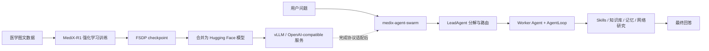

# MedicalAssistant 两部分源码文件、主要类与方法完整索引

> 阅读基线：2026-08-16，分支 `main`，Git HEAD `111966f42027ba34fcfd50fb104538f6f8127bd2`。  
> 口径：以当前工作区实际文件为准，而不是只按 README 描述；统计时排除了 `.git/`、`__pycache__/`、`.pytest_cache/` 和 `.pyc`。  
> 当前范围：`medix-agent-swarm/` 80 个文件，`MediX-R1/` 107 个文件，共 187 个文件；其中 126 个 Python 文件均可被 AST 解析。  
> 工作区说明：`medix-agent-swarm/swarm/events_20260428_231035.py` 当前处于删除状态，`medix-agent-swarm/swarm/events.py` 是当前工作树中实际存在的新文件，因此本文记录后者。  
> 医疗边界：这些代码属于研究、教学和工程原型，不能直接当作临床诊断、处方或真实医疗决策系统。

## 目录

1. [两个部分分别解决什么问题](#1-两个部分分别解决什么问题)
2. [第一部分：medix-agent-swarm 文件索引](#2-第一部分medix-agent-swarm-文件索引)
3. [第二部分：MediX-R1 文件索引](#3-第二部分medix-r1-文件索引)
4. [两个部分如何衔接](#4-两个部分如何衔接)
5. [当前源码中的重要不一致与风险](#5-当前源码中的重要不一致与风险)
6. [推荐阅读顺序](#6-推荐阅读顺序)

---

## 1. 两个部分分别解决什么问题

| 部分 | 所在层次 | 核心问题 | 最终产物 |
|---|---|---|---|
| `medix-agent-swarm` | Agent 应用与运行时 | 用户问题怎样被拆解、路由、调用工具、检索知识、使用记忆并由多个 Agent 汇总 | 一次医疗问答结果、建议、免责声明和会话记忆 |
| `MediX-R1` | 医学视觉语言模型训练与评测 | Qwen-VL 类模型怎样通过 DAPO/GSPO/PPO 类强化学习改进医学图文问答，再怎样合并和评测 | 模型 checkpoint、Hugging Face 权重、评测 JSONL 与分数 |

两者不是同一个程序的上下半段。当前 `medix-agent-swarm` 通过 OpenAI-compatible Chat Completions API 调模型，并依赖 `tool_calls`；当前源码没有直接加载 `MediX-R1` 的 checkpoint。`MediX-R1` 则主要负责训练、推理服务准备和评测。只有把训练后的模型合并、部署成兼容接口，并补齐多模态消息与 Function Calling 契约后，才可能作为 Swarm 的模型后端或医学视觉 Skill。



---

## 2. 第一部分：medix-agent-swarm 文件索引

### 2.1 顶层文件与本地配置

| 文件 | 主要作用 | 主要入口、类或方法 |
|---|---|---|
| `medix-agent-swarm/.gitignore` | 忽略环境变量、Python 缓存、虚拟环境、日志、测试覆盖率和部分本地记忆目录。 | 无代码符号。需要注意它忽略的会话目录与实际 `memory/` 默认落盘目录并不完全一致。 |
| `medix-agent-swarm/README.md` | 项目介绍、安装、架构、Skills、测试和运行说明。它表达了设计目标，但部分数字和“全部可用”结论与当前代码不一致。 | 无代码符号；适合先了解意图，再回源码验证。 |
| `medix-agent-swarm/main.py` | 命令行交互入口，生成会话 ID，循环接收健康问题并调用 Swarm。 | `setup_logger()` 配置 Loguru；`interactive_mode()` 处理 help/clear/exit、调用 `process_with_swarm()` 并打印结果；`main()` 解析 verbose 标志并启动 asyncio。 |
| `medix-agent-swarm/requirements.txt` | 声明 OpenAI SDK、Transformers、Mem0、Redis、Qdrant、Milvus、搜索、日志与异步 HTTP 等依赖。 | 无代码符号。 |
| `medix-agent-swarm/setup.py` | 将项目打包为 `medix-agent-swarm==0.1.0`，读取 README 和 requirements，发现 Python packages。 | 顶层 `setup(...)` 调用；没有独立函数或类。 |
| `medix-agent-swarm/.claude/settings.local.json` | 旧开发环境的 Claude Code 本地权限白名单和机器路径记录，不属于业务运行时。 | 无代码符号；包含机器相关命令与敏感配置痕迹，不应作为共享项目配置或在文档中暴露具体值。 |

### 2.2 `.claude/skills/`：9 个可动态发现的 Skill

Skill 目录同时承担两种角色：`SKILL.md` 提供名称、描述和使用说明；`script/*.py` 提供真正可执行的 Python 函数。`core/skill_loader.py` 会扫描这些目录、读取 YAML frontmatter，并按约定找到同步函数。

| 文件 | 主要作用 | 主要函数 |
|---|---|---|
| `medix-agent-swarm/.claude/skills/analyze-symptoms/SKILL.md` | 定义“症状模式分析”Skill 的名称、触发场景和规则引擎 + Milvus 的实现说明。 | 配置文档，无 Python 方法。 |
| `medix-agent-swarm/.claude/skills/analyze-symptoms/script/__init__.py` | 标记脚本目录为 Python package。 | 无业务符号。 |
| `medix-agent-swarm/.claude/skills/analyze-symptoms/script/symptoms.py` | 按症状关键词识别系统/模式和候选疾病，并用知识库结果补充。 | `get_knowledge_base()` 延迟取得 Milvus 单例；`analyze_symptoms()` 执行规则匹配与检索；`format_analysis()` 组织文本；`analyze_symptoms_sync()` 为动态 Skill 注册提供同步入口。 |
| `medix-agent-swarm/.claude/skills/assess-risk/SKILL.md` | 定义低/中/高/紧急风险评估 Skill。 | 配置文档。 |
| `medix-agent-swarm/.claude/skills/assess-risk/script/__init__.py` | 标记包。 | 无业务符号。 |
| `medix-agent-swarm/.claude/skills/assess-risk/script/risk.py` | 用高危症状规则评估就医紧迫性，并检索知识库建议。 | `get_knowledge_base()`；`assess_risk()` 计算风险级别、原因与建议；`format_assessment()` 格式化；`assess_risk_sync()` 提供同步入口。 |
| `medix-agent-swarm/.claude/skills/clinical-guideline/SKILL.md` | 定义临床指南与专家共识检索 Skill。 | 配置文档。 |
| `medix-agent-swarm/.claude/skills/clinical-guideline/script/__init__.py` | 标记包。 | 无业务符号。 |
| `medix-agent-swarm/.claude/skills/clinical-guideline/script/guideline.py` | 从 Milvus 中按 `guideline` 类型检索权威指南。 | `get_knowledge_base()`；`clinical_guideline()` 查询指南；`format_guideline()` 输出来源、标题和正文；`clinical_guideline_sync()` 提供同步入口。 |
| `medix-agent-swarm/.claude/skills/deep-research/SKILL.md` | 定义组合网络搜索、知识库和 LLM 证据综合的复杂 Skill。 | 配置文档。 |
| `medix-agent-swarm/.claude/skills/deep-research/script/__init__.py` | 标记包。 | 无业务符号。 |
| `medix-agent-swarm/.claude/skills/deep-research/script/research.py` | 把 Skill 参数转交给 `DeepResearchWorkflow`，再把 `ResearchReport` 变成 Agent 可消费的字典。 | `deep_research()` 执行研究；`format_research_report()` 格式化来源、证据与结论；`deep_research_sync()` 提供同步入口。 |
| `medix-agent-swarm/.claude/skills/disease-code/SKILL.md` | 定义 ICD-10 疾病编码查询 Skill。 | 配置文档。 |
| `medix-agent-swarm/.claude/skills/disease-code/script/__init__.py` | 标记包。 | 无业务符号。 |
| `medix-agent-swarm/.claude/skills/disease-code/script/code.py` | 从知识库中检索疾病编码和分类说明。 | `get_knowledge_base()`；`disease_code()` 查询编码文档；`format_code_info()` 整理结果；`disease_code_sync()` 提供同步入口。 |
| `medix-agent-swarm/.claude/skills/recommend-lifestyle/SKILL.md` | 定义饮食、运动、睡眠和生活方式建议 Skill。 | 配置文档。 |
| `medix-agent-swarm/.claude/skills/recommend-lifestyle/script/__init__.py` | 标记包。 | 无业务符号。 |
| `medix-agent-swarm/.claude/skills/recommend-lifestyle/script/lifestyle.py` | 按疾病或症状检索生活方式知识并生成建议文本。 | `get_knowledge_base()`；`recommend_lifestyle()` 检索 `lifestyle` 文档；`format_advice()` 格式化；`recommend_lifestyle_sync()` 提供同步入口。 |
| `medix-agent-swarm/.claude/skills/search-history/SKILL.md` | 定义当前 session 的短期历史搜索 Skill。 | 配置文档。 |
| `medix-agent-swarm/.claude/skills/search-history/script/search.py` | 从 `ShortTermMemory` 读取当前会话最近消息。 | `search_history()` 查询 session；`format_history()` 组织角色和内容；`search_history_sync()` 提供同步入口。 |
| `medix-agent-swarm/.claude/skills/search-knowledge/SKILL.md` | 定义通用医学知识语义检索 Skill。 | 配置文档。 |
| `medix-agent-swarm/.claude/skills/search-knowledge/script/__init__.py` | 标记包。 | 无业务符号。 |
| `medix-agent-swarm/.claude/skills/search-knowledge/script/search.py` | 对 Milvus 医学知识集合执行通用向量检索。 | `get_knowledge_base()`；`search_knowledge()` 执行 top-k 搜索；`format_results()` 展示相似度、类型和内容；`search_knowledge_sync()` 提供同步入口。 |
| `medix-agent-swarm/.claude/skills/search-similar-cases/SKILL.md` | 定义跨会话相似案例搜索 Skill。 | 配置文档。 |
| `medix-agent-swarm/.claude/skills/search-similar-cases/script/search.py` | 调用 `LongTermMemory`/Mem0 搜索历史相似会话。 | `search_similar_cases()` 查询长期记忆；`format_cases()` 整理案例；`search_similar_cases_sync()` 提供同步入口。 |

### 2.3 `agents/`：Agent 角色层

| 文件 | 主要作用 | 主要类、方法或函数 |
|---|---|---|
| `medix-agent-swarm/agents/__init__.py` | 对外统一导出基础 Agent、三个具体 Agent 和三个快捷函数。 | 导出 `BaseAgent`、`ConsultationAgent/consult`、`DiagnosticAgent/diagnose`、`ResearchAgent/research`。 |
| `medix-agent-swarm/agents/base_agent.py` | 定义所有 Worker Agent 共用的生命周期，把角色层接到 `LLMClient`、`AgentLoop` 和 `SkillRegistry`。 | `BaseAgent.get_system_prompt()`/`register_tools()` 是子类扩展点；`get_tools_for_llm()` 暴露 OpenAI tool schema；`execute_tool()` 调注册表；`format_user_input()` 生成用户消息；`process()`/`run_loop()` 进入 AgentLoop；`post_process_result()` 生成统一结果；`set_capabilities()`/`get_capabilities()` 管能力标签；`attach_shared_context()`/`attach_identity_manager()` 接入 Swarm；`process_subtask()` 执行一个 `SubTask`。 |
| `medix-agent-swarm/agents/consultation_agent.py` | 健康咨询角色，强调一般健康建议、风险提示和生活方式，不应下确定性诊断。 | `ConsultationAgent.get_system_prompt()` 定义角色边界；`register_tools()` 注册 9 个 Skill；`format_user_input()` 提取 question/context；`post_process_result()` 整理 answer、suggestions、disclaimer；`consult()` 是单次调用快捷函数。 |
| `medix-agent-swarm/agents/diagnostic_agent.py` | 症状分析和鉴别诊断角色，偏重风险、症状模式和临床推理。 | `DiagnosticAgent.register_tools()`；`get_system_prompt()` 定义诊断推理约束；`post_process_result()` 输出候选方向、风险与免责声明；`diagnose()` 是快捷函数。 |
| `medix-agent-swarm/agents/research_agent.py` | 医学文献、指南、证据综合和事实核查角色。 | `ResearchAgent.register_tools()`；`get_system_prompt()` 强调来源和证据等级；`post_process_result()` 提取引用、证据与建议；`research()` 是快捷函数。 |
| `medix-agent-swarm/agents/skill_registry_mixin.py` | 避免三个 Agent 重复编写 Skill 注册逻辑。 | `SkillRegistryMixin.register_all_skills()` 调 `load_all_skills()` 并逐个注册；`_infer_skill_parameters()` 根据 Skill 名称推断 OpenAI JSON Schema 参数。 |

### 2.4 `core/`：模型协议、循环、工具注册和运行状态

| 文件 | 主要作用 | 主要类、方法或函数 |
|---|---|---|
| `medix-agent-swarm/core/__init__.py` | 聚合导出核心运行时 API。 | 导出 `LLMClient`、`ToolCall`、`LLMResponse`、`AgentLoop`、`AgentState`、`TaskStatus`、`SkillRegistry` 和 `SkillParameter`。 |
| `medix-agent-swarm/core/llm_client.py` | 把 OpenAI-compatible SDK 封装为项目内部稳定的文本和 tool-calling 接口。 | `ToolCall` 保存调用 ID、名称和参数；`LLMResponse.has_tool_calls()` 判断是否需要工具；`LLMClient.chat()` 做普通生成；`chat_with_retry()` 为普通生成重试；`chat_with_tools()` 解析 SDK tool calls；`create_message()`/`create_tool_message()` 构造消息。 |
| `medix-agent-swarm/core/agent_loop.py` | 实现“LLM 生成 → 选择 Skill → 执行 → 回填结果 → 再生成”的有限循环，并接入状态、短期记忆和可选约束修复。 | `AgentLoop.run()` 是主循环，限制迭代数和工具次数；`_initialize_messages()` 合并 system prompt、历史消息和当前输入；`_create_assistant_message_with_tools()` 把内部 `LLMResponse` 还原成消息；构造函数创建 `StateManager`、Validator 和 AutoFixer。 |
| `medix-agent-swarm/core/skill_loader.py` | 按约定从 `.claude/skills/*/SKILL.md` 和 `script/*.py` 动态发现可执行 Skill。 | `parse_skill_md()` 解析 YAML frontmatter；`discover_skills()` 扫描目录并推断脚本/函数；`load_skill_function()` 用 importlib 加载函数；`load_all_skills()` 返回已加载 Skill 字典。 |
| `medix-agent-swarm/core/skill_registry.py` | 保存 Skill 元数据、执行函数并转换为 OpenAI Function Calling schema。 | `SkillParameter` 描述参数；`SkillRegistry.register()` 注册；`get()`/`get_all()` 查询；`execute()` 同时兼容同步和异步函数并统一错误结果；`to_openai_format()` 生成 tools 数组。 |
| `medix-agent-swarm/core/state_manager.py` | 管理单个 AgentLoop 任务的迭代、状态、中间结果和错误。 | `TaskStatus` 定义 pending/in-progress/completed/failed；`AgentState.should_continue()` 控制循环；`add_intermediate_result()`、`mark_completed()`、`mark_failed()` 更新状态；`StateManager.create_state()`/`get_state()`/`update_state()`/`cleanup_old_states()` 管多个任务。 |

### 2.5 `swarm/`：任务分解、共享黑板和并行协调

| 文件 | 主要作用 | 主要类、方法或函数 |
|---|---|---|
| `medix-agent-swarm/swarm/__init__.py` | Swarm 对外入口和统一导出。 | 导出 `SharedContext`、`SubTask`、`Contribution`、`Event`、`LeadAgent`、`SwarmCoordinator` 和 `process_with_swarm()`。 |
| `medix-agent-swarm/swarm/events.py` | 定义 Agent 间通信使用的事件类型和事件载荷。 | `EventType` 枚举任务创建、认领、完成、失败、共享发现等事件；`Event.is_for_agent()` 做目标过滤；`Event.to_dict()` 序列化。 |
| `medix-agent-swarm/swarm/shared_context.py` | 充当 Swarm 的共享黑板：保存子任务、事件、Agent 贡献和共享数据。 | `SubTask.can_be_executed()` 检查依赖；`start()`/`complete()`/`fail()` 更新任务；`SharedContext.publish_event()`/`get_events()` 管事件；`add_subtask()`、`start_subtask()`、`complete_subtask()` 管任务；`get_contributions()` 汇总贡献；`is_all_subtasks_completed()` 判断结束；`set_data()`/`get_data()` 保存共享值；`get_summary()` 输出统计。 |
| `medix-agent-swarm/swarm/lead_agent.py` | 中央协调角色，使用 LLM 评估复杂度、拆分任务并综合 Worker 结果。 | `LeadAgent.assess_and_decompose()` 要求 LLM 返回结构化分解；`create_subtasks()` 把分解结果写入 SharedContext；`wait_for_completion()` 轮询完成状态；`synthesize_results()` 把贡献交给 LLM 汇总；`_get_system_prompt()` 定义路由和拆解规则。 |
| `medix-agent-swarm/swarm/swarm_coordinator.py` | 整个 Agent 应用的真正服务入口，负责单 Agent/多 Agent 分流、记忆、超时、并发和最终结果结构。 | `SwarmCoordinator.process()` 创建 session、调 LeadAgent 并按子任务数路由；`_get_agent_by_id()` 返回 Worker；`_process_with_swarm()` 建 SharedContext、并发执行并汇总；`_worker_execute_assigned_tasks()` 执行该 Worker 的任务队列；`_execute_single_subtask()` 更新任务状态；`_extract_suggestions()` 从答案提取建议；`process_with_swarm()` 是模块级快捷入口。 |

当前实现更准确地说是“中心化拆分 + 固定分配 + Worker 并发 + 黑板聚合”，而不是 README 描述的完全去中心化任务竞标。LeadAgent 已提前给子任务写入 `assigned_agent`，Worker 只执行分配给自己的任务。

### 2.6 `memory/`：短期记忆、长期记忆、总结和熵管理

| 文件 | 主要作用 | 主要类、方法或函数 |
|---|---|---|
| `medix-agent-swarm/memory/__init__.py` | 聚合导出记忆相关类。 | 导出短期/长期记忆、熵管理、AgentIdentity 和 SessionSummary 类型；`__all__` 中包含未定义的 `LearningRecord`，属于当前导出清单错误。 |
| `medix-agent-swarm/memory/short_term.py` | 保存 session 级对话历史，可使用进程内字典或 Redis，并在读取时做熵清理。 | `ConversationHistory.add_message()`、`get_recent_messages()`、`to_dict()`/`from_dict()` 管一段历史；`ShortTermMemory` 使用单例；`create_session()`、`add_message()`、`get_session()`、`get_recent_messages()`、`get_history()`、`clear_session()` 提供主接口；`_save_to_redis()`/`_load_from_redis()` 负责 Redis。 |
| `medix-agent-swarm/memory/long_term.py` | 封装 Mem0 跨会话记忆，保存问答摘要并按语义搜索相似 session。 | `LongTermMemory.add_session_summary()` 写入 Mem0；`search_similar_sessions()` 搜索、规范化并去重结果；初始化负责读取 Mem0 配置和可用性降级。 |
| `medix-agent-swarm/memory/agent_identity.py` | 用 Markdown 持久化 Agent 能力、协作记录和工具表现统计。当前主执行链只提供 attach 接口，实际更新较弱。 | `CollaborationRecord`/`ToolUsageStats` 是数据结构；`AgentIdentity.update_collaboration()` 和 `update_tool_stats()` 累计表现；`to_markdown()`/`from_markdown()` 序列化；`AgentIdentityManager.load_identity()`、`save_identity()`、`create_identity()` 和两个 update 方法管理文件。 |
| `medix-agent-swarm/memory/session_summary.py` | 把一次 Swarm 会话的参与者、发现、经验、性能和最终回答保存为 Markdown。 | `AgentParticipation`、`KeyFinding`、`Lesson`、`PerformanceMetrics` 是数据结构；`SessionSummary.to_markdown()` 输出报告；`from_shared_context()` 从黑板构建总结；`SessionSummaryManager.save_summary()`/`load_summary()`/`search_similar_sessions()` 管本地文件。 |
| `medix-agent-swarm/memory/entropy_manager.py` | 对对话历史做去重、过期清理、压缩和复杂度估算，控制上下文膨胀。 | `deduplicate_messages()`/`deduplicate_sessions()` 去重；`cleanup_old_memories()` 按时间过滤；`compress_session_history()` 保留近期并压缩旧消息；`estimate_entropy()` 估算重复度、长度和复杂度；`auto_clean()` 组合执行。 |

### 2.7 `constraints/` 与 `validation/`：安全约束和输出修复

| 文件 | 主要作用 | 主要类、方法或函数 |
|---|---|---|
| `medix-agent-swarm/constraints/__init__.py` | 导出约束验证器。 | `ConstraintValidator`。 |
| `medix-agent-swarm/constraints/agent_constraints.yaml` | 定义三个 Agent 的能力、允许工具、禁止行为、输出约束和通用医疗安全规则。 | 配置文件；由 `ConstraintValidator` 读取。 |
| `medix-agent-swarm/constraints/swarm_constraints.yaml` | 定义最大 Agent/任务数、超时、拆分规则、必须包含的 Agent、质量控制与冲突解决策略。 | 配置文件；部分规则已有校验函数，但并非全部进入主路由。 |
| `medix-agent-swarm/constraints/validator.py` | 运行时检查工具调用、输出和任务拆分是否符合 YAML。 | `validate_tool_call()` 检查 allowlist；`validate_output()` 检查免责声明、高风险提醒、长度和禁止表述；`validate_task_decomposition()` 检查子任务数与场景规则；`get_required_agents()` 按关键词/症状给出应包含的 Agent。 |
| `medix-agent-swarm/validation/__init__.py` | 期望导出 `AutoFixer`。 | 当前写的是 `from .auto_fixer import AutoFixer`，但目录里没有 `auto_fixer.py`，因此导入失败。 |
| `medix-agent-swarm/validation/auto_fixer_20260428_231043.py` | 实际保存自动修复实现的时间戳文件，但文件名没有满足 `validation/__init__.py` 的导入约定。 | `AutoFixer.fix_output()` 根据问题类型组合修复；`fix_missing_disclaimer()`、`fix_high_risk_warning()`、`fix_excessive_length()` 做确定性修补；`remove_diagnosis_statements()` 是较简化的诊断表述处理。 |

由于 `AgentLoop` 在同一个 `try` 中同时导入 `ConstraintValidator` 与 `AutoFixer`，`auto_fixer.py` 缺失会让 `CONSTRAINTS_ENABLED=False`，即 Validator 也随 AutoFixer 一起被关闭，而不是只关闭修复器。

### 2.8 `knowledge/`：Milvus Lite 知识库与内置医学文档

| 文件 | 主要作用 | 主要类、方法或数据 |
|---|---|---|
| `medix-agent-swarm/knowledge/__init__.py` | 导出 Milvus 知识库封装。 | `MedicalKnowledgeBase`。 |
| `medix-agent-swarm/knowledge/milvus_kb.py` | 使用 SentenceTransformer 生成向量，并通过 Milvus Lite 持久化和检索医学文档。 | `MedicalKnowledgeBase` 是单例；`_chunk_text()` 切块；`add_documents()` 写入向量和 metadata；`search()` 执行 top-k/类型过滤；`delete_collection()` 用于测试清理；`count_documents()` 统计实体。 |
| `medix-agent-swarm/knowledge/data/milvus_lite.db` | 已生成的本地 Milvus Lite 数据库二进制文件。 | 由 `MedicalKnowledgeBase` 读写，不应当作手写源码查看。 |
| `medix-agent-swarm/knowledge/data/documents/01_lifestyle_hypertension.txt` | 高血压饮食、运动、体重、盐摄入等生活方式建议语料。 | 导入后 metadata 类型为生活方式类。 |
| `medix-agent-swarm/knowledge/data/documents/02_lifestyle_diabetes.txt` | 糖尿病饮食、运动、血糖管理等生活方式语料。 | 知识库原始文档。 |
| `medix-agent-swarm/knowledge/data/documents/03_lifestyle_cold.txt` | 普通感冒休息、饮水和症状观察建议。 | 知识库原始文档。 |
| `medix-agent-swarm/knowledge/data/documents/04_lifestyle_general_health.txt` | 通用健康生活方式建议。 | 知识库原始文档。 |
| `medix-agent-swarm/knowledge/data/documents/05_symptoms_emergency.txt` | 胸痛、呼吸困难、意识障碍等急症识别与就医提示。 | 风险评估与通用搜索的安全语料。 |
| `medix-agent-swarm/knowledge/data/documents/10_icd10_cardiovascular.txt` | 循环系统疾病 ICD-10 编码。 | `disease-code` Skill 的数据源之一。 |
| `medix-agent-swarm/knowledge/data/documents/11_icd10_endocrine.txt` | 内分泌、营养和代谢疾病 ICD-10 编码。 | `disease-code` Skill 的数据源之一。 |
| `medix-agent-swarm/knowledge/data/documents/12_icd10_infectious.txt` | 传染病 ICD-10 编码。 | `disease-code` Skill 的数据源之一。 |
| `medix-agent-swarm/knowledge/data/documents/20_guideline_hypertension.txt` | 高血压防治指南文本。 | `clinical-guideline` Skill 的数据源之一。 |
| `medix-agent-swarm/knowledge/data/documents/21_guideline_diabetes.txt` | 2 型糖尿病防治指南文本。 | `clinical-guideline` Skill 的数据源之一。 |
| `medix-agent-swarm/knowledge/scripts/__init__.py` | 标记知识库管理脚本包。 | 无业务符号。 |
| `medix-agent-swarm/knowledge/scripts/import_hardcoded_data.py` | 扫描 `knowledge/data/documents/*.txt`，从文件名推断类型并批量导入 Milvus。 | `load_documents_from_directory()` 读取和构造 metadata；`extract_documents_by_type()` 过滤；`main()` 初始化 KB、导入并打印统计。 |

### 2.9 `research/`：网络搜索与证据综合

| 文件 | 主要作用 | 主要类、方法或函数 |
|---|---|---|
| `medix-agent-swarm/research/deep_research_workflow.py` | 串联查询规划、网络搜索、Milvus 检索和证据综合。 | `DeepResearchWorkflow.run()` 执行一轮研究；`_plan_queries()` 让 LLM 拆分搜索词；`_search_milvus()` 查询本地 KB；`research_with_refinement()` 迭代补充；模块级 `deep_research()` 是快捷入口。 |
| `medix-agent-swarm/research/evidence_synthesizer.py` | 将网页结果和知识库片段交给 LLM，生成结构化研究报告。 | `ResearchReport` 保存摘要、证据、来源、置信度等；`EvidenceSynthesizer.synthesize()` 发起综合；`_build_synthesis_prompt()` 构建证据上下文；`_parse_response()` 转成报告；`format_report()` 输出可读文本。 |
| `medix-agent-swarm/research/knowledge_base.py` | 一套独立于 `knowledge/milvus_kb.py` 的 Qdrant/内存知识库抽象，主要供研究模块实验。 | `Document` 保存内容、metadata 和 score；`KnowledgeBase._init_collection()` 建 Qdrant 集合；`_embed_text()` 向量化；`add_document()`/`bulk_add()` 写入；`search()` 查询；`_cosine_similarity()` 支持内存模式；`get_stats()` 返回统计；`search_knowledge_base()` 是快捷函数。 |
| `medix-agent-swarm/research/web_search.py` | 使用 DuckDuckGo 搜索医学网页，可做域名过滤和正文抓取。 | `SearchResult` 是标准结果；`WebSearchTool.search()` 执行搜索和重试；`filter_by_domain()` 做来源筛选；`fetch_content()` 抓网页；`search_with_content()` 组合搜索和抓取；`search_medical_web()` 是快捷函数。 |

这里存在两个知识库实现：主 Skills 使用 `MedicalKnowledgeBase` + Milvus Lite；`research/knowledge_base.py` 提供 Qdrant/内存实现。DeepResearch 当前本地检索走前者，因此后者更像并行实验抽象，而不是唯一知识库入口。

### 2.10 `examples/`：综合验证脚本

| 文件 | 主要作用 | 主要函数 |
|---|---|---|
| `medix-agent-swarm/examples/test_all.py` | 自定义异步测试/演示脚本，覆盖 AgentLoop、SharedContext、路由、记忆、Skills、DeepResearch、Harness 和单例。它不是 pytest 风格的正式测试套件。 | `generate_test_report()` 生成报告；`test_agent_loop_*` 验证循环；`test_shared_context()`、`test_agent_capabilities()`、`test_agent_identity()` 验证 Swarm 基础；`test_simple_routing()`/`test_complex_case_swarm()` 验证路由；`test_*memory*()` 验证记忆；`test_recommend_lifestyle()`、`test_disease_classification()`、`test_clinical_guidelines()` 验证工具；`test_deep_research_*()` 验证研究；`test_harness_*()` 验证约束/修复/熵；`test_singleton_instances()`/`test_memory_no_duplication()` 验证共享实例；`main()` 顺序执行全部用例。 |

### 2.11 medix-agent-swarm 主链速查

```text
main.py:interactive_mode()
  -> swarm.process_with_swarm()
  -> SwarmCoordinator.process()
  -> LeadAgent.assess_and_decompose()
  -> 单任务: 选一个 Worker.process()
     多任务: _process_with_swarm()
       -> SharedContext + SubTask
       -> Worker.process_subtask()
  -> BaseAgent.run_loop()
  -> AgentLoop.run()
  -> LLMClient.chat_with_tools()
  -> SkillRegistry.execute()
  -> Milvus / Memory / DeepResearch
  -> LeadAgent.synthesize_results()
  -> answer + suggestions + disclaimer
```

---

## 3. 第二部分：MediX-R1 文件索引

### 3.1 顶层、训练曲线与说明材料

| 文件 | 主要作用 | 主要内容 |
|---|---|---|
| `MediX-R1/.gitignore` | 忽略临时文件、日志、克隆的 MedEvalKit、评测结果、压缩包和 `.env`。 | 无代码符号。 |
| `MediX-R1/images/train/training_report.md` | 对 MediX-R1 2B DAPO 的 actor loss、熵、响应长度和各 Reward 曲线做人工分析。 | 这是实验解读文档，不是训练程序；部分因果性表述需要通过样本和 checkpoint 实验验证。 |
| `MediX-R1/images/train/actor-loss.png` | `actor/pg_loss` 训练曲线图。 | 图片资产。 |
| `MediX-R1/images/train/actor-entropy-loss.png` | Actor 熵相关曲线。 | 图片资产。 |
| `MediX-R1/images/train/response-length-mean.png` | 平均响应长度曲线。 | 图片资产。 |
| `MediX-R1/images/train/reward-accuracy_llm.png` | LLM Judge 准确性 Reward 曲线。 | 图片资产。 |
| `MediX-R1/images/train/reward-accuracy_embed.png` | 医学 Embedding 相似度 Reward 曲线。 | 图片资产。 |
| `MediX-R1/images/train/reward-format.png` | 输出标签格式 Reward 曲线。 | 图片资产。 |
| `MediX-R1/images/train/reward-modality.png` | 医学图像模态识别 Reward 曲线。 | 图片资产。 |
| `MediX-R1/images/train/critic-mean.png` | 综合样本分数均值曲线，名称带 critic，但当前无 Critic 的 GRPO/DAPO 训练也会记录该指标。 | 图片资产。 |

### 3.2 `eval/`：通用医学 LLM/VLM 评测流水线

| 文件 | 主要作用 | 主要类、方法或函数 |
|---|---|---|
| `MediX-R1/eval/README.md` | 说明 generate、evaluate、score 三阶段，任务选择、结果目录、MMMU-Medical 和提交方式。 | 无代码符号。 |
| `MediX-R1/eval/tasks.yaml` | 定义 MMLU 医学子集、MedMCQA、MedQA、USMLE、PubMedQA、MIMIC-CXR、SLAKE、VQA-RAD、PathVQA、PMC-VQA 等数据集字段映射。 | 由 `load_dataset_with_params()` 读取。 |
| `MediX-R1/eval/eval.py` | 命令行总控：解析参数、选择任务、启动候选或 Judge vLLM、并行生成、并行评分、汇总分数。 | `main()` 是唯一顶层函数；内部按 `--generate/--evaluate/--score` 分阶段调用 `utils.py`。 |
| `MediX-R1/eval/utils.py` | 实现数据统一、候选生成、LLM Judge、多轮评分、JSONL 断点续跑和 vLLM 进程管理。 | `load_jsonl()`/`load_completed_ids()` 读结果；`load_dataset_with_params()` 统一 sample；`generate()` 调本地候选服务；`_create_eval_client()` 支持 local/OpenRouter；`_eval_completion()`/`_run_eval_rounds()` 调 Judge；`evaluate()` 解析评分；`process_sample()`/`process_evaluation()` 加锁追加；`start_vllm_server()`/`kill_server_process()` 管服务。 |
| `MediX-R1/eval/eval.sh` | 默认对 `MBZUAI/MediX-R1-8B` 执行全部任务的生成、Judge 和汇总，并准备提交提示。 | Shell 入口；会 source `.env`，默认 2 GPU、128 workers、本地 Judge。 |
| `MediX-R1/eval/eval_mmmu_med.sh` | 通过外部 MedEvalKit 单独运行 MMMU-Medical-val。 | 配置模型、GPU、生成参数并调用 `MedEvalKit/eval.py`。 |
| `MediX-R1/eval/submit.sh` | 把某模型的标准评测结果和可选 MMMU 结果压缩成 leaderboard 提交包。 | 校验参数和结果目录，规范化模型名，生成 submission ID 并调用 `zip`。 |
| `MediX-R1/eval/requirements.txt` | 评测依赖：vLLM、OpenAI、datasets、pandas、Pillow、filelock、psutil 等。 | 无代码符号。 |
| `MediX-R1/eval/MedEvalKit_ModelFile/Qwen3_VL/Qwen3_VL_vllm.py` | 提供给外部 MedEvalKit 的 Qwen3-VL + vLLM 模型适配器。 | `Qwen3_VL.process_messages()` 转换文本和图片；`_strip_think_tokens()` 移除思考标签；`generate_output()` 处理单请求；`generate_outputs()` 批量推理。 |

### 3.3 `eval2/`：针对本地 2B checkpoint 的定制评测

| 文件 | 主要作用 | 主要类、方法或函数 |
|---|---|---|
| `MediX-R1/eval2/tasks.yaml` | 大体复制通用任务配置，但把 `rad_vqa` 改为本地 `./datasets_local/vqa-rad`。 | 评测数据映射。 |
| `MediX-R1/eval2/eval.py` | 通用 `eval.py` 的定制版本，默认面向本地 checkpoint 和 configapi Judge。 | `main()` 组织 generate/evaluate/score。 |
| `MediX-R1/eval2/utils.py` | 通用 `utils.py` 的定制版本，从工作区根 `config.py` 创建 OpenAI-compatible Judge 客户端。 | 函数集合与 `eval/utils.py` 基本相同；差异集中在 `_create_eval_client()`、Judge 默认值和本地路径。 |
| `MediX-R1/eval2/merge.sh` | 固定合并 `medix-r1_2b_dapo/global_step_600/actor`，若已有 safetensors 则跳过。 | 调 `training/scripts/model_merger.py`。 |
| `MediX-R1/eval2/eval.sh` | 固定使用 GPU 4、`rad_vqa`、单 worker、本地合并后模型和 configapi Judge。 | 先检查 `actor/huggingface/*.safetensors`，再调用 `eval.py` 完成三阶段。 |

### 3.4 `training/` 顶层：安装、启动和模型合并

| 文件 | 主要作用 | 主要类、方法或函数 |
|---|---|---|
| `MediX-R1/training/.gitignore` | 忽略 Python 构建产物、虚拟环境、测试缓存、日志、模型权重、outputs、checkpoints、wandb 等。 | 无代码符号。 |
| `MediX-R1/training/README.md` | 说明数据、依赖、训练和 checkpoint 合并。列出的若干训练脚本和 `vllm_serve.sh` 在当前目录中不存在。 | 无代码符号。 |
| `MediX-R1/training/requirements.txt` | 锁定训练依赖，包括 PyTorch、Transformers、Ray、vLLM、flash-attn、datasets、SentenceTransformers、日志与 eval2 依赖。 | 无代码符号。 |
| `MediX-R1/training/pyproject.toml` | 声明 setuptools 构建后端、动态项目元数据和 Ruff lint/format 规则。 | 无代码符号。 |
| `MediX-R1/training/setup.py` | 将内置 EasyR1/veRL 代码打包为 `verl`。 | `get_version()` 从 `verl/__init__.py` 取版本；`get_requires()` 解析 requirements；`main()` 调 setuptools。 |
| `MediX-R1/training/run_train.sh` | 选择一个实验脚本作为总启动入口。 | 当前固定调用不存在的 `examples/medix-r1_8b_dapo.sh`，直接运行会失败。 |
| `MediX-R1/training/merge_model.sh` | 示例化的 checkpoint 合并入口。 | 调 `scripts/model_merger.py --local_dir "path/to/model/actor"`；必须先改占位路径。 |
| `MediX-R1/training/scripts/model_merger.py` | 读取 FSDP 分片 metadata 和 rank 权重，按 placement 合并为 Hugging Face safetensors，可选上传 Hub。 | `merge_by_placement()` 根据 placement 拼接/复制 tensor；`upload_model_to_huggingface()` 上传；脚本主流程读取 `world_size`、model shards、optimizer metadata，写入 `actor/huggingface/`。 |

### 3.5 `training/examples/`：实验配置、Prompt、Reward 与启动脚本

#### 3.5.1 配置和训练脚本

| 文件 | 主要作用 | 关键内容 |
|---|---|---|
| `MediX-R1/training/examples/config.yaml` | PPO/GRPO 训练的基础配置；Shell 通过 Hydra/OmegaConf 风格 `key=value` 覆盖它。 | 默认仍是 math12k、Qwen2.5-7B、math Prompt/Reward；定义 data、algorithm、actor、rollout、ref、reward 和 trainer。 |
| `MediX-R1/training/examples/runtime_env.yaml` | Ray runtime 环境：工作目录、排除 `.git`、NCCL/vLLM/CUDA 等环境变量。 | 供 `ray.init(runtime_env=...)` 使用。 |
| `MediX-R1/training/examples/medix-r1_2b_dapo.sh` | 启动 Qwen3-VL-2B 医学 DAPO：2 GPU、每题 3 条 rollout、online filtering、非对称 clip、关闭 KL。 | 覆盖医学数据、Prompt、Reward、长度、batch、checkpoint 和实验名。 |
| `MediX-R1/training/examples/medix-r1_8b_gspo.sh` | 启动 Qwen3-VL-8B 医学 GSPO：8 GPU、每题 5 条 rollout、`gspo_token`、按序列平均、关闭 KL。 | 覆盖医学数据集 ID、Prompt、Reward 和 checkpoint。 |
| `MediX-R1/training/examples/baselines/qwen2_5_vl_3b_clevr.sh` | Qwen2.5-VL-3B 在 CLEVR 计数数据上的 R1V baseline。 | 使用 `r1v.jinja` 和 `r1v.py:compute_score`，2 GPU。 |
| `MediX-R1/training/examples/baselines/qwen2_5_vl_3b_geoqa8k.sh` | Qwen2.5-VL-3B 在 GEOQA-8K 上的 R1V baseline。 | 使用相同 Prompt/Reward，8 GPU。 |

#### 3.5.2 Prompt 模板

| 文件 | 主要作用 | 输出契约 |
|---|---|---|
| `MediX-R1/training/examples/format_prompt/medical_format.jinja` | 医学 VLM 强化学习 Prompt。 | 先输出 16 类医学图像模态标签，再输出 `<thinking>...</thinking>`，最后输出 `<answer>...</answer>`，且不允许额外文本。 |
| `MediX-R1/training/examples/format_prompt/math.jinja` | 通用数学 GRPO Prompt。 | 使用 `<think>...</think>` 和 `\boxed{}`。 |
| `MediX-R1/training/examples/format_prompt/dapo.jinja` | DAPO 数学题 Prompt。 | 最后一行必须为 `Answer: ...`。 |
| `MediX-R1/training/examples/format_prompt/r1v.jinja` | 视觉推理 baseline Prompt。 | 使用 `<think>` 和 `<answer>` 双标签。 |

#### 3.5.3 Reward 函数

| 文件 | 主要作用 | 主要函数 |
|---|---|---|
| `MediX-R1/training/examples/reward_function/medical.py` | 医学组合 Reward：格式、LLM Judge、医学 Embedding 相似度和图像模态匹配。 | `format_reward()` 检查标签；`create_prompt()` 构造 Judge 提示；`chat_with_llm()` 调根 `config.py` 的 API；`llm_answer_match()` 判 YES/NO；`_extract_answer()` 提取 `<answer>`；`_is_invalid_answer()` 拒绝空/过短/非法答案；`accuracy_reward_llm()` 和 `accuracy_reward_embed()` 计算两类准确性；`modality_reward()` 匹配模态；`_score_single()` 加权；`compute_score()` 多线程批量评分。模块导入时会立即加载 MedEmbed。 |
| `MediX-R1/training/examples/reward_function/math.py` | 数学任务的格式 + `mathruler` 正确性 Reward。 | `format_reward()` 检查 `<think>` 和 `\boxed{}`；`accuracy_reward()` 调数学规则；`compute_score()` 加权批量输出。 |
| `MediX-R1/training/examples/reward_function/r1v.py` | R1V baseline 的标签格式和数学/答案正确性 Reward。 | `format_reward()`；`accuracy_reward()`；`compute_score()` 返回 overall/format/accuracy。 |
| `MediX-R1/training/examples/reward_function/dapo.py` | DAPO 数学答案标准化、正确性和软超长惩罚。 | `normalize_final_answer()` 清洗单位、LaTeX 和数值；`accuracy_reward()` 比较答案；`soft_overlong_punishment()` 在 buffer 内逐渐惩罚；`compute_score()` 组合准确性和长度惩罚。 |

### 3.6 `training/verl/`：统一数据协议与模型补丁

| 文件 | 主要作用 | 主要类、方法或函数 |
|---|---|---|
| `MediX-R1/training/verl/__init__.py` | 定义内置 veRL 版本，并可根据 `USE_MODELSCOPE_HUB` 切换 ModelScope Hub。 | `__version__="0.3.3.dev0"`；通过 `is_package_available()` 检查可选依赖并调用 `patch_hub()`。 |
| `MediX-R1/training/verl/protocol.py` | 定义 Driver、Ray Worker、Actor、Rollout、Reward 之间统一传递 batch 的核心协议。 | `DataProtoItem` 表示单样本；`DataProto` 同时保存 TensorDict、non-tensor ndarray 和 meta_info，支持 `select()`、`pop()`、`union()`、`chunk()`、`split()`、`concat()`、`reorder()`、`repeat()`、`save_to_disk()`/`load_from_disk()`；`DataProtoFuture` 延迟获取 Ray ObjectRef；`pad_dataproto_to_divisor()`/`unpad_dataproto()` 适配 world size；`all_gather_data_proto()` 做分布式聚合。 |
| `MediX-R1/training/verl/models/__init__.py` | 模型适配 package 标记。 | 当前无导出。 |
| `MediX-R1/training/verl/models/monkey_patch.py` | 根据模型类型，把 Qwen2-VL/Qwen3-VL forward 和 FlashAttention 替换为支持 Ulysses/mRoPE 的本地实现。 | `apply_ulysses_patch(model_type)` 是唯一入口。 |
| `MediX-R1/training/verl/models/transformers/__init__.py` | Transformers 模型补丁 package 标记。 | 当前无导出。 |
| `MediX-R1/training/verl/models/transformers/flash_attention_utils.py` | 让 FlashAttention2 处理多维位置 ID、变长序列和滑动窗口。 | `prepare_fa2_from_position_ids()` 准备 unpad 索引；`_custom_flash_attention_forward()` 执行定制 FA2；`flash_attention_forward()` 作为 Transformers attention interface。 |
| `MediX-R1/training/verl/models/transformers/qwen2_vl.py` | Qwen2-VL 的 mRoPE 位置、图像/视频 embedding 与 padding-free forward 适配。 | `get_rope_index()` 预计算文本/视觉位置；`_get_input_embeds()` 合并 token 和视觉特征；`qwen2_vl_base_forward()` 执行 base model；`qwen2_vl_model_forward()` 计算语言模型输出和可选 loss。 |
| `MediX-R1/training/verl/models/transformers/qwen3_vl.py` | Qwen3-VL 版本的 mRoPE、视觉 embedding 和 forward 适配。 | `get_rope_index()`；`_get_input_embeds()`；`qwen3_vl_base_forward()`；`qwen3_vl_model_forward()`，职责与 Qwen2-VL 对应但适配 Qwen3 结构。 |

### 3.7 `training/verl/single_controller/`：Worker 方法分发和资源抽象

| 文件 | 主要作用 | 主要类、方法或函数 |
|---|---|---|
| `MediX-R1/training/verl/single_controller/__init__.py` | single-controller package 标记。 | 当前无导出。 |
| `MediX-R1/training/verl/single_controller/base/__init__.py` | 对外导出 Worker 和 WorkerGroup 基础类型。 | `Worker`、`ClassWithInitArgs`、`ResourcePool`、`WorkerGroup`。 |
| `MediX-R1/training/verl/single_controller/base/decorator.py` | 用装饰器描述一个 Worker 方法如何分发到各 rank、在哪里执行以及怎样收集结果。 | `Dispatch` 枚举 one-to-all/all-to-all/DP compute；`Execute` 枚举 all/rank-zero；`dispatch_*()` 拆参数；`collect_*()` 合并 `DataProto`；`get_predefined_dispatch_fn()`/`get_predefined_execute_fn()` 选策略；`register()` 把元数据挂到方法上。 |
| `MediX-R1/training/verl/single_controller/base/register_center/__init__.py` | register-center package 标记。 | 当前无导出。 |
| `MediX-R1/training/verl/single_controller/base/register_center/ray.py` | 在 Ray 命名 actor 中保存 rank-zero 的 master address/port 等注册信息。 | `WorkerGroupRegisterCenter.get_rank_zero_info()` 返回信息；`create_worker_group_register_center()` 创建 detached actor。 |
| `MediX-R1/training/verl/single_controller/base/worker.py` | 分布式 Worker 基类，保存 rank/world-size/master/CUDA 可见设备等上下文。 | `DistRankInfo`/`DistGlobalInfo`/`WorkerMeta` 是元数据；`WorkerHelper.get_availale_master_addr_port()` 找主地址端口；`Worker._configure_before_init()`/`_configure_with_meta()` 注入环境；`world_size()`/`rank()` 查询；`execute_with_func_generator()` 和 `execute_func_rank_zero()` 包装执行。 |
| `MediX-R1/training/verl/single_controller/base/worker_group.py` | 把多张 GPU/多个远程 Worker 组织成一组，并把已注册的方法动态绑定成 group method。 | `ResourcePool` 描述每节点进程数和 GPU；`ClassWithInitArgs` 延迟构造 Worker；`WorkerGroup._bind_worker_method()` 读取 decorator 元数据并生成分发调用；`start_worker_aliveness_check()` 监控存活；`check_workers_alive()` 是后台检查函数。 |

### 3.8 `training/verl/trainer/`：配置、算法和 Ray PPO 主循环

| 文件 | 主要作用 | 主要类、方法或函数 |
|---|---|---|
| `MediX-R1/training/verl/trainer/__init__.py` | trainer package 标记。 | 当前无导出。 |
| `MediX-R1/training/verl/trainer/config.py` | 用 dataclass 表达 data/algorithm/trainer/worker 总配置并传播派生字段。 | `DataConfig.post_init()` 校验 batch 和数据；`AlgorithmConfig` 保存 advantage/KL/filter；`TrainerConfig.post_init()` 校验集群、保存和日志；`PPOConfig.post_init()`/`deep_post_init()` 递归初始化并把长度、KL、Reward 路径等传到子配置；`to_dict()` 导出；`recursive_post_init()` 遍历 dataclass。 |
| `MediX-R1/training/verl/trainer/data_loader.py` | 根据 `DataConfig` 创建 train/val `RLHFDataset`、sampler 和 `StatefulDataLoader`。 | `create_dataloader()` 返回两个 DataLoader，并设置 shuffle、seed、batch、collate 和 drop_last。 |
| `MediX-R1/training/verl/trainer/core_algos.py` | 强化学习数学核心：Reward、Advantage、PPO/GSPO/CISPO policy loss、value loss 和 KL。 | `KLController`、`AdaptiveKLController.update()`、`FixedKLController` 管 KL 系数；`AdvantageEstimator` 枚举算法；`register_adv_estimator()` 注册实现；`compute_advantage_return()` 分发；`compute_gae_advantage_return()`、`compute_grpo_outcome_advantage()`、`compute_grpo_passk_outcome_advantage()`、`compute_rloo_outcome_advantage()`、`compute_reinforce_plus_plus_outcome_advantage()`、`compute_remax_outcome_advantage()` 计算优势；`compute_policy_loss()` 实现 clip/loss_type；`compute_value_loss()` 更新 Critic；`compute_kl()` 计算 KL。 |
| `MediX-R1/training/verl/trainer/metrics.py` | 从训练 batch 和 timing 中生成长度、Reward、Advantage、吞吐和性能指标。 | `reduce_metrics()` 求均值；`compute_length_metrics()`；`compute_data_metrics()`；`compute_timing_metrics()`；`compute_throughout_metrics()`。 |
| `MediX-R1/training/verl/trainer/main.py` | 训练命令行入口：解析 OmegaConf、启动 Ray、构造 tokenizer/processor、DataLoader、Reward Manager、资源池和 Trainer。 | `Runner.run(config)` 在 Ray remote 中构造全部组件并调用 `RayPPOTrainer.fit()`；`main()` 合并 dataclass/YAML/CLI，解析路径并 `ray.init()`。 |
| `MediX-R1/training/verl/trainer/ray_trainer.py` | Driver 侧总训练循环，调度 rollout、Reward、log-prob、Advantage、Actor/Critic 更新、验证、日志和 checkpoint。 | `Role` 定义 ActorRollout、Critic、Ref；`ResourcePoolManager.create_resource_pool()`/`get_resource_pool()` 映射 GPU；`RayPPOTrainer.init_workers()` 创建远程 Worker；`_make_batch_data()` 生成并可在线过滤样本；`_balance_batch()` 均衡 token；`_validate()` 评测；`_save_checkpoint()`/`_load_checkpoint()`；`fit()` 是全局 step 循环；`apply_kl_penalty()` 与 `compute_advantage()` 是 Driver 侧算法桥接。 |

`RayPPOTrainer.fit()` 的关键顺序是：取 prompt → rollout 生成多条 response → Reward 打分 → 可选 ref log-prob/KL → 计算 old log-prob/Advantage → 更新 Critic（若启用）→ 更新 Actor → 记录指标 → 验证/保存。

### 3.9 `training/verl/utils/`：数据、分布式、日志和数值工具

| 文件 | 主要作用 | 主要类、方法或函数 |
|---|---|---|
| `MediX-R1/training/verl/utils/__init__.py` | utils package 标记。 | 当前无导出。 |
| `MediX-R1/training/verl/utils/dataset.py` | 将 Hugging Face/Parquet 数据变成多模态 RL prompt，并生成 token、attention、position IDs 和原始 metadata。 | `process_image()`/`process_video()` 读取并缩放媒体；`collate_fn()` 堆叠 tensor、保留 non-tensor；`RLHFDataset._build_messages()` 构造 chat 内容；`_filter_overlong_prompts()` 过滤；`__getitem__()` 应用 Jinja/chat template、处理 Qwen mRoPE 并返回训练样本。 |
| `MediX-R1/training/verl/utils/flops_counter.py` | 根据模型结构、token 数和耗时估计实际/理论 FLOPS 与 MFU。 | `get_device_flops()` 读取 GPU 峰值；`FlopsCounter._estimate_llama_flops()`、`_estimate_qwen2_moe_flops()` 和 `_estimate_unknown_flops()`；`estimate_flops()` 统一入口。 |
| `MediX-R1/training/verl/utils/fsdp_utils.py` | FSDP 初始化、自动 wrap、模型/优化器 CPU offload 与 reload。 | `get_init_fn()` 为 rank0-init 提供参数初始化；`get_fsdp_wrap_policy()` 选择 Transformer 层；`offload_fsdp_model()`/`load_fsdp_model()`；`offload_fsdp_optimizer()`/`load_fsdp_optimizer()`。 |
| `MediX-R1/training/verl/utils/model_utils.py` | 打印 rank0 GPU 内存和模型参数规模。 | `is_rank0()`；`print_gpu_memory_usage()`；`_get_model_size()`；`print_model_size()`。 |
| `MediX-R1/training/verl/utils/py_functional.py` | 通用 Python/OmegaConf/字典/路径/计时工具。 | `is_package_available()`/`get_package_version()`；`union_two_dict()`；`append_to_dict()`；`flatten_dict()`/`unflatten_dict()`；`convert_dict_to_str()`；`get_abs_path()`；`timer()` context manager。 |
| `MediX-R1/training/verl/utils/seqlen_balancing.py` | 按序列长度做 rank 分区和 dynamic micro-batching，降低最长序列导致的负载不均。 | `Set`/`State` 支持 Karmarkar-Karp；`karmarkar_karp()`/`greedy_partition()`/`get_seqlen_balanced_partitions()` 分区；`log_seqlen_unbalance()` 产指标；`rearrange_micro_batches()` 拆 token-budget batch；`prepare_dynamic_batch()`/`restore_dynamic_batch()` 拆分和恢复顺序。 |
| `MediX-R1/training/verl/utils/tokenizer.py` | 统一加载 Hugging Face tokenizer 和可选多模态 processor，并允许覆盖 chat template。 | `get_tokenizer()`；`get_processor()`。 |
| `MediX-R1/training/verl/utils/torch_dtypes.py` | 精度字符串与 PyTorch dtype 的转换。 | `PrecisionType.is_fp16()`/`is_fp32()`/`is_bf16()`；`to_dtype()`；`to_str()`。 |
| `MediX-R1/training/verl/utils/torch_functional.py` | 概率、mask、padding、scheduler 和低精度 AdamW 数值工具。 | `log_probs_from_logits()`/`log_probs_from_logits_flash_attn()`；`masked_mean()`/`masked_var()`/`masked_whiten()`；`get_response_mask()`；`pad_2d_list_to_length()`/`pad_sequence_to_length()`/`postprocess_data()`；两个 warmup scheduler；`AnyPrecisionAdamW.step()` 使用可配置动量/方差精度和 Kahan 补偿。 |
| `MediX-R1/training/verl/utils/ulysses.py` | DeepSpeed Ulysses 序列并行的 process group、all-to-all、pad/slice、gather 和 autograd 封装。 | `set/get_ulysses_sequence_parallel_*()`；`gather_seq_scatter_heads()`/`gather_heads_scatter_seq()`；`slice_input_tensor()`、`all_to_all_tensor()`、`all_gather_tensor()`；`SeqAllToAll`/`Gather` 自定义 autograd；`ulysses_pad()`/`ulysses_pad_and_slice_inputs()`；`validate_ulysses_config()`。 |
| `MediX-R1/training/verl/utils/checkpoint/__init__.py` | 导出 checkpoint 基类、FSDP 实现和辅助函数。 | `BaseCheckpointManager`、`FSDPCheckpointManager`、`find_latest_ckpt()`、`remove_obsolete_ckpt()`。 |
| `MediX-R1/training/verl/utils/checkpoint/checkpoint_manager.py` | Checkpoint 抽象、随机数状态、tracker 查找和旧 checkpoint 清理。 | `BaseCheckpointManager.load_checkpoint()`/`save_checkpoint()` 是抽象接口；`local_mkdir()`；`get_rng_state()`/`load_rng_state()`；`get_checkpoint_tracker_filename()`；`find_latest_ckpt()` 读 tracker；`remove_obsolete_ckpt()` 删除超限目录。 |
| `MediX-R1/training/verl/utils/checkpoint/fsdp_checkpoint_manager.py` | 按 rank 保存/加载 FSDP model、optimizer、scheduler、RNG，并由 rank0 保存 Hugging Face config/tokenizer/processor。 | `FSDPCheckpointManager.load_checkpoint()` 恢复分片与状态；`save_checkpoint()` 写 shard，支持 `save_model_only`。 |
| `MediX-R1/training/verl/utils/logger/__init__.py` | 导出统一 Tracker。 | `Tracker`。 |
| `MediX-R1/training/verl/utils/logger/logger.py` | 统一训练标量日志接口，支持 console、file、MLflow、SwanLab、TensorBoard、W&B。 | `Logger` 基类；各 `*Logger.log()`/`finish()` 适配后端；`Tracker.log()` 广播指标；`log_generation()` 交给生成日志器；析构时收尾。 |
| `MediX-R1/training/verl/utils/logger/gen_logger.py` | 专门记录验证样本的 prompt、output、label、score 表格。 | `GenerationLogger` 基类；`ConsoleGenerationLogger`、`FileGenerationLogger`、`WandbGenerationLogger`、`SwanlabGenerationLogger`；`AggregateGenerationsLogger.log()` 同时分发到多个后端。 |

### 3.10 `training/verl/workers/`：Actor、Critic、Rollout、Reward 和权重切换

#### 3.10.1 公共配置与 FSDP Worker

| 文件 | 主要作用 | 主要类、方法或函数 |
|---|---|---|
| `MediX-R1/training/verl/workers/__init__.py` | workers package 标记。 | 当前无导出。 |
| `MediX-R1/training/verl/workers/config.py` | 把 Actor、Rollout、Ref、Critic、Reward 配置组合成 Worker 总配置。 | `WorkerConfig.post_init()` 传播 disable_kl、模型路径、batch、rollout n 等派生值并校验。 |
| `MediX-R1/training/verl/workers/fsdp_workers.py` | GPU 远程 Worker 的核心实现，在同一进程角色中构建 FSDP Actor/Ref/Critic 和 vLLM Rollout，并暴露 Trainer 调用的方法。 | `FSDPWorker._init_dist_mesh()` 建 DP/SP mesh；`_build_model_optimizer()` 加载 HF 模型、补丁、FSDP、optimizer/scheduler；`_build_rollout()` 建 vLLM 和 sharding manager；`init_model()` 初始化角色；`_process_multi_modal_inputs()` 处理图像视频；`generate_sequences()`、`compute_log_probs()`、`compute_ref_log_probs()`、`compute_values()`；`update_actor()`/`update_critic()`；`prepare_rollout_engine()`/`release_rollout_engine()` 在训练与生成间切权重/显存；`save_checkpoint()`/`load_checkpoint()`。 |

#### 3.10.2 Actor

| 文件 | 主要作用 | 主要类、方法或函数 |
|---|---|---|
| `MediX-R1/training/verl/workers/actor/__init__.py` | 导出 Actor、模型、优化器、FSDP 和 Reference 配置。 | `ActorConfig`、`ModelConfig`、`OptimConfig`、`FSDPConfig`、`RefConfig`。 |
| `MediX-R1/training/verl/workers/actor/base.py` | Actor 抽象接口。 | `BasePPOActor.compute_log_prob()` 和 `update_policy()` 定义子类契约。 |
| `MediX-R1/training/verl/workers/actor/config.py` | Actor/Reference 的 dataclass 配置。 | `ModelConfig.post_init()` 解析模型路径与 dtype；`OptimConfig` 定义 AdamW/scheduler；`FSDPConfig` 定义 shard/offload/init；`OffloadConfig` 定义参数/优化器卸载；`ActorConfig` 定义 batch、clip、loss type、动态 batching、Ulysses；`RefConfig` 定义参考策略。 |
| `MediX-R1/training/verl/workers/actor/dp_actor.py` | Data Parallel PPO/GRPO Actor，负责 response log-prob 和参数更新。 | `DataParallelPPOActor._forward_micro_batch()` 执行多模态 forward 并计算 token log-prob/entropy；`_optimizer_step()` clip grad 并 step；`compute_log_prob()` 按 micro/dynamic batch 推理；`update_policy()` 遍历 mini-batch/epoch，调用 `compute_policy_loss()`、反传并产指标。 |

#### 3.10.3 Critic

| 文件 | 主要作用 | 主要类、方法或函数 |
|---|---|---|
| `MediX-R1/training/verl/workers/critic/__init__.py` | 导出 Critic 配置。 | `CriticConfig`。 |
| `MediX-R1/training/verl/workers/critic/base.py` | Critic 抽象接口。 | `BasePPOCritic.compute_values()` 和 `update_critic()`。 |
| `MediX-R1/training/verl/workers/critic/config.py` | Value model 的 batch、模型、优化器、FSDP、offload 和 clip 配置。 | `CriticConfig` dataclass。 |
| `MediX-R1/training/verl/workers/critic/dp_critic.py` | Data Parallel Critic，计算 response token values 并最小化 clipped value loss。 | `_forward_micro_batch()` 取 value logits；`_optimizer_step()`；`compute_values()` 批量推理；`update_critic()` 调 `compute_value_loss()` 反传。 |

#### 3.10.4 Reward

| 文件 | 主要作用 | 主要类、方法或函数 |
|---|---|---|
| `MediX-R1/training/verl/workers/reward/__init__.py` | 导出 Reward 配置和管理器。 | `RewardConfig`、`AutoRewardManager`。 |
| `MediX-R1/training/verl/workers/reward/config.py` | 指定 Reward 函数文件、函数名、额外参数和并行模式。 | `RewardConfig.post_init()` 校验路径和函数，并决定 sequential/batch 模式。 |
| `MediX-R1/training/verl/workers/reward/function.py` | 动态加载用户 Reward 函数，把 `DataProto` 转成文本/ground truth 输入，再把标量结果放到 response 最后一个有效 token。 | `RewardInput`/`RewardScore` 类型别名；`SequentialFunctionRewardManagerMixin.compute_reward_sequential()` 逐样本调用；`BatchFunctionRewardManagerMixin.compute_reward_batch()` 一次传整个 batch；`AutoRewardManager.compute_reward()` 分发并返回 reward tensor 与分项指标。 |

#### 3.10.5 Rollout

| 文件 | 主要作用 | 主要类、方法或函数 |
|---|---|---|
| `MediX-R1/training/verl/workers/rollout/__init__.py` | 导出 Rollout 配置和 vLLM 实现。 | `RolloutConfig`、`vLLMRollout`。 |
| `MediX-R1/training/verl/workers/rollout/base.py` | 生成引擎抽象接口。 | `BaseRollout.generate_sequences()`。 |
| `MediX-R1/training/verl/workers/rollout/config.py` | vLLM sampling、tensor parallel、显存、长度、图像数量和验证覆盖配置。 | `RolloutConfig.to_dict()` 转普通字典。 |
| `MediX-R1/training/verl/workers/rollout/vllm_rollout_spmd.py` | 在每个 SPMD Worker 中启动 vLLM，接收 prompt DataProto，处理多模态输入并生成 n 条 response。 | `_repeat_interleave()` 复制 non-tensor 数据；`_get_logit_bias()` 处理特殊 token；`_process_multi_modal_data()` 转图像视频；`vLLMRollout.update_sampling_params()` 临时覆盖采样参数；`generate_sequences()` 调 vLLM、pad response、拼 prompt/response 并构造 attention/position IDs。 |

#### 3.10.6 Sharding Manager

| 文件 | 主要作用 | 主要类、方法或函数 |
|---|---|---|
| `MediX-R1/training/verl/workers/sharding_manager/__init__.py` | 期望统一导出 FSDP-Ulysses 与 FSDP-vLLM 权重/数据切换管理器。 | 当前导入 `.fsdp_vllm`，但实际文件是时间戳名，因此 package import 会失败。 |
| `MediX-R1/training/verl/workers/sharding_manager/base.py` | Sharding manager 抽象和 context-manager 契约。 | `BaseShardingManager.__enter__()`/`__exit__()`；`preprocess_data()`/`postprocess_data()`。 |
| `MediX-R1/training/verl/workers/sharding_manager/fsdp_ulysses.py` | 在 FSDP 数据并行与 Ulysses 序列并行之间 all-gather、切分和还原 `DataProto`。 | `FSDPUlyssesShardingManager.__enter__()`/`__exit__()`；`preprocess_data()` 聚合 SP 数据；`postprocess_data()` 重新按 rank 切分。 |
| `MediX-R1/training/verl/workers/sharding_manager/fsdp_vllm_20260428_224950.py` | 实际保存 FSDP Actor ↔ vLLM 权重同步和 tensor-parallel 数据切换实现的时间戳文件。 | `FSDPVLLMShardingManager._rename_weight_keys()` 适配 HF/vLLM 键；`_make_weight_iterator()` 处理 DTensor；`_sync_weight_to_vllm()` 同步；`load_vllm_and_sync_weights()` 把 Actor 权重载入 vLLM；`offload_vllm()` 释放；`preprocess_data()` all-gather TP 输入；`postprocess_data()` 取本 rank 数据。 |

### 3.11 MediX-R1 训练与评测主链速查

```text
examples/medix-r1_*_*.sh
  -> python -m verl.trainer.main
  -> PPOConfig + config.yaml + CLI 覆盖
  -> create_dataloader() -> RLHFDataset
  -> Runner.run()
  -> RayPPOTrainer.init_workers()
  -> FSDPWorker.init_model()
  -> RayPPOTrainer.fit()
      -> vLLMRollout.generate_sequences()
      -> AutoRewardManager.compute_reward()
      -> compute_advantage()
      -> DataParallelPPOActor.compute_log_prob()
      -> DataParallelPPOActor.update_policy()
      -> FSDPCheckpointManager.save_checkpoint()
  -> scripts/model_merger.py
  -> actor/huggingface/*.safetensors
  -> eval/eval.py 或 eval2/eval.py
      -> generate -> evaluate -> score
```

---

## 4. 两个部分如何衔接

### 4.1 当前已经存在的边界

| 能力 | medix-agent-swarm | MediX-R1 |
|---|---|---|
| 用户会话与多轮历史 | 有，`ShortTermMemory` | 无，单样本训练/评测为主 |
| 工具调用 | 有，OpenAI `tool_calls` + SkillRegistry | 训练代码不负责 Function Calling |
| 多 Agent 分工 | 有，Lead + 三个 Worker | 无，主要是分布式训练 Worker，不是业务 Agent |
| 医学图像 | 当前主入口仍是文本问题 | 核心能力，Dataset/Processor/Qwen-VL/vLLM 都支持图像 |
| 医学知识检索 | Milvus、Qdrant/内存、网络搜索 | Reward 和数据驱动，不承担在线 RAG |
| 模型训练 | 无 | 核心能力 |
| 模型评测 | 只有应用级自定义测试 | 有完整 generate/Judge/score 与 MMMU 适配 |

### 4.2 推荐的工程接入方式

最稳妥的方式不是把两个目录直接 import 到一起，而是保持服务边界：

1. 用 MediX-R1 训练得到 FSDP checkpoint；
2. 用 `model_merger.py` 合并到 Hugging Face 目录；
3. 用 vLLM 或其他服务暴露 OpenAI-compatible 多模态接口；
4. 在 Swarm 新增一个“医学图像问答 Skill”，明确输入为图片路径/URL + question；
5. Skill 调 MediX-R1 服务并返回结构化结果；
6. Consultation/Diagnostic/Research Agent 负责解释、检索、风险提示和最终汇总；
7. 不应假设 MediX-R1 自动支持标准 `tool_calls`，Function Calling 仍由上层 Agent 模型或专门适配器承担。

---

## 5. 当前源码中的重要不一致与风险

| 位置 | 当前事实 | 影响 |
|---|---|---|
| `medix-agent-swarm/README.md` | 同时出现 7、8、9、10 个 Skill 的不同描述；当前目录实际是 9 个。 | 仅看 README 会误判工具数量。 |
| `medix-agent-swarm/swarm/events.py` | 当前工作树已存在，但 Git 记录显示原时间戳文件被删、新文件未跟踪。 | 本地可导入不等于改动已纳入版本控制。 |
| `medix-agent-swarm/validation/__init__.py` | 导入不存在的 `auto_fixer.py`。 | AgentLoop 捕获 ImportError 后关闭整个约束与修复系统。 |
| `medix-agent-swarm/memory/__init__.py` | `__all__` 包含未定义的 `LearningRecord`。 | `from memory import *` 可能出现导出异常或误导。 |
| `medix-agent-swarm/.claude/settings.local.json` | 含旧机器绝对路径、宽泛命令权限和敏感配置痕迹。 | 不应提交、分享或当作运行配置；应清理并使用环境变量。 |
| `medix-agent-swarm/core/llm_client.py` | 含旧机器硬编码 `sys.path`；`temperature = temperature or default` 会吞掉显式 0。 | 可移植性差，且无法稳定请求 temperature=0。 |
| `medix-agent-swarm` 测试 | `examples/test_all.py` 是自定义集成脚本，会调用外部模型/存储，不等于 26 个稳定单元测试。 | README 的 100% 通过率不能代表当前工作树。 |
| `MediX-R1/training/run_train.sh` | 调用不存在的 `medix-r1_8b_dapo.sh`。 | 总入口当前不可直接运行。 |
| `MediX-R1/training/README.md` | 列出多个不存在的实验脚本和 `vllm_serve.sh`。 | 文档与当前快照不同步。 |
| `MediX-R1/training/verl/workers/sharding_manager/__init__.py` | 导入不存在的 `fsdp_vllm.py`，实际实现带时间戳后缀。 | `FSDPWorker` 导入链被阻塞，正式训练无法启动。 |
| `medical.py` | import 时立即加载 MedEmbed，并把网络/API 异常降为 0 分。 | 启动耗时和内存高；外部服务故障会与“模型答错”混在一起。 |
| `medical_format.jinja` 与其他模板 | 医学模板使用 `<thinking>`，math/r1v 使用 `<think>`。 | Reward、训练报告和评测解析必须匹配具体实验，不能混用。 |
| `eval2/` | 固定 checkpoint step、GPU、数据路径和根 `config.py` Judge。 | 更像本地实验快照，不是可移植通用入口。 |
| Checkpoint 清理 | `remove_obsolete_ckpt()` 使用递归删除旧目录。 | 调整 `save_limit` 前要确认恢复与保留策略。 |

---

## 6. 推荐阅读顺序

### 6.1 想理解 Agent 应用

```text
medix-agent-swarm/main.py
  -> swarm/swarm_coordinator.py
  -> swarm/lead_agent.py
  -> swarm/shared_context.py
  -> agents/base_agent.py
  -> core/agent_loop.py
  -> core/llm_client.py
  -> core/skill_loader.py + core/skill_registry.py
  -> 任选一个 .claude/skills/*/script/*.py
  -> memory/ + knowledge/ + research/
```

### 6.2 想理解 MediX-R1 训练

```text
training/examples/medix-r1_2b_dapo.sh 或 medix-r1_8b_gspo.sh
  -> training/examples/config.yaml
  -> training/verl/trainer/config.py
  -> training/verl/trainer/main.py
  -> training/verl/utils/dataset.py
  -> training/verl/trainer/ray_trainer.py
  -> training/verl/workers/fsdp_workers.py
  -> training/verl/workers/rollout/vllm_rollout_spmd.py
  -> training/examples/reward_function/medical.py
  -> training/verl/trainer/core_algos.py
  -> training/verl/workers/actor/dp_actor.py
  -> training/verl/utils/checkpoint/
```

### 6.3 想理解评测和发布

```text
training/scripts/model_merger.py
  -> eval/eval.py
  -> eval/utils.py
  -> eval/tasks.yaml
  -> eval/MedEvalKit_ModelFile/Qwen3_VL/Qwen3_VL_vllm.py
  -> eval/submit.sh
```

### 6.4 最短记忆版

- `medix-agent-swarm` 的骨架是：**Coordinator 决定路线，Lead 拆任务，Worker 跑 AgentLoop，Skill 执行业务，SharedContext 汇总，Memory 保存上下文**。
- `MediX-R1` 的骨架是：**Dataset 产 prompt，vLLM 采样 response，Reward 打分，Core Algos 算 advantage/loss，Actor 更新，FSDP 保存，Merger 合并，Eval 评分**。
- 两部分的合理边界是服务/API 或专门 Skill，而不是直接把训练框架耦合进 AgentLoop。
